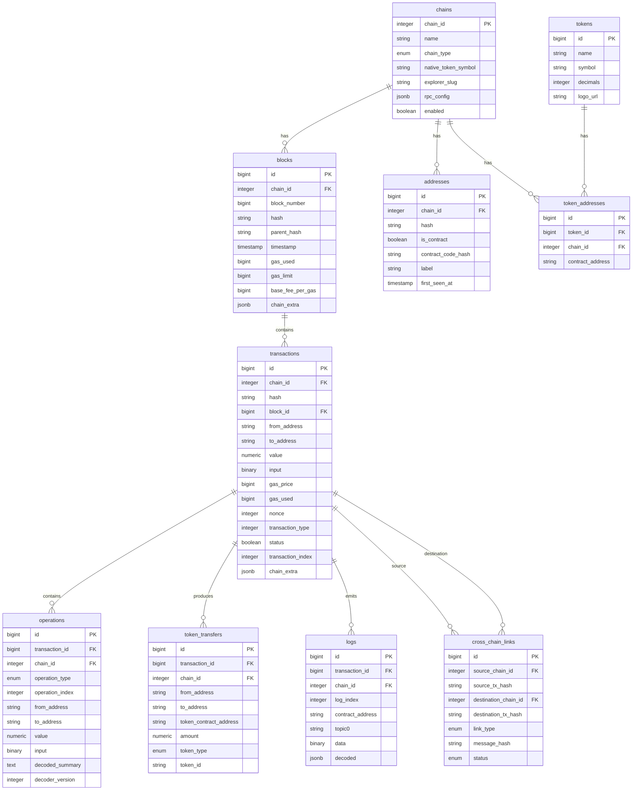

# Rexplorer Architecture

## Overview

Rexplorer is a multi-chain Ethereum-like blockchain explorer built with Elixir and Phoenix. It is organized as an umbrella application with three child apps, designed for independent scaling of indexing and serving workloads.

## Umbrella Structure

```
rexplorer/
├── apps/
│   ├── rexplorer/           # Core domain — schemas, chain adapters, business logic
│   ├── rexplorer_indexer/   # Chain data ingestion (no web dependencies)
│   └── rexplorer_web/       # Phoenix web layer (controllers, views, channels)
├── config/                  # Shared configuration (all apps)
├── docs/                    # Project documentation
└── openspec/                # Change management artifacts
```

### App Responsibilities

| App | Responsibility | Dependencies |
|-----|---------------|--------------|
| `rexplorer` | Ecto Repo, schemas, chain adapters, registry, business logic | None (core) |
| `rexplorer_indexer` | Fetching blocks/txs from RPC nodes, persisting via core | `rexplorer` |
| `rexplorer_web` | HTTP API, WebSocket channels, UI rendering | `rexplorer` |

**Key principle:** `rexplorer_indexer` and `rexplorer_web` never depend on each other. Both depend only on the shared `rexplorer` core. This allows them to be deployed as separate OTP releases, scaling independently.

## Core Data Model



### Key Design Decisions

- **Multi-chain from the schema level:** Every table has a `chain_id` column. The same 20-byte address on different chains produces separate records.
- **JSONB extension columns:** `chain_extra` on blocks and transactions stores chain-specific fields without per-chain tables or migrations.
- **Operations as the core abstraction:** A transaction may contain multiple operations (user intents). This enables proper AA, multisig, and multicall support.
- **Cross-chain links:** Connects related transactions across chains (bridge deposits/withdrawals) for journey tracking.
- **Decoded summary versioning:** Operations store a `decoder_version` alongside the human-readable summary, enabling background reprocessing when the decoder improves.

## Chain Adapter System

Each supported chain implements the `Rexplorer.Chain.Adapter` behaviour via the shared `Rexplorer.Chain.EVM` base module. OP Stack chains (Optimism, Base) additionally use `Rexplorer.Chain.OPStack` for L2-specific fields. The `Rexplorer.Chain.Registry` maps chain IDs to adapter modules at runtime.

See [Chain Adapters](chain-adapters.md) for the full adapter documentation.

## Decoder Pipeline

The decoder pipeline runs as an async background worker with two parallel paths:
- **Operation decoding**: calldata → ABI decode → unwrap (Safe/Multicall) → interpret → narrate → `decoded_summary`
- **Event decoding**: logs → topic0 lookup → decode params → format summary → `logs.decoded` JSONB

See [Decoder Pipeline](decoder-pipeline.md) and [Effects Composition](workflows/effects-composition.md).

## Supported Chains

| Chain | Chain ID | Type | Native Token | Poll Interval |
|-------|----------|------|-------------|---------------|
| Ethereum | 1 | L1 | ETH | 12s |
| Optimism | 10 | Optimistic Rollup | ETH | 2s |
| Base | 8453 | Optimistic Rollup | ETH | 2s |
| BNB Smart Chain | 56 | Sidechain | BNB | 3s |
| Polygon | 137 | Sidechain | POL | 2s |
