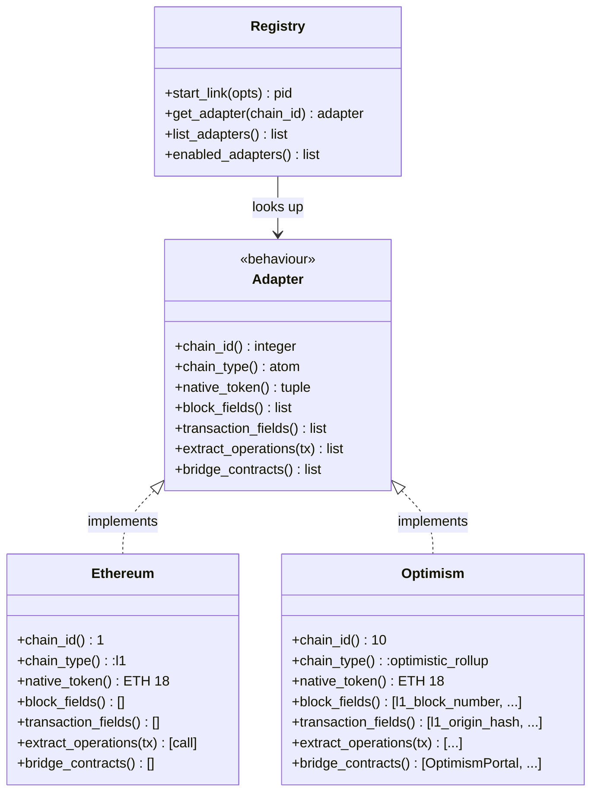
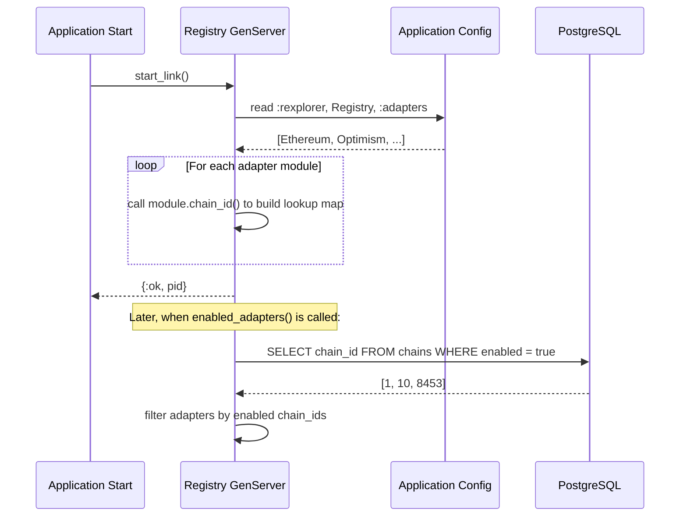

# Chain Adapters

## Overview

The chain adapter system is rexplorer's extension mechanism for supporting multiple blockchains. Each chain implements the `Rexplorer.Chain.Adapter` behaviour, providing chain-specific metadata and logic while sharing the common data model and infrastructure.

## Architecture



## The `Rexplorer.Chain.Adapter` Behaviour

Every chain adapter must implement these callbacks:

### `chain_id/0`
Returns the EIP-155 chain ID as a positive integer.

### `chain_type/0`
Returns the chain architecture: `:l1`, `:optimistic_rollup`, `:zk_rollup`, or `:sidechain`.

### `native_token/0`
Returns `{symbol, decimals}` tuple for the chain's native currency.

### `block_fields/0`
Returns chain-specific field definitions for the `chain_extra` JSONB column on blocks. Each entry is a `{field_name, type}` tuple. Returns `[]` if the chain has no block-level extensions.

### `transaction_fields/0`
Same as `block_fields/0` but for transaction-level chain-specific data.

### `extract_operations/1`
Given a transaction map, returns a list of operation maps. This is where chain-specific transaction decomposition happens:
- Simple EOA transactions → single `call` operation
- AA bundles → multiple `user_operation` operations
- Multisig executions → `multisig_execution` operation
- Multicalls → multiple `multicall_item` operations

### `bridge_contracts/0`
Returns a list of known bridge contract addresses for cross-chain link detection.

## Implementing a New Chain Adapter

### Step 1: Create the module

```elixir
defmodule Rexplorer.Chain.Optimism do
  @moduledoc "Chain adapter for Optimism (chain ID: 10)."
  @behaviour Rexplorer.Chain.Adapter

  @impl true
  def chain_id, do: 10

  @impl true
  def chain_type, do: :optimistic_rollup

  @impl true
  def native_token, do: {"ETH", 18}

  @impl true
  def block_fields do
    [
      {:l1_block_number, :integer},
      {:sequence_number, :integer}
    ]
  end

  @impl true
  def transaction_fields do
    [
      {:l1_origin_tx_hash, :string},
      {:deposit_nonce, :integer}
    ]
  end

  @impl true
  def extract_operations(transaction) do
    # Chain-specific operation extraction logic
    [%{
      operation_type: :call,
      operation_index: 0,
      from_address: transaction.from_address,
      to_address: transaction.to_address,
      value: transaction.value,
      input: transaction.input
    }]
  end

  @impl true
  def bridge_contracts do
    [
      "0xbeb5fc579115071764c7423a4f12edde41f106ed"  # OptimismPortal
    ]
  end
end
```

### Step 2: Register the adapter

Add the module to the adapter list in `config/config.exs`:

```elixir
config :rexplorer, Rexplorer.Chain.Registry,
  adapters: [
    Rexplorer.Chain.Ethereum,
    Rexplorer.Chain.Optimism
  ]
```

### Step 3: Seed the chain record

Add the chain to `priv/repo/seeds.exs`:

```elixir
%{
  chain_id: 10,
  name: "Optimism",
  chain_type: :optimistic_rollup,
  native_token_symbol: "ETH",
  explorer_slug: "optimism"
}
```

### Step 4: No migrations needed

Chain-specific data goes into `chain_extra` JSONB columns. No per-chain database migrations are required. The adapter's `block_fields/0` and `transaction_fields/0` define the expected structure, validated at the application level.

## The Registry

`Rexplorer.Chain.Registry` is a GenServer that maps chain IDs to adapter modules. It starts as part of the `Rexplorer.Application` supervision tree and loads adapters from configuration.

### API

- `get_adapter(chain_id)` → `{:ok, module}` or `{:error, :unknown_chain}`
- `list_adapters()` → list of all registered adapter modules
- `enabled_adapters()` → adapter modules for chains marked as enabled in the database

### How adapter discovery works


