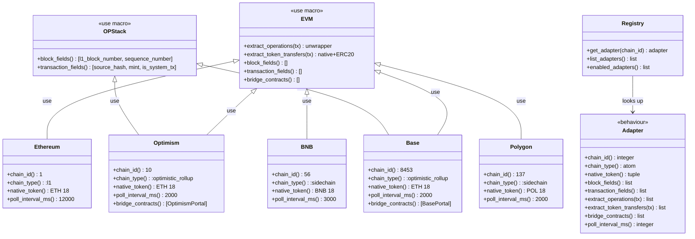
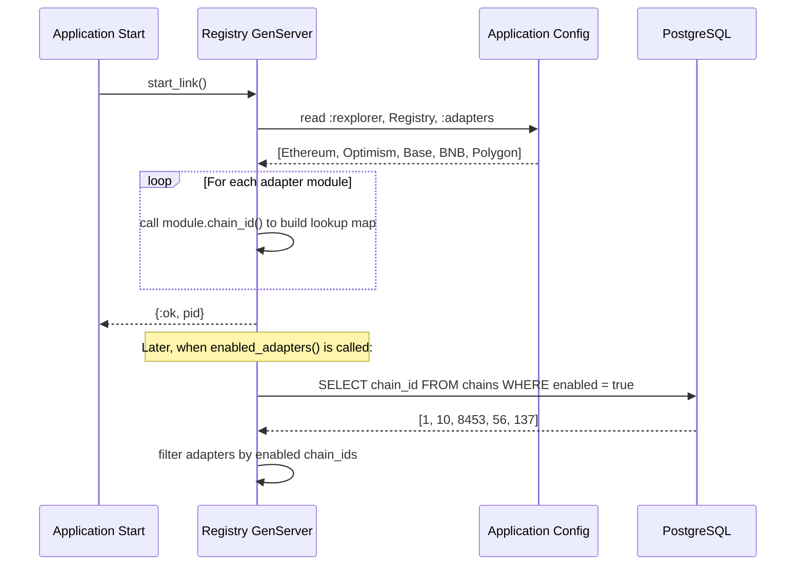

# Chain Adapters

## Overview

The chain adapter system is rexplorer's extension mechanism for supporting multiple blockchains. Each chain implements the `Rexplorer.Chain.Adapter` behaviour, providing chain-specific metadata and logic while sharing the common data model and infrastructure.

A shared `Rexplorer.Chain.EVM` base module provides default implementations for all EVM-common callbacks (operation extraction, token transfer parsing). Chain adapters only need to define their metadata. OP Stack chains (Optimism, Base) additionally use `Rexplorer.Chain.OPStack` for L2-specific block and transaction fields.

## Architecture



## Module Hierarchy

```
Rexplorer.Chain.Adapter        (behaviour — defines 9 callbacks)
  └── Rexplorer.Chain.EVM      (use macro — default implementations)
        ├── Rexplorer.Chain.Ethereum     (chain_id: 1,    L1)
        ├── Rexplorer.Chain.BNB          (chain_id: 56,   sidechain)
        ├── Rexplorer.Chain.Polygon      (chain_id: 137,  sidechain)
        └── + Rexplorer.Chain.OPStack    (use macro — L2 block/tx fields)
              ├── Rexplorer.Chain.Optimism  (chain_id: 10,   optimistic rollup)
              └── Rexplorer.Chain.Base      (chain_id: 8453, optimistic rollup)
```

## Supported Chains

| Chain | Chain ID | Type | Native Token | Poll Interval | Block Fields | Bridge Contracts |
|-------|----------|------|-------------|---------------|--------------|-----------------|
| Ethereum | 1 | L1 | ETH | 12s | — | — |
| Optimism | 10 | Optimistic Rollup | ETH | 2s | l1_block_number, sequence_number | OptimismPortal |
| Base | 8453 | Optimistic Rollup | ETH | 2s | l1_block_number, sequence_number | BasePortal |
| BNB Smart Chain | 56 | Sidechain | BNB | 3s | — | — |
| Polygon | 137 | Sidechain | POL | 2s | — | — |

## The `Rexplorer.Chain.Adapter` Behaviour

Every chain adapter must implement these callbacks:

| Callback | Description | Required to define? |
|----------|-------------|-------------------|
| `chain_id/0` | EIP-155 chain ID | Yes |
| `chain_type/0` | `:l1`, `:optimistic_rollup`, `:zk_rollup`, `:sidechain` | Yes |
| `native_token/0` | `{symbol, decimals}` tuple | Yes |
| `poll_interval_ms/0` | Polling interval in ms (matches block time) | Yes |
| `extract_operations/1` | Decompose tx into operations (via unwrapper) | No (EVM default) |
| `extract_token_transfers/1` | Extract native + ERC-20 transfers | No (EVM default) |
| `block_fields/0` | Chain-specific block `chain_extra` fields | No (default `[]`) |
| `transaction_fields/0` | Chain-specific tx `chain_extra` fields | No (default `[]`) |
| `bridge_contracts/0` | Bridge contract addresses for cross-chain links | No (default `[]`) |

## The Shared EVM Base

`Rexplorer.Chain.EVM` is a `__using__` macro that injects default implementations for all callbacks common across EVM chains:

- `extract_operations/1` — delegates to the unwrapper registry (handles Safe, Multicall, plain calls)
- `extract_token_transfers/1` — extracts native token transfers + ERC-20 Transfer events
- `block_fields/0`, `transaction_fields/0`, `bridge_contracts/0` — return `[]`

All defaults are `defoverridable`, so any chain adapter can override them.

## The OP Stack Module

`Rexplorer.Chain.OPStack` layers on top of EVM for Optimism and Base. It overrides:

- `block_fields/0` → `[{:l1_block_number, :integer}, {:sequence_number, :integer}]`
- `transaction_fields/0` → `[{:source_hash, :string}, {:mint, :integer}, {:is_system_tx, :boolean}]`

These fields are extracted from the raw RPC data into the `chain_extra` JSONB column during indexing. OP Stack chains also have deposit transactions (type 0x7E / 126) whose metadata is captured in these fields.

## Implementing a New Chain Adapter

### Step 1: Create the module

For a simple EVM chain (no L2-specific fields):

```elixir
defmodule Rexplorer.Chain.MyChain do
  @moduledoc "Chain adapter for MyChain (chain ID: 42)."

  use Rexplorer.Chain.EVM

  @impl true
  def chain_id, do: 42

  @impl true
  def chain_type, do: :sidechain

  @impl true
  def native_token, do: {"MYC", 18}

  @impl true
  def poll_interval_ms, do: 5_000
end
```

For an OP Stack L2:

```elixir
defmodule Rexplorer.Chain.MyL2 do
  @moduledoc "Chain adapter for MyL2 (chain ID: 99)."

  use Rexplorer.Chain.EVM
  use Rexplorer.Chain.OPStack

  @impl true
  def chain_id, do: 99

  @impl true
  def chain_type, do: :optimistic_rollup

  @impl true
  def native_token, do: {"ETH", 18}

  @impl true
  def poll_interval_ms, do: 2_000

  @impl true
  def bridge_contracts, do: ["0x..."]
end
```

### Step 2: Register the adapter

Add the module to the adapter list in `config/config.exs`:

```elixir
config :rexplorer, Rexplorer.Chain.Registry,
  adapters: [
    Rexplorer.Chain.Ethereum,
    Rexplorer.Chain.Optimism,
    Rexplorer.Chain.Base,
    Rexplorer.Chain.BNB,
    Rexplorer.Chain.Polygon,
    Rexplorer.Chain.MyChain
  ]
```

### Step 3: Add RPC configuration

```elixir
config :rexplorer_indexer,
  chains: %{
    42 => %{rpc_url: "http://localhost:8545"}
  }
```

### Step 4: Seed the chain record

Add the chain to `priv/repo/seeds.exs`:

```elixir
%{
  chain_id: 42,
  name: "MyChain",
  chain_type: :sidechain,
  native_token_symbol: "MYC",
  explorer_slug: "mychain"
}
```

### Step 5: No migrations needed

Chain-specific data goes into `chain_extra` JSONB columns. No per-chain database migrations are required.

## The Registry

`Rexplorer.Chain.Registry` is a GenServer that maps chain IDs to adapter modules. It starts as part of the `Rexplorer.Application` supervision tree and loads adapters from configuration.

### API

- `get_adapter(chain_id)` → `{:ok, module}` or `{:error, :unknown_chain}`
- `list_adapters()` → list of all registered adapter modules
- `enabled_adapters()` → adapter modules for chains marked as enabled in the database

### How adapter discovery works


