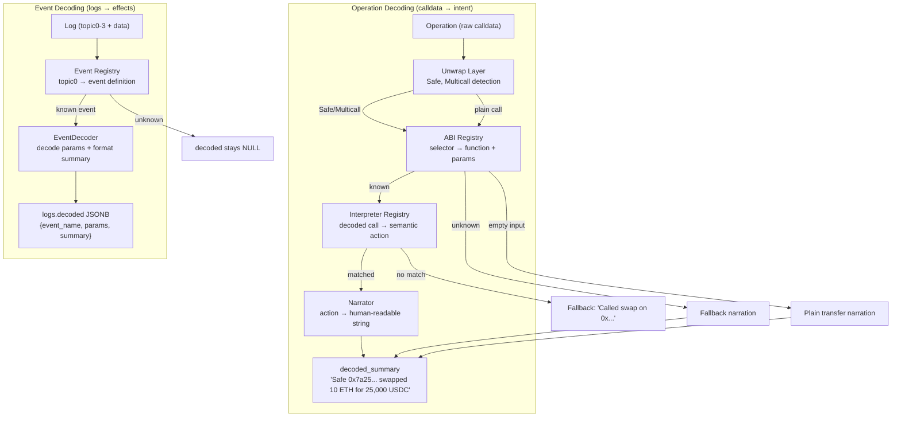
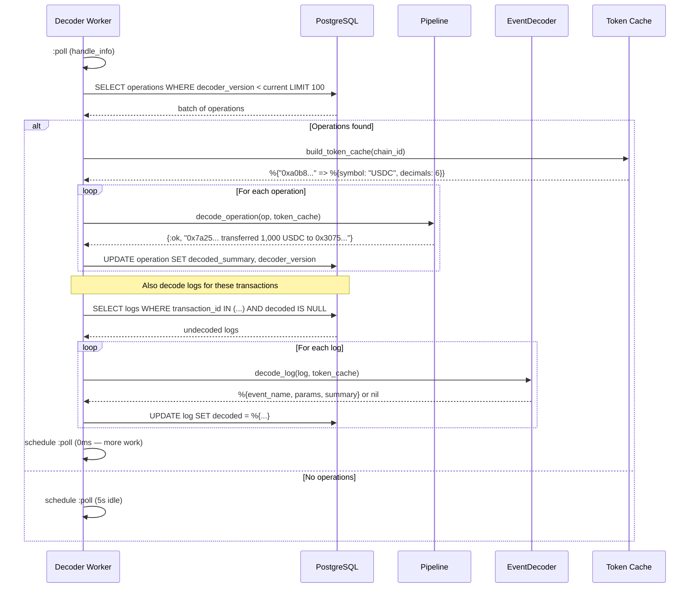

# Decoder Pipeline

## Overview

The decoder pipeline transforms raw EVM data into human-readable stories. It has two parallel paths: **operation decoding** (calldata → intent) and **event decoding** (logs → effects). Both run in the same async background worker.

## Pipeline Flow

## Unwrap Layer

Before ABI decoding, the pipeline checks if the operation wraps inner calls:

| Wrapper | Selector | Result |
|---------|----------|--------|
| Safe `execTransaction` | `0x6a761202` | Extracts inner call, sets from=Safe address |
| `multicall(bytes[])` | `0xac9650d8` | Splits into N inner calls |
| `multicall(uint256,bytes[])` | `0x5ae401dc` | Splits into N inner calls (Uniswap V3) |
| Plain call | any other | Passed through unchanged |

After unwrapping, the inner calldata is decoded by the ABI registry and interpreted. The narrator prefixes the summary with context: "Safe 0x7a25...: transferred 1,000 USDC to 0x3075..."

See [Unwrap Layer](unwrap-layer.md) for details.

## Protocol Interpreters

| Protocol | Module | Actions | Matched by |
|----------|--------|---------|------------|
| ERC-20 | `Interpreter.ERC20` | transfer, transferFrom, approve | Function name (any address) |
| Uniswap V2 | `Interpreter.UniswapV2` | swap | Router address + function |
| Uniswap V3 | `Interpreter.UniswapV3` | swap | Router address + function |
| WETH | `Interpreter.WETH` | wrap, unwrap | WETH address + function |
| Aave V3 | `Interpreter.AaveV3` | supply, withdraw, borrow, repay | Pool address + function |

## Event Decoder

The event decoder processes transaction logs in parallel with operations:

| Event | Protocol | Summary Example |
|-------|----------|----------------|
| Transfer | ERC-20 | "Transfer 1,000 USDC from 0x7a25... to 0x3075..." |
| Approval | ERC-20 | "Approval: 0x7a25... approved 0x68b3... for Unlimited USDC" |
| Swap | Uniswap V2/V3 | "Swap on pool 0x8ad5..." |
| Supply | Aave V3 | "Supply 1,000 USDC to Aave" |
| Withdraw | Aave V3 | "Withdraw 1,000 USDC from Aave" |
| Borrow/Repay | Aave V3 | "Borrow/Repay 500 USDC from/to Aave" |
| Deposit/Withdrawal | WETH | "WETH Deposit 1.0 ETH" |

See [Effects Composition](workflows/effects-composition.md) for how the frontend composes the "What Happened" section.

## Decoder Worker

The worker processes in batches of 100 operations. When catching up, it polls with no delay. Logs are decoded alongside their transactions' operations in the same batch.

## Adding a New Protocol Interpreter

1. Create a module implementing `Rexplorer.Decoder.Interpreter`
2. Add the ABI signature to `@known_signatures` in `Rexplorer.Decoder.ABI`
3. Add a narration clause in `Rexplorer.Decoder.Narrator`
4. Register it in `Rexplorer.Decoder.Interpreter.Registry`
5. Bump `@decoder_version` in `Rexplorer.Decoder.Pipeline`

## Adding a New Event Signature

1. Add the event to `@known_events` in `Rexplorer.Decoder.ABI` with param names and indexed flags
2. Add a `format_summary` clause in `Rexplorer.Decoder.EventDecoder`
3. Bump `@decoder_version` — the worker will reprocess logs

## Address Handling

All summaries contain **full 42-character addresses** (not truncated). The frontend's `linkifyAddresses()` utility scans for `0x` + 40 hex chars and renders them as clickable, truncated links. This keeps the backend data complete while the UI handles display formatting.

## Token Resolution

The narrator resolves token contract addresses to symbols using the `tokens` + `token_addresses` tables (cached per chain per batch). Unknown tokens show the raw address. Amounts for unknown tokens are displayed as raw values without decimal division to avoid incorrect formatting.

## Amount Formatting

- **Known tokens**: raw ÷ 10^decimals (e.g., 1000000 ÷ 10^6 = 1.0 USDC)
- **Unknown tokens**: raw amount as-is
- **Unlimited approvals**: amounts ≥ 10^30 display as "Unlimited"
