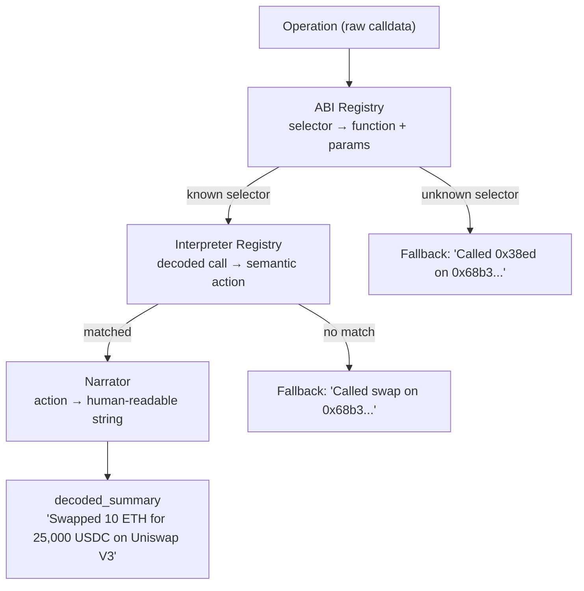

# Decoder Pipeline

## Overview

The decoder pipeline transforms raw EVM calldata into human-readable transaction stories. It runs as an async background worker, independent from the indexer.

## Pipeline Flow



## Protocol Interpreters

| Protocol | Module | Actions | Matched by |
|----------|--------|---------|------------|
| ERC-20 | `Interpreter.ERC20` | transfer, approve | Function name (any address) |
| Uniswap V2 | `Interpreter.UniswapV2` | swap | Router address + function |
| Uniswap V3 | `Interpreter.UniswapV3` | swap | Router address + function |
| WETH | `Interpreter.WETH` | wrap, unwrap | WETH address + function |
| Aave V3 | `Interpreter.AaveV3` | supply, withdraw, borrow, repay | Pool address + function |

## Adding a New Protocol Interpreter

1. Create a module implementing `Rexplorer.Decoder.Interpreter`:

```elixir
defmodule Rexplorer.Decoder.Interpreter.MyProtocol do
  @behaviour Rexplorer.Decoder.Interpreter
  alias Rexplorer.Decoder.Action

  @addresses %{1 => ["0x..."]}

  @impl true
  def matches?(to_address, %{function: func}, chain_id) do
    to_address in Map.get(@addresses, chain_id, []) and func == "myFunction"
  end

  @impl true
  def interpret(%{function: "myFunction", params: params}, _tx_context, _chain_id) do
    {:ok, %Action{type: :my_action, protocol: "MyProtocol", params: %{...}}}
  end
end
```

2. Add the ABI signature to `@known_signatures` in `Rexplorer.Decoder.ABI`

3. Add a narration clause in `Rexplorer.Decoder.Narrator`

4. Register it in `Rexplorer.Decoder.Interpreter.Registry` (before ERC-20 for priority)

5. Bump `@decoder_version` in `Rexplorer.Decoder.Pipeline` — the worker will reprocess all operations

## Decoder Worker

The worker polls for operations where `decoder_version IS NULL OR decoder_version < current`. It processes in batches of 100, with no delay between batches when catching up.

## Token Resolution

The narrator resolves token addresses to symbols (e.g., `0xa0b8...` → "USDC") using the `tokens` + `token_addresses` tables. Token data is seeded in `priv/repo/seeds.exs`. Unknown tokens display as truncated addresses.
