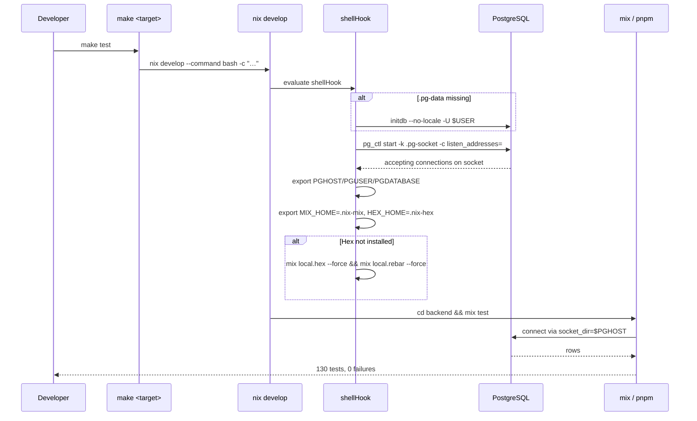
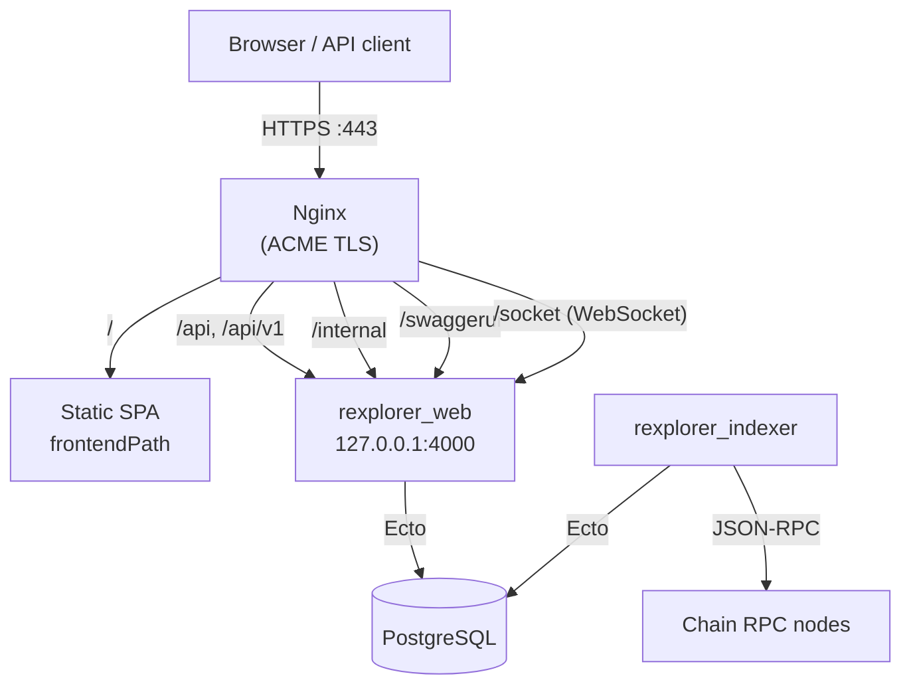
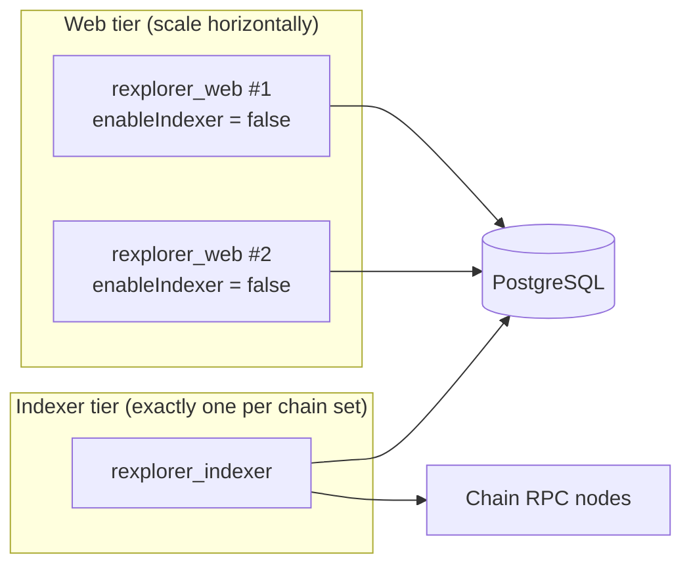

# Deployment

Rexplorer is built and deployed with Nix. The flake at the repository root
serves two purposes: it defines the **development shell** every `make` target
runs inside, and it builds the three **release artifacts** a NixOS host runs.

## Development environment

The only host requirement is Nix with flakes enabled. `nix develop` provides
Elixir 1.19 on Erlang/OTP 28, PostgreSQL 18, Node.js 24 and pnpm, and its
`shellHook` brings up a project-local Postgres.

That Postgres is deliberately **not** a system service: the cluster lives in
`.pg-data/` and listens only on a Unix socket in `.pg-socket/`, with TCP
disabled entirely. Nothing can collide with a Homebrew or system Postgres on
port 5432, and the whole database is thrown away by deleting a directory.

`backend/config/dev.exs` and `backend/config/test.exs` pick the connection
method up from the environment: when `PGHOST` is set (inside the Nix shell)
they connect over the socket as the current OS user, and otherwise they fall
back to a conventional `postgres:postgres@localhost` over TCP. A contributor
who is not using Nix therefore still gets a working default.



Because Hex is bootstrapped by the hook, any target works from a clean
checkout without a separate setup step. `make shell` opens the same
environment interactively; `direnv allow` loads it on `cd`.

### Local service control

| Command | Effect |
|---------|--------|
| `make services.start` | Start the project-local Postgres |
| `make services.stop` | Stop it |
| `make services.status` | Report cluster status |

## Release artifacts

```bash
make nix.build            # all three
make nix.build.web        # nix build .#rexplorer-web
make nix.build.indexer    # nix build .#rexplorer-indexer
make nix.build.frontend   # nix build .#rexplorer-frontend
```

| Output | Contents |
|--------|----------|
| `rexplorer-web` | Mix release, `bin/rexplorer_web` — public API, BFF, channels |
| `rexplorer-indexer` | Mix release, `bin/rexplorer_indexer` — chain ingestion |
| `rexplorer-frontend` | Static SPA bundle (`index.html` + `assets/`) |

The umbrella declares both releases explicitly in `backend/mix.exs`; each
bundles the shared `rexplorer` core plus exactly one tier, so a web node never
starts indexer workers and vice versa.

### Reproducible dependencies

Three fixed-output derivations pin everything fetched from the network. All
three hashes live in `nix/packages.nix` and must be refreshed when the
corresponding lockfile changes — build, read the `got:` hash from the
mismatch error, and paste it in.

| Hash | Covers | Refresh after changing |
|------|--------|------------------------|
| `mixFodDeps.hash` | Hex packages | `backend/mix.lock` |
| `pnpmDeps.hash` | npm packages | `frontend/pnpm-lock.yaml` |
| `nifCache` entries | `ex_keccak` precompiled NIFs | the `ex_keccak` version |

The `nifCache` deserves a note. `ex_abi` pulls in `ex_keccak`, which uses
`rustler_precompiled` to **download** a prebuilt Rust NIF at compile time —
network access the Nix sandbox forbids, so the build fails with
`Error while downloading precompiled NIF: erofs`. We fetch those tarballs
ahead of time as fixed-output derivations and point the compiler at them with
`RUSTLER_PRECOMPILED_GLOBAL_CACHE_PATH`. Erlang 28 reports NIF version 2.17,
for which `rustler_precompiled` falls back to the `nif-2.16` tarballs; all
four default systems are covered so the release builds on Linux servers and
macOS dev machines alike.

## NixOS deployment

`nixosModules.rexplorer` turns the artifacts into a running host: two systemd
units, PostgreSQL, and an Nginx vhost with ACME TLS.

```nix
{
  imports = [ rexplorer.nixosModules.rexplorer ];

  services.rexplorer = {
    enable = true;
    domain = "explorer.example.com";
    webPath = "/opt/rexplorer/web";
    indexerPath = "/opt/rexplorer/indexer";
    frontendPath = "/opt/rexplorer/frontend";
    envFile = "/etc/rexplorer/env";
    nginx.acmeEmail = "admin@example.com";
  };
}
```

[`nix/server-example.nix`](../nix/server-example.nix) is a complete host
configuration to copy from.

### Request routing



`/` falls back to `index.html` so client-side routes deep-link correctly. When
`frontendPath` is null, `/` is proxied to Phoenix instead.

### Configuration options

| Option | Default | Purpose |
|--------|---------|---------|
| `domain` | — | Public hostname; also `PHX_HOST` |
| `port` | `4000` | Loopback port Phoenix binds |
| `envFile` | `/etc/rexplorer/env` | Secrets, read by both units |
| `webPath` | `/opt/rexplorer/web` | Deployed web release |
| `indexerPath` | `/opt/rexplorer/indexer` | Deployed indexer release |
| `frontendPath` | `null` | Static SPA root; `null` proxies `/` to Phoenix |
| `enableIndexer` | `true` | Run the indexer on this host |
| `localPostgres` | `true` | Provision PostgreSQL 18 locally |
| `nginx.enable` | `true` | Configure the reverse proxy |
| `nginx.enableACME` | `true` | Let's Encrypt TLS |
| `nginx.acmeEmail` | — | ACME registration address |

The env file must define at least:

```sh
DATABASE_URL=ecto://rexplorer@localhost/rexplorer
SECRET_KEY_BASE=<64+ chars, from `mix phx.gen.secret`>
```

Both units run as the unprivileged `rexplorer` user under systemd hardening
(`ProtectSystem=strict`, `PrivateTmp`, `NoNewPrivileges`, and friends), with
`/var/lib/rexplorer` as the only writable path.

### Scaling out

The web and indexer tiers are separate releases precisely so they can live on
different machines. On a multi-node deployment, set `enableIndexer = false`
on every web node and run the indexer on exactly one host (or a dedicated
indexer node) — the workers poll chain heads and write blocks, so running
several against one database duplicates work and causes write contention.


