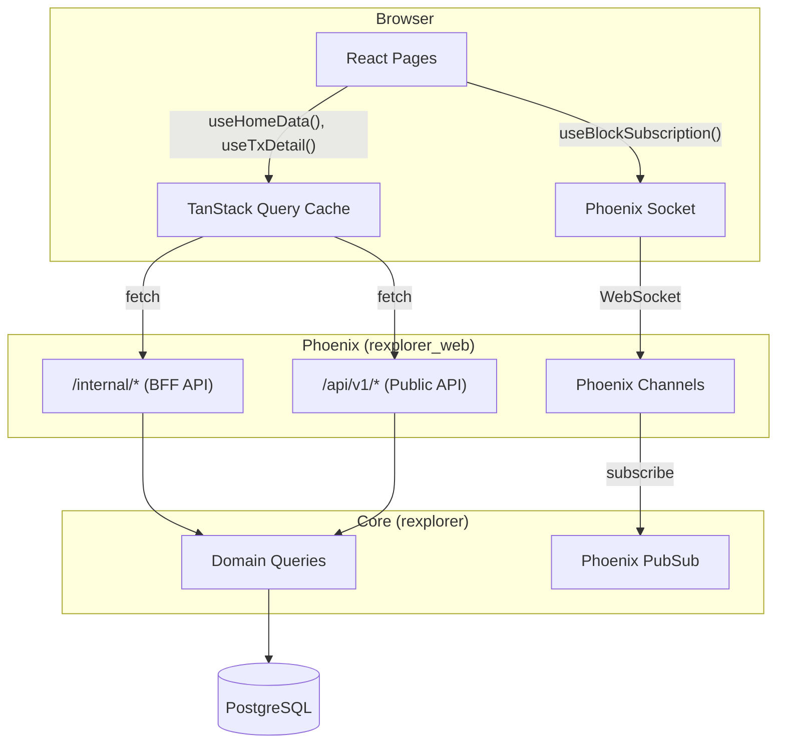
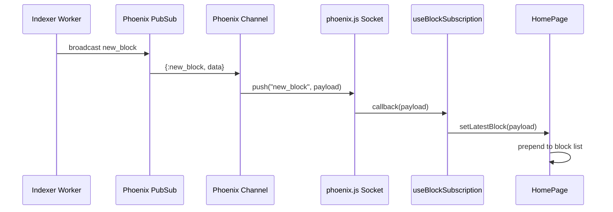

# Frontend Architecture

## Overview

The rexplorer frontend is a React SPA that consumes the two-tier API and Phoenix Channels for real-time updates.

## Data Flow

## Real-time Flow

## Key Decisions

- **Custom component library** — no third-party UI framework. All components in `src/components/ui/` built with Tailwind CSS.
- **Two data sources** — pages use BFF (`/internal/*`) for aggregated data; public API (`/api/v1/*`) for simple lists.
- **TanStack Query** — handles caching, deduplication, loading/error states. Navigating back to a cached page is instant.
- **Dark mode** — Tailwind `class` strategy, persisted in localStorage, defaults to system preference.
