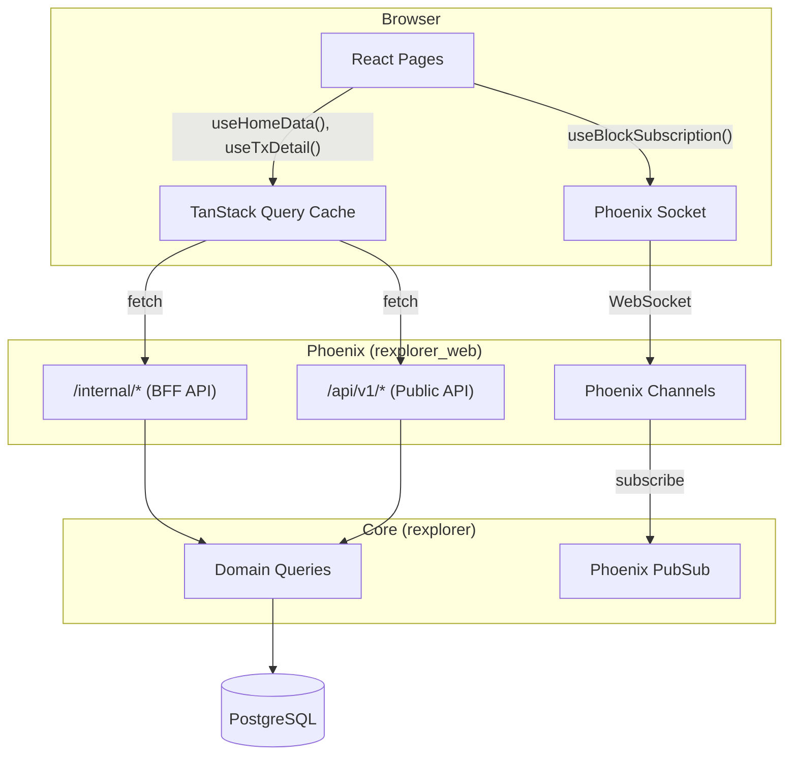
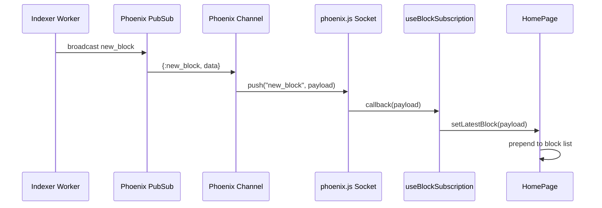
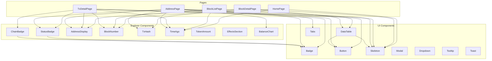

# Frontend Architecture

## Overview

The rexplorer frontend is a React SPA that consumes the two-tier API and Phoenix Channels for real-time updates.

## Data Flow

## Real-time Flow

## Component Architecture

### Component usage guidelines

| When rendering... | Use this component |
|---|---|
| Transaction status (success/fail/pending) | `StatusBadge` |
| Chain name with color dot | `ChainBadge` |
| Blockchain address (with link + copy) | `AddressDisplay` |
| Block number (with link) | `BlockNumber` |
| Transaction hash (with link + copy) | `TxHash` |
| Relative timestamps | `TimeAgo` (not `timeAgo()` utility) |
| Token amounts with decimals | `TokenAmount` |
| Tabular data with pagination | `DataTable` (with `onLoadMore`/`hasMore`) |
| Loading placeholders | `Skeleton` (not raw `animate-pulse` divs) |
| Label/tag badges | `Badge` |
| Clickable actions | `Button` |

Explorer components (`StatusBadge`, `ChainBadge`) delegate to UI components (`Badge`) internally. Pages should never re-implement badge or status rendering inline.

## Key Decisions

- **Custom component library** — no third-party UI framework. All components in `src/components/ui/` built with Tailwind CSS.
- **Two data sources** — pages use BFF (`/internal/*`) for aggregated data; public API (`/api/v1/*`) for simple lists.
- **TanStack Query** — handles caching, deduplication, loading/error states. Navigating back to a cached page is instant.
- **Dark mode** — Tailwind `class` strategy, persisted in localStorage, defaults to system preference.
