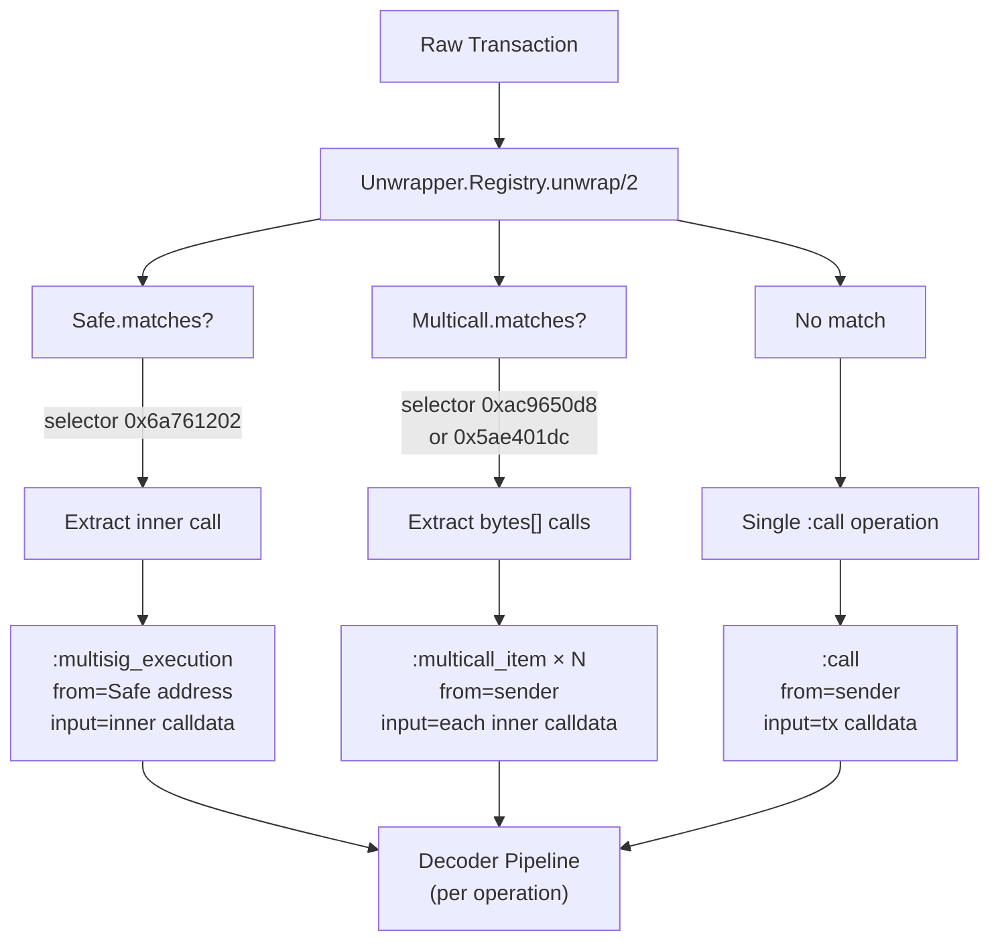

# Unwrap Layer

## Overview

The unwrap layer detects wrapper contract patterns in transactions and decomposes them into their inner operations. It runs at index time inside `extract_operations/1`.

## Flow



## Supported Wrappers

| Wrapper | Selector | Operation Type | From Address |
|---------|----------|---------------|--------------|
| Safe `execTransaction` | `0x6a761202` | `:multisig_execution` | Safe contract address |
| Safe delegatecall | `0x6a761202` (op=1) | `:delegate_call` | Safe contract address |
| `multicall(bytes[])` | `0xac9650d8` | `:multicall_item` | Original sender |
| `multicall(uint256,bytes[])` | `0x5ae401dc` | `:multicall_item` | Original sender |

## Adding a New Unwrapper

1. Create a module implementing `Rexplorer.Unwrapper`:

```elixir
defmodule Rexplorer.Unwrapper.MyWrapper do
  @behaviour Rexplorer.Unwrapper

  @my_selector <<0x12, 0x34, 0x56, 0x78>>

  @impl true
  def matches?(%{input: <<selector::binary-size(4), _::binary>>}, _chain_id) do
    selector == @my_selector
  end
  def matches?(_, _), do: false

  @impl true
  def unwrap(transaction, _chain_id) do
    # Decode and extract inner operations
    [%{operation_type: :call, operation_index: 0, ...}]
  end
end
```

2. Register it in `Rexplorer.Unwrapper.Registry` (before the fallback)

3. Add the function signature to the ABI registry if decoding is needed

## Design Notes

- **Detection is selector-based** — no address lists needed. `execTransaction` is unique to Safe, multicall selectors are standard.
- **Single-level unwrap** — a multicall wrapping a Safe execution won't recursively unwrap the Safe inner call.
- **Only applies to new blocks** — historical transactions indexed before the unwrap layer keep their single `:call` operation.
