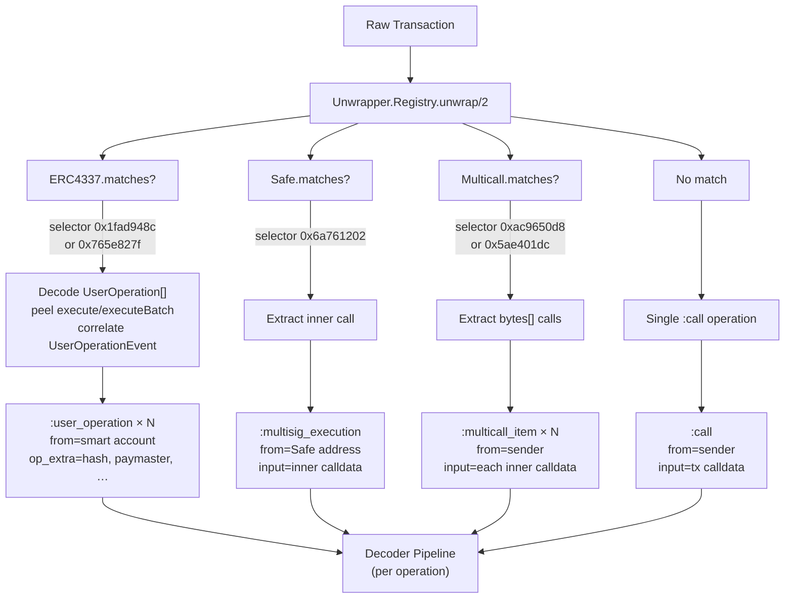

# Unwrap Layer

## Overview

The unwrap layer detects wrapper contract patterns in transactions and decomposes them into their inner operations. It runs at index time inside `extract_operations/1`.

The transaction map an unwrapper receives carries the transaction's logs alongside its calldata, for wrapper patterns whose inner operations are only fully described by the events the wrapper emitted. An unwrapper must still work without them: when logs are absent it produces whatever calldata alone allows.

## Flow


```mermaid
graph TD
    TX["Raw Transaction"] --> Registry["Unwrapper.Registry.unwrap/2"]

    Registry --> AA["ERC4337.matches?"]
    Registry --> Safe["Safe.matches?"]
    Registry --> MC["Multicall.matches?"]
    Registry --> Default["No match"]

    AA -->|"selector 0x1fad948c<br/>or 0x765e827f"| AAUnwrap["Decode UserOperation[]<br/>peel execute/executeBatch<br/>correlate UserOperationEvent"]
    Safe -->|"selector 0x6a761202"| SafeUnwrap["Extract inner call"]
    MC -->|"selector 0xac9650d8<br/>or 0x5ae401dc"| MCUnwrap["Extract bytes[] calls"]
    Default --> DefaultOp["Single :call operation"]

    AAUnwrap --> Op0[":user_operation × N<br/>from=smart account<br/>op_extra=hash, paymaster, …"]
    SafeUnwrap --> Op1[":multisig_execution<br/>from=Safe address<br/>input=inner calldata"]
    MCUnwrap --> Op2[":multicall_item × N<br/>from=sender<br/>input=each inner calldata"]
    DefaultOp --> Op3[":call<br/>from=sender<br/>input=tx calldata"]

    Op0 --> Decoder["Decoder Pipeline<br/>(per operation)"]
    Op1 --> Decoder
    Op2 --> Decoder
    Op3 --> Decoder
```

## Supported Wrappers

| Wrapper | Selector | Operation Type | From Address |
|---------|----------|---------------|--------------|
| EntryPoint v0.6 `handleOps` | `0x1fad948c` | `:user_operation` | UserOperation sender (smart account) |
| EntryPoint v0.7/v0.8 `handleOps` | `0x765e827f` | `:user_operation` | UserOperation sender (smart account) |
| Safe `execTransaction` | `0x6a761202` | `:multisig_execution` | Safe contract address |
| Safe delegatecall | `0x6a761202` (op=1) | `:delegate_call` | Safe contract address |
| `multicall(bytes[])` | `0xac9650d8` | `:multicall_item` | Original sender |
| `multicall(uint256,bytes[])` | `0x5ae401dc` | `:multicall_item` | Original sender |

## ERC-4337 Bundles

A bundler submits `handleOps` to an EntryPoint, so an unwrapped bundle is the
difference between "Called 0x1fad948c on 0x0000000071727de2…" and one story per
smart account. `Rexplorer.Unwrapper.ERC4337` handles both live EntryPoint
calldata shapes; the fields it reads sit at the same tuple positions in each,
so one extraction path serves both:

| EntryPoint | Ops array element | Fields |
|------------|-------------------|--------|
| v0.6 | `UserOperation` (11) | sender, nonce, initCode, callData, …, paymasterAndData, signature |
| v0.7 / v0.8 | `PackedUserOperation` (9) | sender, nonce, initCode, callData, packed gas fields, paymasterAndData, signature |

v0.8 kept v0.7's calldata, so the selector cannot tell them apart. The version
recorded on the operation comes from the canonical EntryPoint addresses
(`0x5ff137d4…` v0.6, `0x00000000717…` v0.7, `0x4337084d…` v0.8) and falls back
to the calldata shape for any other deployment. Detection itself stays
selector-based, so a chain running its own EntryPoint still unwraps.

### Two-level unwrap

A UserOperation's `callData` is a call to the smart account *itself*, so the
unwrapper peels that second layer as well — otherwise every AA transaction
would read "Called execute on 0x…". This is the one place the layer's
single-level rule is relaxed, because the second level is the account interface
the standard defines, not an arbitrary wrapper.

| Account calldata | Selector | Produces |
|------------------|----------|----------|
| `execute(address,uint256,bytes)` | `0xb61d27f6` | one operation at the inner target |
| `executeBatch(address[],bytes[])` | `0x18dfb3c7` | one operation per inner call |
| `executeBatch(address[],uint256[],bytes[])` | `0x47e1da2a` | one operation per inner call, with values |
| anything else | — | one operation at the smart account, raw `callData` kept |

Operations from one UserOperation share a `user_op_index`, so a batched
UserOperation regroups into a single card in the UI.

Adding support for a wallet vendor's own execution selector (Kernel, Biconomy,
the Safe 4337 module) is one entry in that table plus its signature in the ABI
registry.

### Event correlation

The EntryPoint emits one `UserOperationEvent` per UserOperation, in bundle
order, whether it succeeded or reverted. When the transaction's logs are
present they are matched positionally and are authoritative — a v0.7 paymaster
address is otherwise buried in an opaque `paymasterAndData`.

Correlation applies **only when the event count equals the UserOperation
count**. A mismatch means the bundle is not the shape we think it is (an
aggregated bundle, an unexpected EntryPoint version), and a positional zip
would then attribute one user's hash and paymaster to another user's
operation. Dropping the enrichment is recoverable; mis-attributing it is not.

What lands in `op_extra`:

| Key | Source |
|-----|--------|
| `user_op_hash` | `UserOperationEvent` topic1 |
| `user_op_index` | position in the bundle — the grouping key |
| `entry_point` | the transaction's `to_address` |
| `entry_point_version` | `"0.6"`, `"0.7"` or `"0.8"` — from the canonical EntryPoint address, else the calldata shape |
| `paymaster` | event topic3, else the `paymasterAndData` prefix |
| `factory` | the `initCode` prefix |
| `success` | event data — this UserOperation's own outcome |
| `actual_gas_cost` | event data, as a decimal string |

Keys are omitted rather than set to nil, so `Map.has_key?/2` is meaningful.
Addresses that played a role — EntryPoint, paymaster, smart account, factory —
are labelled by `Rexplorer.Labels` as the block is indexed.

## Adding a New Unwrapper

1. Create a module implementing `Rexplorer.Unwrapper`:

```elixir
defmodule Rexplorer.Unwrapper.MyWrapper do
  @behaviour Rexplorer.Unwrapper

  @my_selector <<0x12, 0x34, 0x56, 0x78>>

  @impl true
  def matches?(%{input: <<selector::binary-size(4), _::binary>>}, _chain_id) do
    selector == @my_selector
  end
  def matches?(_, _), do: false

  @impl true
  def unwrap(transaction, _chain_id) do
    # Decode and extract inner operations
    [%{operation_type: :call, operation_index: 0, ...}]
  end
end
```

2. Register it in `Rexplorer.Unwrapper.Registry` (before the fallback)

3. Add the function signature to the ABI registry if decoding is needed

## Design Notes

- **Detection is selector-based** — no address lists needed. `execTransaction` is unique to Safe, multicall selectors are standard.
- **Single-level unwrap** — a multicall wrapping a Safe execution won't recursively unwrap the Safe inner call. The one exception is ERC-4337, where the account-level `execute`/`executeBatch` is peeled as part of the same standard.
- **Optimistic detection, safe fallback** — an unwrapper that matches but cannot decode returns nothing, and the registry falls back to a single `:call`. A false positive therefore degrades to the pre-unwrap behaviour rather than producing a wrong operation.
- **Only applies to new blocks** — historical transactions indexed before the unwrap layer keep their single `:call` operation.
