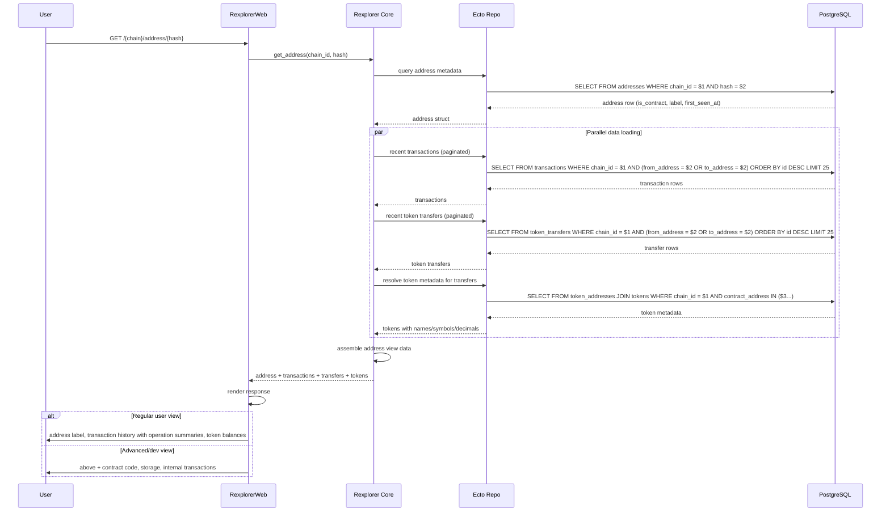
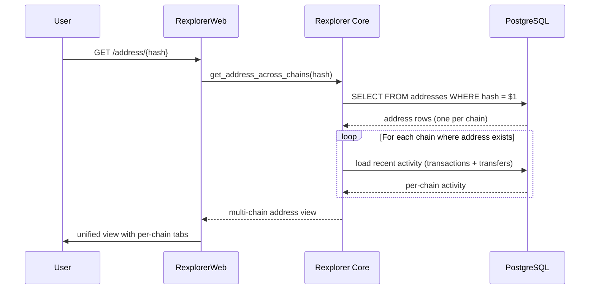

# Address View Workflow

## Overview

This workflow describes how the address page assembles data from multiple tables to present a comprehensive view of an address: its metadata, transaction history, token transfers, and balances across chains.

## Sequence Diagram

## Step-by-Step

1. **Address Lookup** — query the `addresses` table by `(chain_id, hash)` using the unique index. Returns metadata: is_contract flag, label (ENS/known name), first_seen_at timestamp.

2. **Parallel Data Loading** — to minimize latency, the following queries run in parallel:

   - **Recent Transactions:** paginated query on `transactions` table, matching on `from_address` or `to_address`. Uses the `(chain_id, from_address)` and `(chain_id, to_address)` indexes.

   - **Recent Token Transfers:** paginated query on `token_transfers` table with the same address matching pattern.

   - **Token Metadata:** for the token contract addresses found in transfers, resolve names, symbols, and decimals via `token_addresses` → `tokens` join.

3. **Data Assembly** — combine all loaded data into the address view struct.

4. **Response Rendering:**
   - **Regular user view:** Address label, paginated transaction list with human-readable operation summaries, token transfer history with resolved names and formatted amounts
   - **Advanced/dev view:** All of the above plus contract bytecode (if contract), storage state queries, internal transaction traces

## Pagination Strategy

- Cursor-based pagination using `id` (bigint) as the cursor — more efficient than OFFSET for large result sets
- Default page size: 25 items
- Separate cursors for transactions and token transfers (independent pagination)

## Cross-Chain Address View

When no chain is specified (e.g., `/address/{hash}`), the system can show the address across all chains where it appears:

## Query Optimization

- Address lookups use the `(chain_id, hash)` unique index
- Transaction queries use `(chain_id, from_address)` and `(chain_id, to_address)` indexes
- Token transfer queries use the same index pattern
- Token metadata can be aggressively cached (changes are rare)
- Consider materialized views for address balance aggregations at scale
