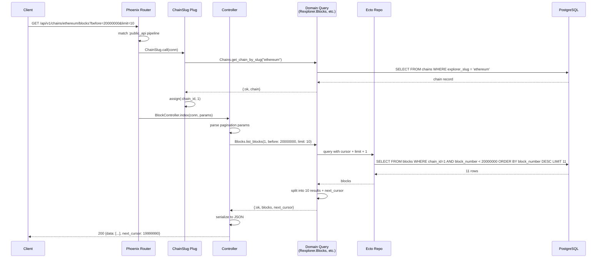
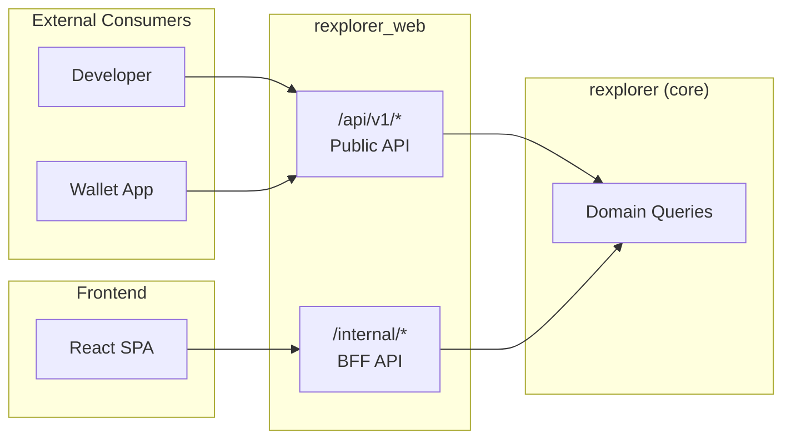

# API Request Workflow

## Overview

This workflow shows how an API request flows through the Phoenix web layer, from router to JSON response.

## Sequence Diagram

## Two-Tier Architecture

The public API (`/api/v1/*`) and BFF (`/internal/*`) share the same domain query layer but have separate controllers and serialization. The public API is stable and versioned; the BFF is free to evolve with the UI.
