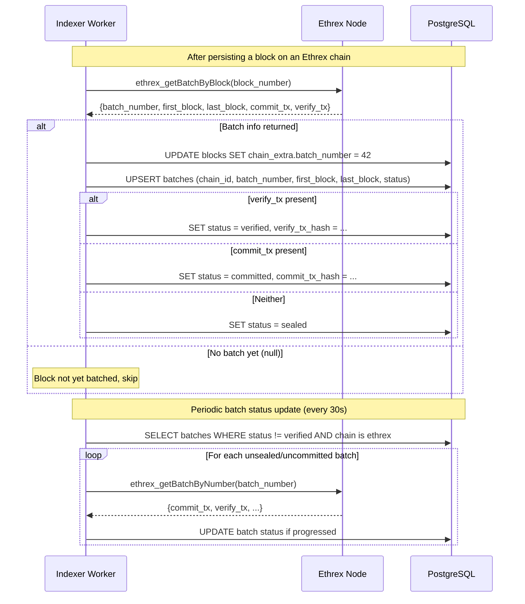

# Batch Lifecycle Workflow

## Overview

Ethrex ZK rollup chains group blocks into batches that go through a commit/verify lifecycle on L1. The indexer tracks batch info alongside block indexing.

## Sequence Diagram



## Batch States

```
┌────────┐    commitBatch()    ┌───────────┐    verifyBatches()    ┌──────────┐
│ Sealed │ ──────────────────▶ │ Committed │ ────────────────────▶ │ Verified │
└────────┘                     └───────────┘                       └──────────┘
  Blocks                        commit_tx_hash                      verify_tx_hash
  grouped                       set (L1 tx)                         set (L1 tx)
  locally                                                           ZK proof valid
```

## Data Model

```
batches table:
  chain_id      → FK to chains
  batch_number  → unique per chain
  first_block   → first L2 block in batch
  last_block    → last L2 block in batch
  status        → sealed | committed | verified
  commit_tx_hash → L1 tx that committed the batch
  verify_tx_hash → L1 tx that verified the ZK proof

blocks.chain_extra:
  batch_number  → denormalized for O(1) block→batch lookup
```

## Lookup Patterns

| Query | Method |
|-------|--------|
| Block → batch | Read `block.chain_extra.batch_number` (O(1)) |
| Batch → blocks | Query batches table for `first_block`/`last_block` range |
| Batch lifecycle | Query batches table by `(chain_id, batch_number)` |
| Unverified batches | Query `WHERE status != 'verified'` for status updates |
