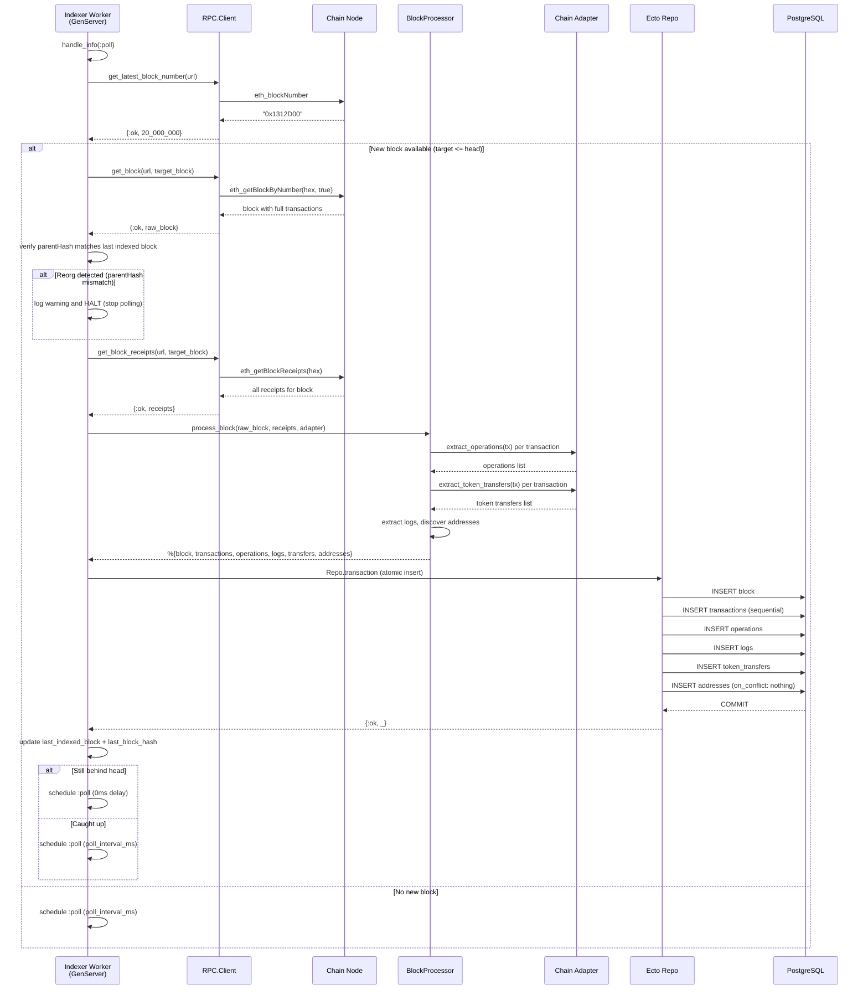

# Block Indexing Workflow

## Overview

This workflow describes how a new block is fetched from a blockchain node, processed through the chain adapter, and persisted to the database. Each chain runs its own `RexplorerIndexer.Worker` GenServer with an independent poll loop.

## Sequence Diagram



## Components

| Component | Module | App | Responsibility |
|-----------|--------|-----|---------------|
| RPC Client | `Rexplorer.RPC.Client` | `rexplorer` | Stateless JSON-RPC HTTP wrapper |
| Worker | `RexplorerIndexer.Worker` | `rexplorer_indexer` | Per-chain GenServer poll loop |
| BlockProcessor | `RexplorerIndexer.BlockProcessor` | `rexplorer_indexer` | Pure RPC→Ecto transformation |
| Chain Adapter | `Rexplorer.Chain.Adapter` | `rexplorer` | Chain-specific extraction logic |
| Supervisor | `RexplorerIndexer.ChainSupervisor` | `rexplorer_indexer` | Starts/restarts workers |

## Error Handling

- **RPC failures:** Worker logs the error and retries on next poll cycle.
- **Duplicate blocks:** Unique constraint on `(chain_id, block_number)` prevents double-indexing. Worker detects and skips.
- **Chain reorganizations:** Detected via parentHash mismatch. Worker halts and requires manual intervention (v1). Auto-recovery planned for v2.
- **Worker crashes:** Supervisor restarts the worker. Worker bootstraps from DB on restart, resuming from last indexed block.

## Configuration

RPC endpoints are configured per-chain in `config/config.exs`:

```elixir
config :rexplorer_indexer,
  chains: %{
    1 => %{rpc_url: "http://localhost:8545"},
    10 => %{rpc_url: "http://localhost:9545"}
  }
```
