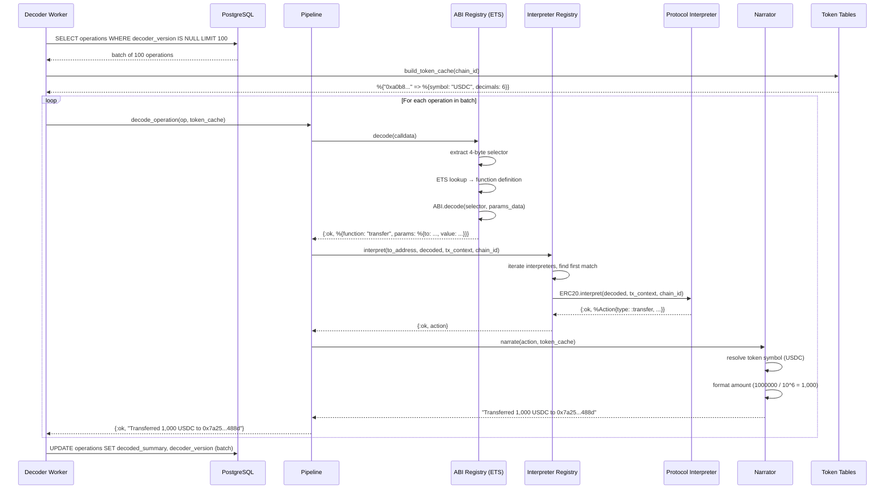

# Decode Operation Workflow

## Overview

This workflow shows how the decoder worker processes an operation's calldata into a human-readable summary.

## Sequence Diagram

## Error Handling

- **Unknown selector:** Pipeline returns a fallback string like "Called 0x38ed on 0x68b3..."
- **No interpreter match:** Pipeline returns "Called transfer on 0x68b3..." (function name known, protocol unknown)
- **Decode exception:** Worker catches error, sets `decoder_version` to current (prevents retry), leaves `decoded_summary` as nil
