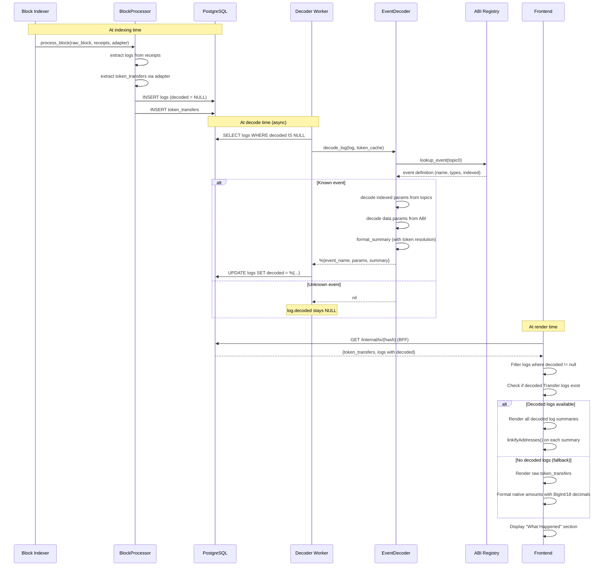

# Effects Composition Workflow

## Overview

The "What Happened" section on the transaction detail page shows a human-readable timeline of on-chain effects. It is composed from two data sources: decoded event logs and raw token transfers.

## Data Flow

## Supported Event Types

| Event | Protocol | Summary Format |
|-------|----------|---------------|
| Transfer | ERC-20 | "Transfer 1,000 USDC from 0x7a25... to 0x3075..." |
| Approval | ERC-20 | "Approval: 0x7a25... approved 0x68b3... for Unlimited USDC" |
| Swap | Uniswap V2 | "Swap on pool 0x8ad5..." |
| Swap | Uniswap V3 | "Swap on pool 0x8ad5..." |
| Supply | Aave V3 | "Supply 1,000 USDC to Aave" |
| Withdraw | Aave V3 | "Withdraw 1,000 USDC from Aave" |
| Borrow | Aave V3 | "Borrow 500 USDC from Aave" |
| Repay | Aave V3 | "Repay 500 USDC to Aave" |
| Deposit | WETH | "WETH Deposit 1.0 ETH" |
| Withdrawal | WETH | "WETH Withdrawal 1.0 ETH" |

## Amount Formatting

- **Known tokens** (in token cache): raw amount divided by token's decimals
- **Unknown tokens** (not in cache): raw amount displayed as-is (no incorrect guessing)
- **Unlimited approvals** (amount ≥ 10^30): displayed as "Unlimited"
- **Native transfers** (frontend fallback): BigInt division by 10^18

## Deduplication

When decoded Transfer logs exist, the frontend shows the decoded summaries (which have proper token resolution and formatting). Raw token_transfers are only shown as a fallback when no decoded Transfer events are available — preventing duplicate display of the same transfer.
