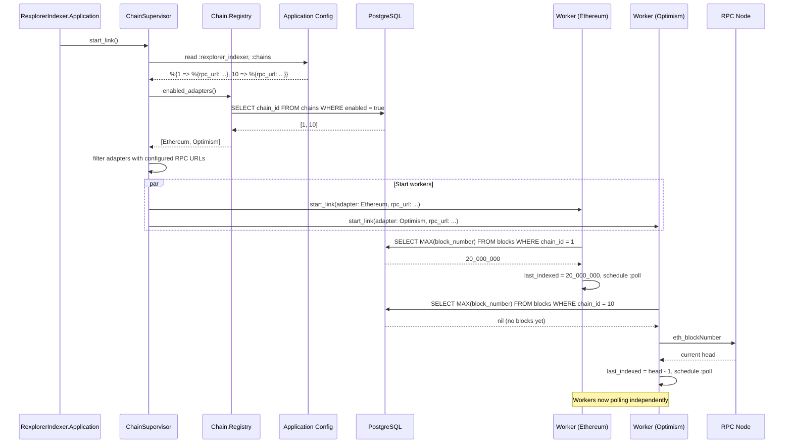

# Indexer Startup Workflow

## Overview

This workflow describes how the indexer application boots up, discovers enabled chains, and starts per-chain worker processes that begin indexing.

## Sequence Diagram

## Step-by-Step

1. **Application Start** — `RexplorerIndexer.Application.start/2` starts `ChainSupervisor` as a child.

2. **Chain Discovery** — The supervisor reads the chain configuration (RPC URLs) and queries the registry for enabled adapters. Only chains with both an enabled DB record AND a configured RPC URL are started.

3. **Worker Start** — One `RexplorerIndexer.Worker` is started per chain, supervised with `:one_for_one` strategy.

4. **DB Bootstrap** — Each worker queries `MAX(block_number)` for its chain. If blocks exist, it resumes from there. If no blocks exist (fresh chain), it queries the RPC node for the current head and starts from there.

5. **First Poll** — Workers schedule their first `:poll` message with 0ms delay, beginning the indexing loop.

## Failure Scenarios

| Scenario | Behavior |
|----------|----------|
| DB unavailable at boot | Supervisor fails to start, application retries |
| RPC unavailable at boot | Worker starts but bootstrap uses block 0 as fallback, first poll will fail and retry |
| Worker crash during indexing | Supervisor restarts worker with backoff, worker re-bootstraps from DB |
| Chain disabled in DB | Worker not started for that chain |
| No RPC URL configured | Worker not started, warning logged |
