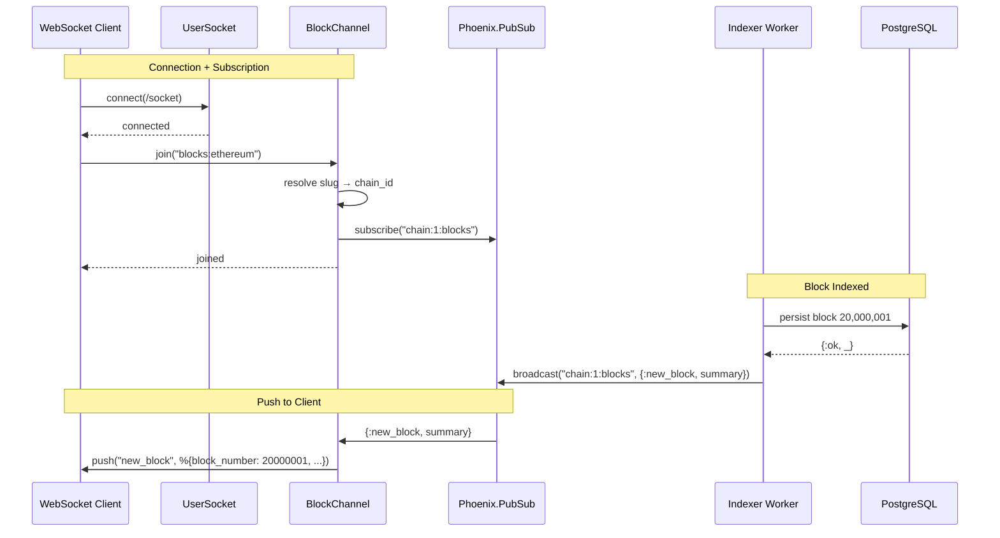
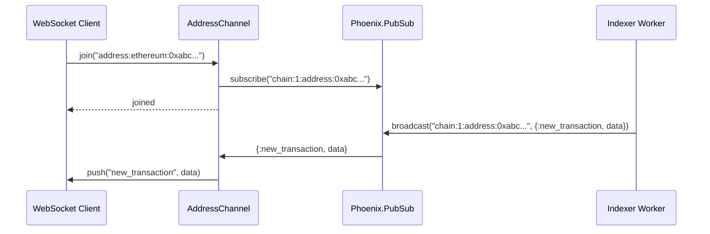

# Real-time Subscription Workflow

## Overview

This workflow shows how clients receive real-time updates via Phoenix Channels. The indexer broadcasts events through PubSub after persisting blocks, and channel processes push them to connected WebSocket clients.

## Sequence Diagram

## Address Activity

## Available Topics

| Topic Pattern | Events | Description |
|---------------|--------|-------------|
| `blocks:<chain_slug>` | `new_block` | New block indexed on chain |
| `address:<chain_slug>:<hash>` | `new_transaction`, `new_token_transfer` | Activity on address |

## Connection Details

- **Endpoint:** `/socket`
- **Transport:** WebSocket
- **Authentication:** None (v1)
- **Library:** Any Phoenix Channel client (JavaScript, Elixir, etc.)
