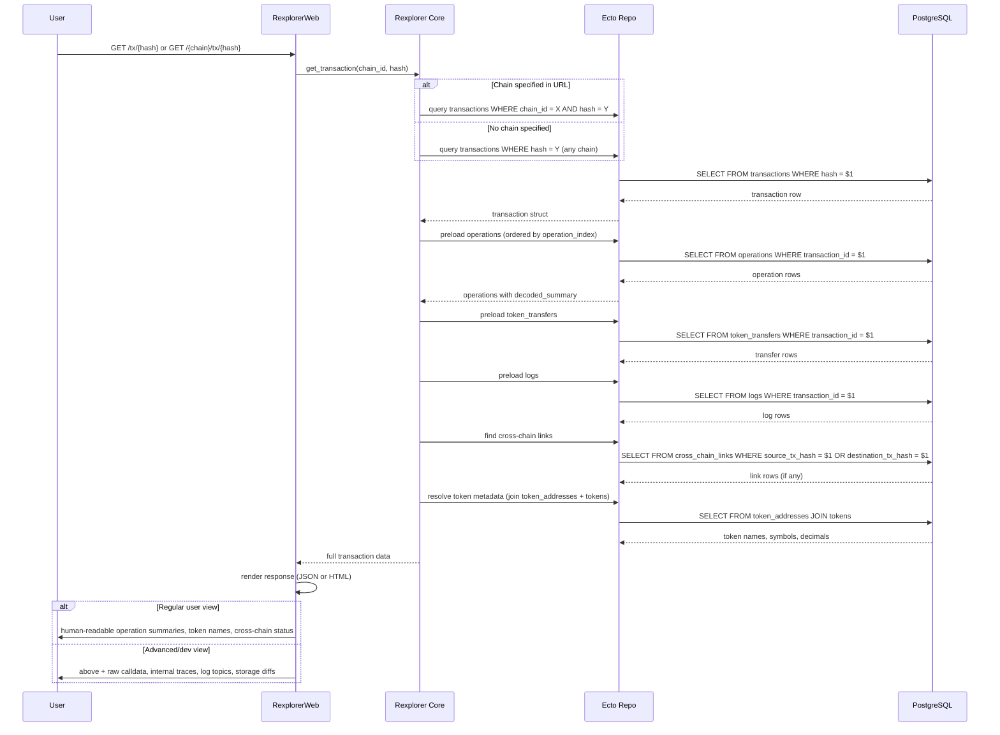

# Transaction Lookup Workflow

## Overview

This workflow describes how a user's transaction hash query is resolved into a full transaction view, including operations (user intents), token transfers, event logs, and cross-chain links.

## Sequence Diagram

## Step-by-Step

1. **URL Routing** — the user provides a transaction hash, optionally scoped to a chain via URL prefix (e.g., `/optimism/tx/0xabc...`). If no chain is specified, the system searches across all chains.

2. **Transaction Lookup** — query the `transactions` table by `(chain_id, hash)` or just `hash`. Uses the unique index for fast lookups.

3. **Operation Loading** — preload all operations for the transaction, ordered by `operation_index`. Each operation may have a `decoded_summary` with the human-readable narration.

4. **Token Transfer Loading** — preload token transfers to show value movements (ERC-20, ERC-721, native transfers).

5. **Log Loading** — preload event logs. The `decoded` JSONB field may contain decoded event data from the decoder pipeline.

6. **Cross-Chain Link Resolution** — check if this transaction is part of a cross-chain journey (bridge deposit/withdrawal). If found, include the link status and the related transaction on the other chain.

7. **Token Metadata Resolution** — for token transfers, join through `token_addresses` to `tokens` to resolve human-readable names, symbols, and decimal places.

8. **Response Rendering** — the web layer renders the data with two levels of detail:
   - **Regular user view:** Human-readable operation summaries, token names/amounts, cross-chain status
   - **Advanced/dev view:** All of the above plus raw calldata, internal call traces, log topics, storage diffs

## Query Optimization

- Transaction lookup uses the `(chain_id, hash)` unique index — O(1) lookup
- Operations, transfers, and logs are loaded via foreign key index on `transaction_id`
- Cross-chain links use indexes on `source_tx_hash` and `destination_tx_hash`
- Token metadata can be cached (tokens table changes rarely)
