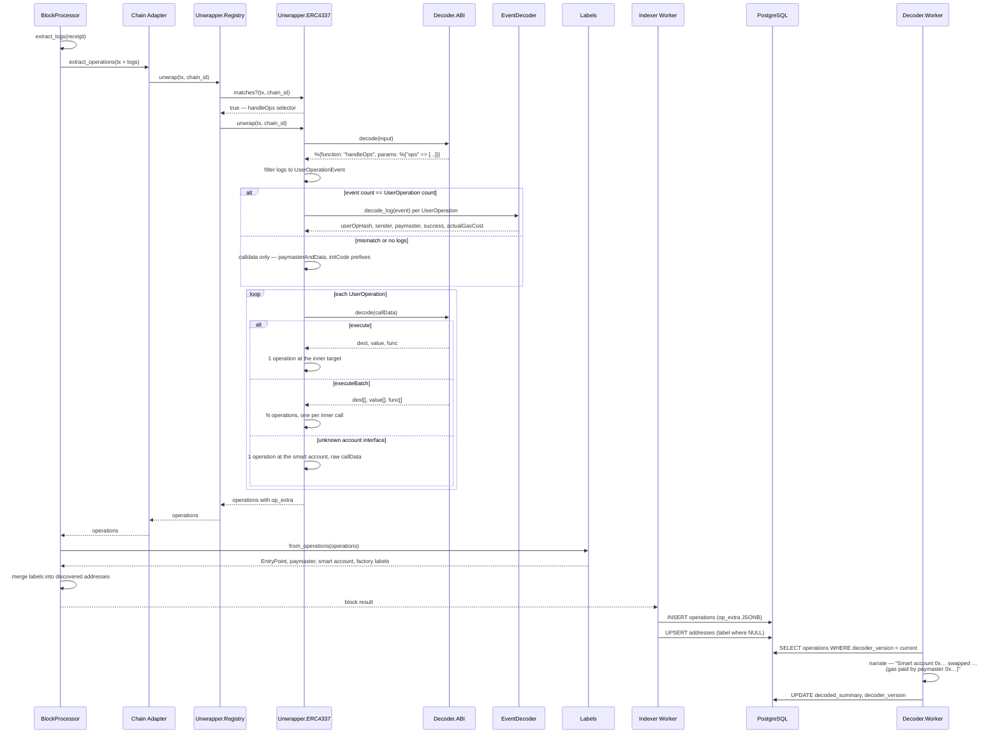

# User Operation Indexing Workflow

## Overview

An ERC-4337 bundle arrives as an ordinary transaction: a bundler EOA calling
`handleOps` on an EntryPoint. Without unwrapping it produces one `:call`
operation from the one address in the transaction with no user intent at all.

This workflow describes how that bundle becomes one operation per user intent,
attributed to the smart account that authored it. It is the ERC-4337 path
through the second stage of the decoder pipeline — see
[`unwrap-layer.md`](../unwrap-layer.md) for the layer as a whole and
[`block-indexing.md`](block-indexing.md) for the surrounding block flow.

## Sequence Diagram

## What each stage contributes

| Stage | Module | Contributes |
|-------|--------|-------------|
| Detection | `Unwrapper.ERC4337.matches?/2` | Which EntryPoint shape, by selector |
| Bundle decode | `Decoder.ABI` | The UserOperation array |
| Correlation | `Decoder.EventDecoder` | userOpHash, paymaster, success, gas cost |
| Account peel | `Unwrapper.ERC4337` | The real target of each inner call |
| Labels | `Rexplorer.Labels` | Role names for the addresses involved |
| Narration | `Decoder.Pipeline` | The sentence a user reads |

## Failure modes

| Situation | Result |
|-----------|--------|
| `handleAggregatedOps` (BLS bundle) | Not matched — falls through to a single `:call` |
| Calldata does not decode | Unwrapper returns `[]`, registry falls back to a single `:call` |
| Event count ≠ UserOperation count | Correlation skipped; operations still produced from calldata |
| No logs available | Same, minus `user_op_hash`, `success` and `actual_gas_cost` |
| Unknown account execution selector | Operation stays at the smart account with its calldata intact |

Every one of these degrades to less detail, never to a wrong attribution: the
sender of a UserOperation is read from the bundle calldata, so it is correct
even when nothing else is available.

## Where the data surfaces

- **Transaction page** — a User Operations section, one card per UserOperation,
  with sender, outcome, sponsorship and the actions it performed
- **BFF** `GET /internal/chains/:slug/transactions/:hash` — `op_extra` per operation
- **Public API** `GET /api/v1/chains/:slug/transactions/:hash/operations` — the same fields
- **Search** — a userOpHash resolves to its parent transaction
- **Address pages** — role labels (`Smart Account`, `ERC-4337 Paymaster`, …)
