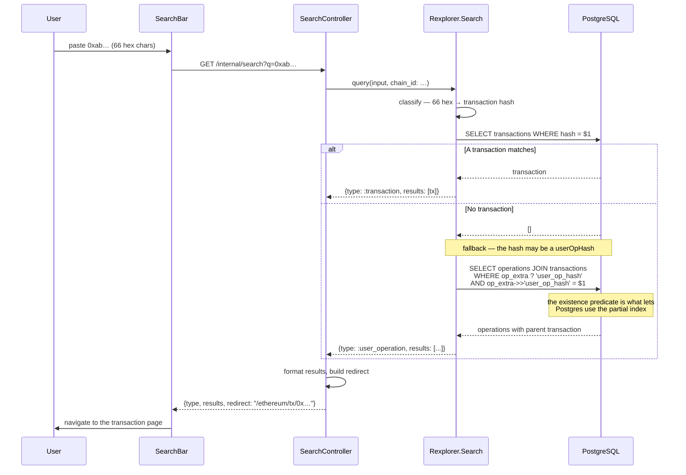

# UserOp Hash Lookup Workflow

## Overview

A user who sent a transaction through a smart wallet has a **userOpHash**, not
a transaction hash — that is what their wallet showed them. Pasting it into the
search bar must land them on the transaction it was bundled into.

The lookup is a fallback on the transaction-hash path: both are 66-character
hex strings, and transaction hashes are the overwhelmingly common case, so they
must not pay for the fallback.

## Sequence Diagram



## The index

```sql
CREATE INDEX operations_user_op_hash_idx
  ON operations (chain_id, (op_extra->>'user_op_hash'))
  WHERE op_extra ? 'user_op_hash';
```

Partial, because ERC-4337 operations are a small fraction of all operations.
The partial predicate is only usable when the query carries it, which is why
`Rexplorer.Search` includes `op_extra ? 'user_op_hash'` alongside the equality
— without it the planner falls back to a scan.

## Notes

- A batched UserOperation produces several operations sharing one hash. They
  all live in the same transaction, so the redirect is the same for each.
- Scoping to a chain adds `chain_id` to the query, matching the index's leading
  column.
- A hash matching neither a transaction nor a userOpHash returns an empty
  result, exactly as before this fallback existed.
