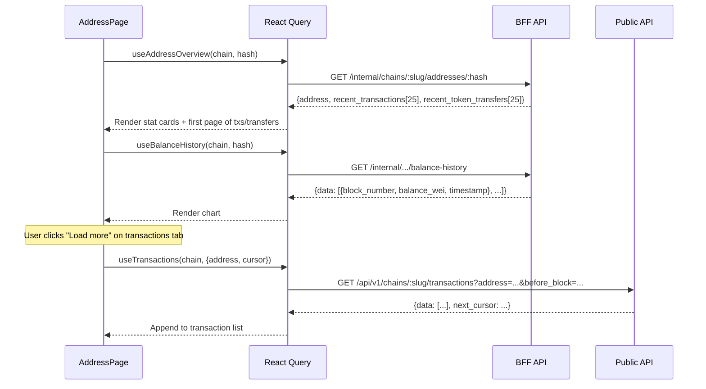

## Context

The address page (`frontend/src/pages/AddressPage.tsx`) currently shows the address hash, a contract badge, an optional label, and two stacked lists: recent transactions (25) and recent token transfers (25). No balance, no chart, no pagination. The backend already serves:

- `balance_wei` on the address overview response (`GET /internal/chains/:slug/addresses/:hash`)
- Balance history (`GET /internal/chains/:slug/addresses/:hash/balance-history`)
- Paginated transactions (`GET /api/v1/chains/:slug/transactions?address=...&limit=25`)
- Paginated token transfers (`GET /api/v1/chains/:slug/addresses/:hash/token-transfers?limit=25`)

The frontend is a React 19 SPA with TypeScript, Tailwind CSS, React Query, and no chart library.

## Goals / Non-Goals

**Goals:**
- Show the address balance prominently with native token symbol
- Display a balance-over-time area chart from the balance history endpoint
- Show stat cards: Balance, Last Active, First Seen
- Reorganize tx and transfers into tabs with cursor-based "Load more" pagination
- Keep the implementation dependency-free (no chart library)

**Non-Goals:**
- Fiat conversion
- Real-time WebSocket balance updates
- ERC-20/721/1155 token balance display
- Chart tooltips, zoom, or time-range selectors
- Infinite scroll (use explicit "Load more" button)

## Decisions

### 1. Hand-rolled SVG area chart

**Decision:** Build the balance chart as a React component rendering an SVG `<path>` for the area and line. No external chart library.

**Why:** The frontend is dependency-light (no UI library, just Tailwind). A simple area chart needs ~60 lines of SVG path math. Adding `recharts` (200KB) or similar for a single chart is disproportionate.

**The chart component receives an array of `{timestamp, balance_wei}` points and:**
- Maps timestamps to X coordinates
- Maps balance values to Y coordinates (inverted, with padding)
- Renders a filled area path + a stroke line path
- Shows min/max labels on the Y axis
- Handles empty state gracefully

**Alternatives considered:**
- `recharts`: full-featured but heavy for one chart
- `lightweight-charts`: TradingView quality but financial-chart-focused
- Canvas-based: harder to style with Tailwind/CSS variables

### 2. Tabs for transactions and token transfers

**Decision:** Use the existing `Tabs` UI component to switch between Transactions and Token Transfers sections.

**Why:** With the chart and stat cards taking vertical space, stacking both lists makes the page too long. Tabs reduce scroll depth and match common explorer patterns (Etherscan, Blockscout).

### 3. Pagination via public API endpoints

**Decision:** For paginated data (transactions, token transfers), use the public API endpoints (`/api/v1/...`) which already support cursor-based pagination, rather than the BFF overview endpoint which returns a fixed 25 items.

**Why:** The BFF overview is optimized for the initial page load (single request, no pagination). For "Load more," dedicated paginated endpoints are the right fit. The overview still provides the first page of data — subsequent pages come from the public API.

**Data flow:**



### 4. "Last Active" derived from existing data

**Decision:** Derive "Last Active" from `recent_transactions[0].block_number` joined with block timestamp, falling back to `first_seen_at` if no transactions exist. No new backend endpoint.

**Why:** The overview already returns recent transactions ordered by most recent. The block is preloaded, so the timestamp is available.

### 5. Balance formatting

**Decision:** Format balance using BigInt division by 10^18 (same pattern as existing `formatTransferAmount`), showing up to 6 decimal places. Display alongside the chain's native token symbol.

**Chain extensibility:** The native token symbol comes from the chain data (already available via `useChains` or could be passed from a parent context). The existing `NATIVE_SYMBOLS` lookup pattern on the page handles this.

## Page Layout

```
┌──────────────────────────────────────────────────────┐
│  Address                               [Contract]    │
│  0xabc...def (monospace, break-all)                  │
│  "Uniswap Router" (label, if present)                │
├──────────────────────────────────────────────────────┤
│  ┌──────────────┐ ┌──────────────┐ ┌──────────────┐ │
│  │   Balance    │ │ Last Active  │ │  First Seen  │ │
│  │  2.53 ETH   │ │   2h ago     │ │   3d ago     │ │
│  └──────────────┘ └──────────────┘ └──────────────┘ │
├──────────────────────────────────────────────────────┤
│  Balance History                                     │
│  ┌──────────────────────────────────────────────┐   │
│  │ 3.0 ─                        ╱╲              │   │
│  │      ╱╲      ╱╲             ╱  ╲─────        │   │
│  │     ╱  ╲────╱  ╲───╲      ╱               │   │
│  │ 1.0 ╱              ╲────╱                    │   │
│  │     Jan    Feb    Mar    Apr                  │   │
│  └──────────────────────────────────────────────┘   │
├──────────────────────────────────────────────────────┤
│  [Transactions]  [Token Transfers]                   │
│  ┌──────────────────────────────────────────────┐   │
│  │  0xabc → 0xdef   2.5 ETH         OK         │   │
│  │  0x123 → 0x456   0.1 ETH         OK         │   │
│  │  ...                                         │   │
│  │         [ Load more ]                        │   │
│  └──────────────────────────────────────────────┘   │
└──────────────────────────────────────────────────────┘
```

## Risks / Trade-offs

**[Risk] Large balance history datasets** — An address touched every block on a busy chain could have thousands of data points. The SVG chart may become sluggish.
- Mitigation: The backend already limits to 500 points by default. For denser data, we can downsample on the backend or add a `limit` param later.

**[Risk] SVG chart edge cases** — Single data point, all-zero balances, or very large numbers could produce degenerate charts.
- Mitigation: Handle in the component — show "No history" for empty data, clamp the Y axis for single points.

**[Risk] Two API calls for initial page load** — Overview + balance history are separate requests.
- Mitigation: React Query fires both in parallel. The chart can show a skeleton while loading independently.

## Open Questions

None — all data is already served by the backend.
