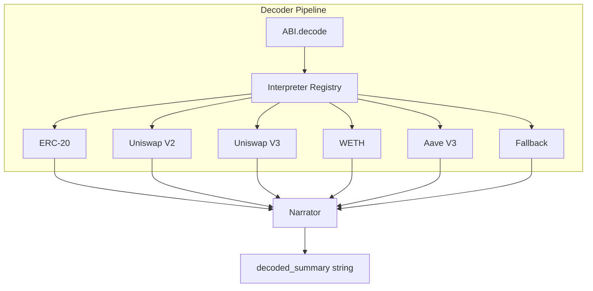
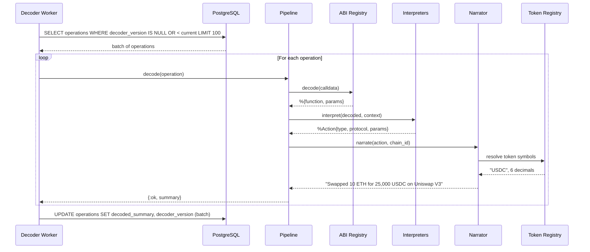

## Context

Rexplorer stores operations with `decoded_summary` (text, nullable) and `decoder_version` (integer, nullable). Both are currently always null. This change adds the decoder pipeline that populates them with human-readable transaction stories.

The pipeline runs as an async worker, independent from the indexer. This decouples indexing speed from decode complexity and provides a natural reprocessing mechanism when the decoder is improved.

## Goals / Non-Goals

**Goals:**
- ABI registry with built-in protocol definitions
- Protocol interpreters for ERC-20, Uniswap V2/V3, WETH, Aave V3
- Narrator that composes actions into human-readable strings with resolved token symbols
- Async decoder worker for batch processing and reprocessing
- Pipeline module orchestrating ABI decode → interpret → narrate

**Non-Goals:**
- Unwrap layer (Safe, AA, Multicall) — follow-up change
- Event/log decoding
- External ABI sources (4byte.directory, Sourcify)
- Contract verification

## Decisions

### Decision 1: ex_abi for ABI decoding

**Choice:** Use `ex_abi` library for ABI encoding/decoding.

**Alternatives considered:**
- **Custom ABI parser:** ABI spec is well-defined but handling all Solidity types (tuples, dynamic arrays, fixed bytes) is substantial work.
- **Ethers.js via Node.js:** Cross-language call overhead, unnecessary complexity.

**Rationale:** `ex_abi` is the established Elixir library for this. It handles selector computation, calldata decoding, and all Solidity types. No reason to rebuild it.

### Decision 2: Built-in ABI registry as ETS table

**Choice:** Load curated ABI definitions into an ETS table at startup, keyed by 4-byte function selector. The registry module provides lookup functions.

**Alternatives considered:**
- **Module attributes / compiled map:** Simpler but harder to extend at runtime.
- **Database table:** Unnecessary persistence for what's essentially config.
- **GenServer with state:** ETS is faster for concurrent reads from the worker.

**Rationale:** ETS gives O(1) concurrent reads without GenServer bottleneck. The registry is loaded once at startup from hardcoded ABI JSON files in `priv/abis/`. Adding a new protocol = adding a JSON file and registering it.

### Decision 3: Interpreter behaviour + registry pattern

**Choice:** Each protocol interpreter is a module implementing the `Rexplorer.Decoder.Interpreter` behaviour. A registry iterates through all interpreters and returns the first match.



**Rationale:** The behaviour pattern makes adding new protocols trivial — implement `matches?/2` and `interpret/2`, add to the registry list. The ordered registry allows priority (more specific interpreters first, fallback last).

### Decision 4: Interpreter matching by address + function

**Choice:** Interpreters match by a combination of known contract addresses (per chain) and function names. Address lists are hardcoded in each interpreter module.

```elixir
# In Rexplorer.Decoder.Interpreter.UniswapV3
@router_addresses %{
  1 => ["0x68b3465833fb72a70ecdf485e0e4c7bd8665fc45"],  # Ethereum
  10 => ["0x68b3465833fb72a70ecdf485e0e4c7bd8665fc45"], # Optimism
  8453 => ["0x2626664c2603336e57b271c5c0b26f421741e481"]  # Base
}

def matches?(to_address, %{function: func}, chain_id) do
  to_address in Map.get(@router_addresses, chain_id, []) and
    func in ["exactInputSingle", "exactInput", "exactOutputSingle", "exactOutput"]
end
```

**Rationale:** For v1, hardcoded addresses are reliable and fast. The top protocols have stable, well-known contract addresses. This can be extended later with factory-based detection.

### Decision 5: Separate async worker in core app

**Choice:** `Rexplorer.Decoder.Worker` is a GenServer in the `rexplorer` core app, not the indexer app. It polls for undecoded operations and processes them in batches.



**Rationale:** Lives in core because it's domain logic. The worker pattern is identical for initial decode and reprocessing — only the WHERE clause changes. Batch updates reduce DB round-trips.

### Decision 6: Token resolution via cached query

**Choice:** The narrator resolves token addresses to symbols by querying `token_addresses` → `tokens`. Results are cached in a process-local map for the duration of a batch to avoid repeated queries for the same token.

**Rationale:** Within a batch of 100 operations, the same tokens appear many times (USDC, WETH, ETH). Caching per-batch eliminates redundant queries. The cache is discarded between batches to stay fresh.

## Risks / Trade-offs

**[Hardcoded address lists need maintenance]** → When protocols deploy new router contracts, the interpreter address lists need updating. Mitigated by: this is rare (major protocol upgrades), and the fallback narrator still produces "Called function on 0x..." for unmatched calls.

**[ex_abi may not handle all edge cases]** → Some contracts use non-standard ABI encoding. Mitigated by: graceful failure handling in the worker (skip and mark with current version).

**[Token resolution requires seeded tokens table]** → If the tokens table is empty, the narrator falls back to truncated addresses. The seed data should include common tokens (ETH, USDC, USDT, DAI, WETH) per chain.

**[Interpreter ordering matters]** → The first matching interpreter wins. If a contract matches multiple interpreters, the more specific one must come first. Mitigated by: explicit ordering in the registry.

## Open Questions

*(none)*
