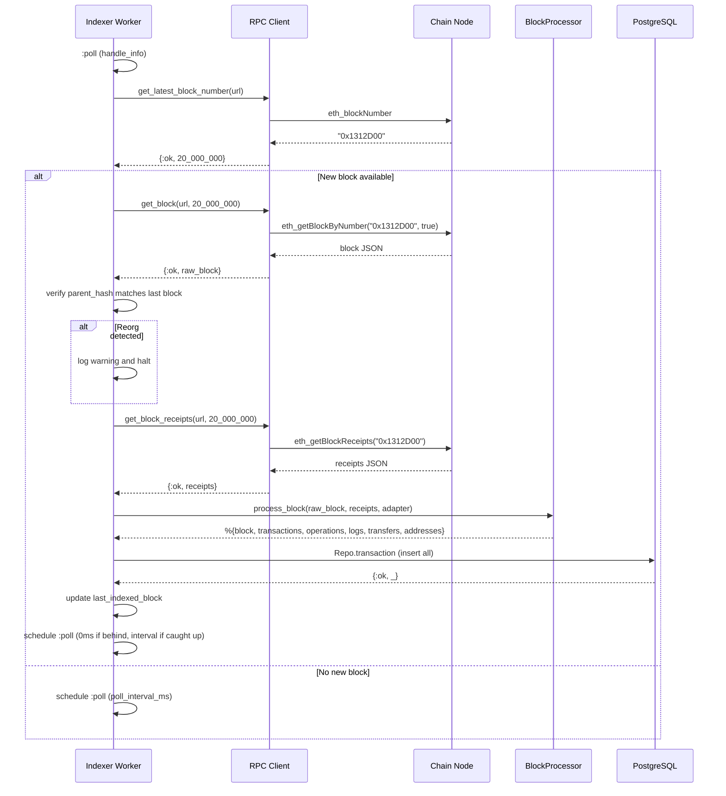

## Context

Rexplorer has the database schema, Ecto schemas, chain adapter behaviour, and Ethereum reference adapter in place. The `rexplorer_indexer` app exists but has no indexing logic. This change adds the live chain indexer — the first data pipeline that populates the database with real blockchain data.

Key constraints:
- Live indexing only (no backfill). Must keep up with block production on each chain.
- Own archive nodes with JSON-RPC endpoints.
- Per-chain isolation — one chain's RPC issues must not affect others.
- Atomic persistence — a block is fully committed or fully rolled back.

## Goals / Non-Goals

**Goals:**
- RPC client in core app for communicating with Ethereum-compatible nodes
- Per-chain GenServer worker with poll loop
- Pure block processing functions (raw RPC → Ecto attrs)
- Atomic block persistence (single DB transaction per block)
- Reorg detection (detect and halt)
- New adapter callbacks: `poll_interval_ms/0`, `extract_token_transfers/1`
- Address discovery and upsert

**Non-Goals:**
- Backfill / parallel block fetching
- Automatic reorg recovery
- Decoder pipeline / decoded_summary population
- Cross-chain link detection
- WebSocket block subscriptions

## Decisions

### Decision 1: Req as HTTP client

**Choice:** Use `Req` for the JSON-RPC HTTP client.

**Alternatives considered:**
- **Finch:** Lower-level, more control over connection pools. But requires more boilerplate for JSON encoding/decoding and error handling.
- **HTTPoison/Hackney:** Older ecosystem, less maintained. Finch/Req have replaced them.
- **Tesla:** Middleware-based, flexible. But adds unnecessary abstraction for a simple JSON-RPC wrapper.
- **Raw Mint:** Too low-level for this use case.

**Rationale:** Req is built on Finch (so we get connection pooling), has built-in JSON encoding/decoding, retry support, and is the modern standard in the Elixir ecosystem. It's the simplest path to a correct, production-quality HTTP client.

### Decision 2: Simple GenServer poll loop

**Choice:** Each chain runs a single GenServer with a `Process.send_after(:poll, interval)` loop.

**Alternatives considered:**
- **GenStage/Broadway pipeline:** Overkill for live indexing where throughput is one block every 2-12 seconds.
- **Task.async per block:** Loses ordering guarantees and state management.

**Rationale:** Live indexing is not a throughput problem. Block production rate (1 block per 2-12 seconds) is well within what a single process can handle. Simple loop is easiest to debug, test, and reason about. When backfill is added later, GenStage/Broadway can be introduced alongside this.



### Decision 3: RPC Client in core app, BlockProcessor in indexer app

**Choice:** `Rexplorer.RPC.Client` lives in the `rexplorer` core app. `RexplorerIndexer.BlockProcessor` and `RexplorerIndexer.Worker` live in the `rexplorer_indexer` app.

**Rationale:** The RPC client may be needed by the web layer in the future (e.g., transaction simulation, live gas price queries). The BlockProcessor and Worker are purely indexer concerns. This follows the established umbrella boundary: core = shared, indexer = ingestion-specific.

### Decision 4: Address upsert strategy

**Choice:** Use `Repo.insert_all` with `on_conflict: :nothing` for address records. Addresses are discovered during block processing and batch-upserted. If the address already exists, it's silently skipped.

**Alternatives considered:**
- **Check-then-insert:** Query first, insert if missing. Requires N queries per block. Too slow.
- **Upsert with update:** `on_conflict: :replace_all`. Would overwrite existing labels or metadata. Wrong.

**Rationale:** `on_conflict: :nothing` is the fastest path — one bulk INSERT that silently skips existing addresses. Since `first_seen_at` is set to the block timestamp, the first insert wins (correct semantics). Later, a separate process can enrich addresses with labels, contract detection, etc.

### Decision 5: Reorg detection — detect and halt

**Choice:** On each new block, verify `parentHash` matches the stored hash of `last_indexed_block`. This check happens immediately after fetching the block header, before fetching receipts, to fail fast. On mismatch, log a warning and stop the worker (no automatic recovery).

**Alternatives considered:**
- **Auto-recovery:** Walk back to fork point, delete divergent blocks, re-index. Correct but complex — involves cascading deletes across transactions, operations, logs, transfers. Deferred to a follow-up change.
- **Ignore reorgs:** Dangerous. Would produce inconsistent data.

**Rationale:** Reorgs on Ethereum mainnet are rare (a few per year). On L2s, "reorgs" are sequencer-level and typically shallow. Detect-and-halt is safe for v1: no bad data enters the system, and an operator can investigate and restart. Auto-recovery is planned for v2.

### Decision 6: Configuration structure

**Choice:** RPC endpoints are configured per-chain in the application config, keyed by chain_id.

```elixir
config :rexplorer_indexer,
  chains: %{
    1 => %{rpc_url: "http://localhost:8545"},
    10 => %{rpc_url: "http://localhost:9545"}
  }
```

**Rationale:** Simple and explicit. Each chain's indexer worker reads its RPC URL from this config at startup. Environment-specific overrides go in `dev.exs` / `prod.exs`. This can later be extended with per-chain options (batch size, timeout, etc.) without changing the structure.

## Risks / Trade-offs

**[eth_getBlockReceipts not universally supported]** → Most modern nodes (Geth 1.13+, Erigon, Reth) support it. Since we run our own archive nodes, we control the node software. If a node doesn't support it, we'd need a fallback to per-transaction `eth_getTransactionReceipt`. Deferred — not needed for v1 with own nodes.

**[GenServer state lost on crash]** → Worker state (last_indexed_block) is bootstrapped from DB on restart. The only risk is re-processing the last block, which is handled by duplicate detection (unique constraint + skip).

**[Halting on reorg blocks the chain]** → Acceptable for v1. Reorgs are rare on mainnet, and on L2s the operator can restart after the sequencer stabilizes. Monitoring/alerting on worker halts is recommended.

**[No backpressure on DB writes]** → With live indexing (1 block per 2-12 seconds), DB writes are never a bottleneck. This becomes relevant only with backfill, which is out of scope.

## Open Questions

*(none — all questions resolved during exploration)*
