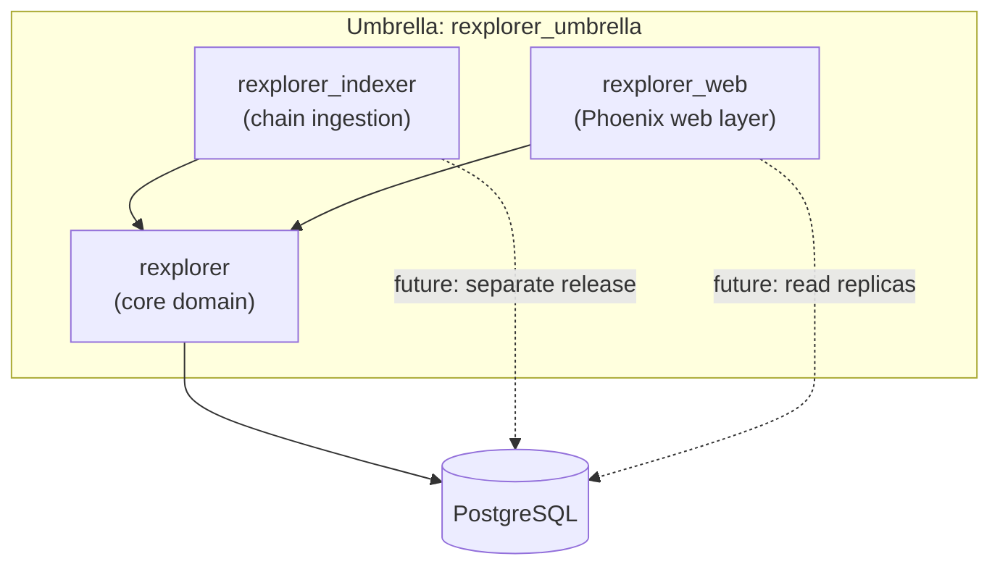
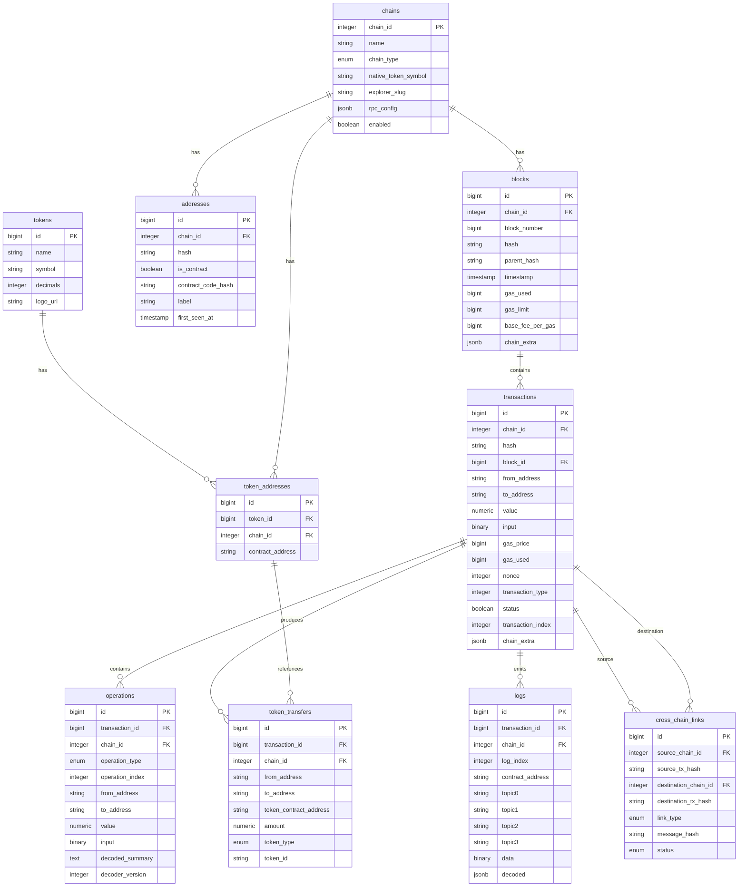
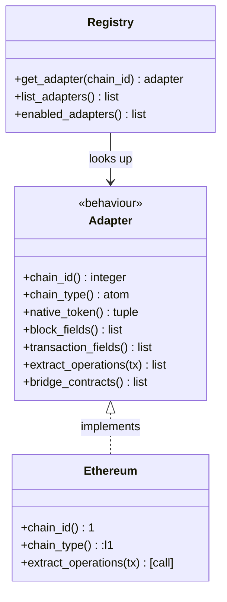

## Context

Rexplorer is a greenfield Ethereum-like blockchain explorer. This change establishes the foundational project structure, database schema, and chain adapter system that everything else builds upon. There is no existing code — we're starting from zero.

Key constraints:
- Must support multiple chains from day one (not bolted on later)
- The "operation" abstraction (user intent vs raw transaction) is a core differentiator
- Schema must handle chain-specific fields without per-chain tables
- Designed for Etherscan-level scale (millions of daily queries, high write throughput from indexing)

## Goals / Non-Goals

**Goals:**
- Runnable Phoenix umbrella project with three apps
- PostgreSQL schema covering all core entities with proper indexes
- Chain adapter behaviour + Ethereum mainnet reference implementation
- Documentation foundation with architecture overview and workflow diagrams

**Non-Goals:**
- Actual indexing logic (no RPC calls, no block fetching)
- Decoder pipeline (ABI decode, unwrap, interpret, narrate)
- Frontend UI
- API endpoints
- Performance tuning or read replicas (design for it, don't implement it)

## Decisions

### Decision 1: Phoenix umbrella with three apps

**Choice:** Umbrella with `rexplorer`, `rexplorer_indexer`, `rexplorer_web`

**Alternatives considered:**
- **Monolith (single app):** Simpler to start but harder to scale independently. The indexer has very different resource profiles (CPU-heavy, constant writes) vs the web layer (read-heavy, bursty). Keeping them in one app makes independent deployment impossible.
- **Separate repos:** Too much overhead for this stage. Umbrella gives us the isolation benefits with shared tooling.
- **Four apps (adding `rexplorer_decoder`):** Considered separating the decoder pipeline into its own app. Deferred — the decoder will live in the core `rexplorer` app initially and can be extracted later if needed.

**Rationale:** The umbrella mirrors the natural deployment boundaries. In production, `rexplorer_indexer` and `rexplorer_web` can run as separate releases on different machines, sharing the `rexplorer` core library. This is critical for Etherscan-level scale: indexers need to keep up with block production, web servers need to handle user traffic spikes.

### Decision 2: Single PostgreSQL database with JSONB extension columns

**Choice:** One database, shared tables across all chains, with `chain_id` column on every table and `chain_extra` JSONB columns for chain-specific data.

**Alternatives considered:**
- **Database per chain:** Full isolation, but makes cross-chain queries (the journey feature) require cross-database joins or application-level stitching. Also multiplies operational complexity.
- **Schema per chain (PostgreSQL schemas):** Better than separate databases, but still complicates cross-chain queries and migrations.
- **Fully normalized chain-specific tables:** e.g., `optimism_blocks` with explicit columns. Type-safe but creates N×M table explosion and requires code generation or macros for each new chain.

**Rationale:** JSONB gives us flexibility for chain-specific fields without schema migrations when adding a new chain. The `chain_extra` column is "schemaless" at the DB level but validated at the application level by each chain adapter's `block_fields/0` and `transaction_fields/0` callbacks. Cross-chain queries work naturally with JOINs on `cross_chain_links`.

**Scalability path:** When a single database becomes a bottleneck, we can partition tables by `chain_id` using PostgreSQL declarative partitioning. The `(chain_id, ...)` composite keys are already partition-friendly.

### Decision 3: Operation types as a database enum

**Choice:** PostgreSQL enum type for `operation_type` with values: `call`, `user_operation`, `multisig_execution`, `multicall_item`, `delegate_call`.

**Alternatives considered:**
- **String column:** More flexible but no DB-level validation, easy to introduce typos.
- **Integer codes:** Compact but opaque, requires lookup table.
- **Separate tables per operation type (STI):** Over-engineered for this stage.

**Rationale:** Enum gives us type safety at the DB level, good query performance, and self-documenting values. New operation types can be added via `ALTER TYPE ... ADD VALUE` migrations — this is a rare event (adding a new wrapper pattern), not a per-chain thing.

**Chain extensibility implication:** If a chain needs a custom operation type (e.g., Ethrex-specific proving operations), we add it to the enum. This is an intentional centralized decision — operation types are part of the core domain, not arbitrary per-chain extensions.

### Decision 4: Composite indexes for query patterns

**Choice:** Design indexes around the primary query patterns from day one.

Primary query patterns and their indexes:
| Query Pattern | Index |
|---|---|
| "Show me block N on chain X" | `(chain_id, block_number)` UNIQUE on blocks |
| "Show me tx 0xabc…" | `(chain_id, hash)` UNIQUE on transactions |
| "Show me all txs for address X" | `(chain_id, from_address)` and `(chain_id, to_address)` on transactions |
| "Show me operations for tx Y" | `(transaction_id, operation_index)` on operations |
| "Show me token transfers for address" | `(chain_id, from_address)` and `(chain_id, to_address)` on token_transfers |
| "Show me cross-chain journey for tx" | `(source_chain_id, source_tx_hash)` and `(destination_chain_id, destination_tx_hash)` on cross_chain_links |
| "Show me events for contract" | `(chain_id, contract_address, topic0)` on logs |

**Rationale:** These indexes directly map to the user-facing queries described in the workflow specs. Adding them upfront avoids painful migrations on tables with billions of rows later.

### Decision 5: Chain adapter as Elixir behaviour + registry GenServer

**Choice:** Define `Rexplorer.Chain.Adapter` as a behaviour (callbacks), with `Rexplorer.Chain.Registry` as a GenServer that maps chain IDs to adapter modules at startup.

**Alternatives considered:**
- **Protocol-based (Elixir protocols):** Protocols dispatch on data types, not on configuration. Chain adapters are module-level, not data-level — behaviour fits better.
- **Plugin system with dynamic code loading:** Overkill at this stage. We know the chains at compile time.
- **Configuration-only (no behaviour):** Just YAML/JSON config per chain. Insufficient — chains need code for `extract_operations/1` and other logic.

**Rationale:** Behaviours are the idiomatic Elixir pattern for "interface that modules implement." The registry GenServer is a simple lookup cache loaded from config at startup. This gives us compile-time checking (behaviour warnings) plus runtime flexibility (enable/disable chains without recompile).

### Decision 6: Address storage as hex strings, values as numeric

**Choice:** Store addresses as lowercase hex strings (e.g., `"0x7a25..."`) and ETH/token values as PostgreSQL `numeric` type.

**Alternatives considered:**
- **Addresses as bytea:** More compact and faster for exact match, but harder to debug in SQL console, requires encoding/decoding at app boundary.
- **Addresses as checksummed strings:** EIP-55 mixed case. Complicates lookups (need case-insensitive or normalize on write).
- **Values as bigint:** Overflows on uint256 values (max 2^256-1 vs bigint max 2^63-1).
- **Values as string:** Loses numeric comparisons and aggregations.

**Rationale:** Lowercase hex strings are human-readable in SQL queries and avoid checksum complexity. `numeric` type handles arbitrary precision — critical for token amounts that can be up to 78 digits. The slight storage overhead vs bytea is acceptable given the query debugging benefits.

## Risks / Trade-offs

**[JSONB chain_extra is untyped at DB level]** → Mitigated by application-level validation in chain adapters. Each adapter's `block_fields/0` and `transaction_fields/0` define the expected shape. We can add CHECK constraints or generated columns for frequently-queried JSONB fields later.

**[Single database may become bottleneck at Etherscan scale]** → Mitigated by partition-friendly composite keys (`chain_id` first). PostgreSQL declarative partitioning by `chain_id` is a known scaling path. Read replicas for the web layer are straightforward since indexing is the only writer.

**[Operation extraction happens at indexing time]** → If we later change how operations are extracted (e.g., better Safe decoding), we'd need to reprocess historical transactions. Mitigated by keeping the raw transaction data (input calldata) so reprocessing is possible without re-fetching from the node.

**[Enum types are hard to remove values from]** → PostgreSQL enums support `ADD VALUE` but not `DROP VALUE`. Mitigated by being conservative about what becomes an enum vs a string. Operation types and chain types are stable enough for enums; anything more volatile should be a string.

## Migration Plan

Not applicable — greenfield project. The first `mix ecto.migrate` creates everything from scratch.

Seed data: The chains table will be seeded with the initial chain configurations (Ethereum, Optimism, Base, BNB, Polygon) via a seed script (`priv/repo/seeds.exs`).

## Resolved Questions

1. **Bigint serial for primary keys.** No distributed merge scenario anticipated. Bigint is simpler, more compact, and faster for range scans at scale.

2. **Tokens table included from day one.** A `tokens` table stores the canonical registry of known tokens (name, symbol, decimals, logo_url). A separate `token_addresses` table maps tokens to their contract addresses per chain, since the same logical token (e.g., USDC) can have different addresses on Ethereum, Optimism, Base, etc. This enables the decoder to narrate "25,000 USDC" instead of "25000000000 of 0xA0b8...".

3. **Decoded summary: hybrid approach (index time + versioned reprocessing).** The `operations` table stores `decoded_summary` (text, nullable) and `decoder_version` (integer). Summaries are computed at index time for fast reads. When the decoder improves, a background job reprocesses operations where `decoder_version < current_version`. Trivial operations (simple ETH transfers) can remain NULL — the UI generates those on the fly. If storage becomes a concern, summaries can be extracted to a separate `operation_summaries` table with a simple migration.
