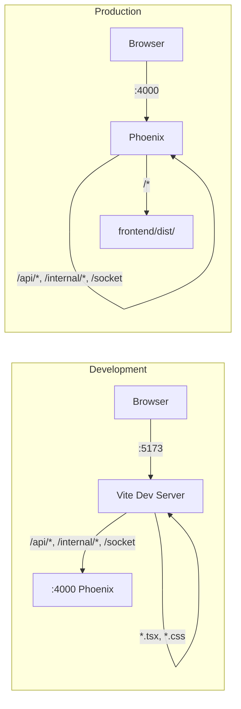

## Context

Rexplorer has a two-tier API (public REST + BFF) and Phoenix Channels for real-time. This change adds the React frontend that consumes them. The frontend is a Vite SPA with a custom component library — no third-party UI framework.

## Goals / Non-Goals

**Goals:**
- Vite + React + TypeScript project at `frontend/`
- Custom component library with Tailwind CSS and dark mode
- Explorer-specific display components (addresses, hashes, amounts)
- Core pages: home, block list, block detail, transaction detail, address overview
- TanStack Query for data fetching/caching
- Phoenix Channels integration for real-time updates
- Responsive layout with header (search, chain switcher, dark mode)

**Non-Goals:**
- SSR / SEO prerendering
- Contract interaction, token pages, trace explorer
- User accounts, watchlists
- Mobile-optimized layouts

## Decisions

### Decision 1: Top-level `frontend/` directory

**Choice:** The React app lives at `frontend/` in the repository root, not inside an Elixir app.

**Rationale:** Clear separation from the Elixir umbrella while staying in the same repo. The Makefile provides unified commands (`make frontend.dev`). In production, `frontend/dist/` can be served by Phoenix's static plug, a CDN, or a separate web server.

### Decision 2: Custom component library over third-party framework

**Choice:** Build all UI components from scratch using Tailwind CSS. No shadcn/ui, no Ant Design, no Chakra.

**Rationale:** Rexplorer should have its own visual identity, not look like a template. The component set is manageable (~10 base components + ~9 explorer components). Tailwind handles the low-level styling; components handle composition and behavior. The `ui/` directory is the single source of truth — change one file, every instance updates.

### Decision 3: TanStack Query for server state

**Choice:** Use TanStack Query (React Query) for all API data fetching.

**Alternatives considered:**
- **SWR:** Simpler but fewer features (no devtools, simpler cache).
- **Custom hooks:** Full control but rebuilds caching, deduplication, and retry logic.

**Rationale:** TanStack Query handles caching, deduplication, background refetching, loading/error states, and stale data management. For an explorer where users navigate between pages frequently (block list → block detail → back), cached data provides instant navigation. Worth the ~12KB bundle cost.

### Decision 4: React Router with chain-scoped routes

**Choice:** All explorer routes are prefixed with `/:chain/` (the explorer slug). React Router v7 with data loaders.

```
/                           → LandingPage (chain selector)
/:chain/                    → HomePage
/:chain/blocks              → BlockListPage
/:chain/block/:number       → BlockDetailPage
/:chain/tx/:hash            → TxDetailPage
/:chain/address/:hash       → AddressPage
*                           → NotFoundPage
```

**Rationale:** Chain-scoped URLs make links shareable and bookmarkable. The chain slug in the URL matches the API's chain slug routing. A `useChain()` hook extracts the current chain from the route and provides it to all data-fetching hooks.

### Decision 5: phoenix.js for WebSocket

**Choice:** Use the official `phoenix` npm package for channel connections.

**Rationale:** It's the maintained client for Phoenix Channels. Custom React hooks (`useBlockSubscription`, `useAddressSubscription`) wrap the channel lifecycle (join on mount, leave on unmount, handle events) with React state integration.

### Decision 6: Vite proxy in development

**Choice:** Vite's dev server proxies `/api/*`, `/internal/*`, and `/socket` to `http://localhost:4000` (Phoenix).

**Rationale:** Avoids CORS issues in development. The frontend dev server runs on port 5173 (Vite default), but API calls are transparently proxied to Phoenix. In production, both are served from the same origin.



### Decision 7: Directory structure

```
frontend/
├── index.html
├── package.json
├── tsconfig.json
├── tailwind.config.ts
├── vite.config.ts
├── src/
│   ├── main.tsx                    # App entry point
│   ├── App.tsx                     # Router + providers
│   ├── api/
│   │   ├── client.ts              # Base fetch config
│   │   ├── queries.ts             # TanStack Query hooks
│   │   └── types.ts               # API response TypeScript types
│   ├── components/
│   │   ├── ui/                    # Component library
│   │   │   ├── Button.tsx
│   │   │   ├── DataTable.tsx
│   │   │   ├── Badge.tsx
│   │   │   ├── Tabs.tsx
│   │   │   ├── Modal.tsx
│   │   │   ├── Skeleton.tsx
│   │   │   ├── Toast.tsx
│   │   │   ├── Tooltip.tsx
│   │   │   └── Dropdown.tsx
│   │   ├── explorer/              # Explorer-specific
│   │   │   ├── AddressDisplay.tsx
│   │   │   ├── TxHash.tsx
│   │   │   ├── TokenAmount.tsx
│   │   │   ├── BlockNumber.tsx
│   │   │   ├── TimeAgo.tsx
│   │   │   ├── StatusBadge.tsx
│   │   │   ├── ChainBadge.tsx
│   │   │   ├── CopyButton.tsx
│   │   │   └── SearchBar.tsx
│   │   └── layout/
│   │       ├── Header.tsx
│   │       ├── Footer.tsx
│   │       └── PageContainer.tsx
│   ├── hooks/
│   │   ├── useChain.ts            # Current chain from route
│   │   ├── useBlockSubscription.ts
│   │   ├── useAddressSubscription.ts
│   │   ├── useDarkMode.ts
│   │   └── useSocket.ts           # Phoenix socket singleton
│   ├── lib/
│   │   ├── format.ts              # Number, address, amount formatters
│   │   └── constants.ts           # Chain colors, config
│   ├── pages/
│   │   ├── LandingPage.tsx
│   │   ├── HomePage.tsx
│   │   ├── BlockListPage.tsx
│   │   ├── BlockDetailPage.tsx
│   │   ├── TxDetailPage.tsx
│   │   ├── AddressPage.tsx
│   │   └── NotFoundPage.tsx
│   └── styles/
│       └── globals.css            # Tailwind directives + custom CSS
```

## Risks / Trade-offs

**[No SSR = no SEO for v1]** → Acceptable. Block explorer pages are primarily used by direct link (not Google search). SEO prerendering is a planned follow-up.

**[Custom components take longer than library]** → True for initial build, but the explorer-specific components need custom work regardless. The base `ui/` components are straightforward Tailwind wrappers.

**[TanStack Query adds bundle size (~12KB)]** → Worth it for the caching and DX benefits. The alternative (manual caching) would likely add more code.

**[phoenix.js bundle size (~8KB)]** → Required for channel support. No alternative for Phoenix Channels.

## Open Questions

*(none)*
