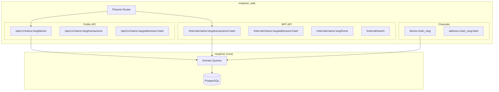
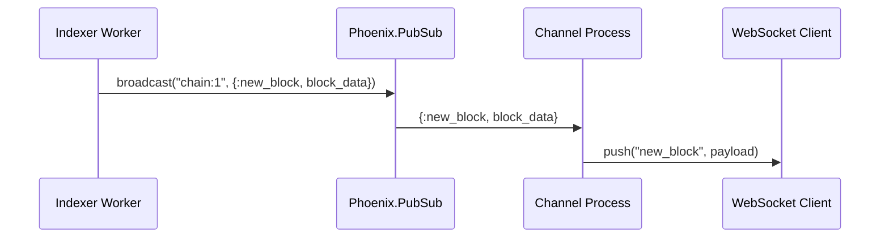

## Context

Rexplorer has the database populated by the live indexer but no way to query the data. This change adds the API layer — both a public REST API for external consumers and a BFF for the upcoming React UI. The existing `rexplorer_web` Phoenix app has the endpoint and router scaffolded but no controllers or channels.

## Goals / Non-Goals

**Goals:**
- Domain query modules in core app (shared by both API tiers)
- Public REST API at `/api/v1/*` — stable, versioned, well-documented
- BFF API at `/internal/*` — UI-optimized aggregated endpoints
- Phoenix Channels for real-time subscriptions (blocks, address activity)
- Consistent pagination, error handling, and JSON serialization
- CORS support for cross-origin React app
- OpenAPI spec for public API documentation

**Non-Goals:**
- React frontend (separate change)
- Authentication, API keys, rate limiting
- GraphQL
- Write operations (transaction submission)

## Decisions

### Decision 1: Two-tier API in one Phoenix app

**Choice:** Both `/api/v1/*` and `/internal/*` routes live in `rexplorer_web`, sharing the same Phoenix endpoint but with separate router pipelines and controller namespaces.

**Rationale:** The public API has stability guarantees and clean REST semantics. The BFF is free to aggregate, change shape, and optimize for the UI. Separating the controller namespaces (`RexplorerWeb.API.V1.*` vs `RexplorerWeb.Internal.*`) enforces this boundary while sharing the same deployment.

### Decision 2: Chain slug routing, not chain ID

**Choice:** API routes use the human-readable `explorer_slug` (e.g., `/api/v1/chains/ethereum/blocks`) rather than the numeric chain ID.

**Alternatives considered:**
- **Chain ID in URL** (`/api/v1/chains/1/blocks`): More precise, but less readable. External developers need to know chain IDs.
- **No chain in URL** (`/api/v1/blocks?chain=ethereum`): Loses RESTful nesting. Cross-chain queries need a different pattern.

**Rationale:** Slugs are human-readable and URL-friendly. The `chains` table already has a unique `explorer_slug` column. A plug resolves the slug to chain_id early in the request pipeline so controllers work with chain_id internally.

### Decision 3: Semantic cursor pagination

**Choice:** Each resource uses its natural ordering key as the pagination cursor, with `before` and `limit` query parameters.

| Resource | Cursor | Example |
|----------|--------|---------|
| Blocks | `block_number` | `?before=20000000&limit=10` |
| Transactions | `block_number,tx_index` | `?before_block=20000000&before_index=5&limit=25` |
| Token transfers | `id` | `?before=123456&limit=25` |
| Logs | `id` | `?before=789012&limit=25` |
| Operations | `operation_index` | (within a transaction, no pagination needed) |

Default limit: 25. Maximum: 100.

**Alternatives considered:**
- **Opaque ID-based cursor**: Generalizable but meaningless to developers. A block explorer API should let you say "blocks before 20M."
- **Page/offset**: Shifts on live data, slow at deep pages. Etherscan uses this and developers work around its problems.

**Rationale:** Semantic cursors are intuitive for a block explorer API. External developers can "start from block 20M" without decoding anything. Each resource's natural key is already indexed. For transactions (which need a compound cursor), the `before_block` + `before_index` params are explicit and unambiguous. For resources without a natural semantic key (transfers, logs), the bigint `id` is still stable and monotonic — just less meaningful, which is fine for those resources.

### Decision 4: Domain query modules in core app

**Choice:** Business logic lives in `Rexplorer.Blocks`, `Rexplorer.Transactions`, `Rexplorer.Addresses`, `Rexplorer.Chains`, `Rexplorer.Search` — all in the core `rexplorer` app.

**Rationale:** Both API tiers call the same query functions. If we later add GraphQL, it uses the same layer. Controllers are thin — they parse params, call domain functions, and serialize responses.

### Decision 5: Phoenix PubSub for channel broadcasts

**Choice:** The indexer broadcasts new block/transaction events via `Phoenix.PubSub` on the existing `Rexplorer.PubSub` server. Channel processes subscribe to relevant topics.

**Rationale:** PubSub is already in the stack (started by the core app). The indexer worker can broadcast after persisting a block without coupling to the web layer. Channel handlers subscribe to PubSub topics and push to connected clients.

### Decision 6: JSON serialization with Phoenix JSON views

**Choice:** Use Phoenix's built-in JSON rendering (controller + JSON view modules) rather than a serializer library.

**Alternatives considered:**
- **JaSerializer / JSONAPI**: Adds JSONAPI spec compliance. Overkill for our needs and forces a specific response structure.
- **Custom serializer modules**: More flexible than views. But Phoenix views already solve this well.

**Rationale:** Phoenix JSON views are simple, explicit, and don't add dependencies. Public API views (`RexplorerWeb.API.V1.BlockJSON`) render stable formats. BFF views (`RexplorerWeb.Internal.TransactionDetailJSON`) render aggregated formats. Clear separation.

### Decision 7: CORS via plug

**Choice:** Use `cors_plug` to allow cross-origin requests from the React app (which will be served from a different origin in development).

**Rationale:** Standard solution. In production, the React app may be served from the same domain (no CORS needed), but in development the Vite dev server runs on a different port.

## Risks / Trade-offs

**[No authentication on v1]** → The API is fully open. Acceptable for a block explorer (all data is public). Rate limiting should be added before production to prevent abuse.

**[BFF coupling to UI]** → The BFF endpoints are shaped by UI needs, which means they'll need to change when the UI changes. This is by design — the BFF exists to absorb UI-driven change so the public API doesn't have to.

**[PubSub single-node limitation]** → Phoenix PubSub works across nodes with the PG adapter (already configured). No single-node bottleneck at scale.

**[No total_count on large tables]** → `COUNT(*)` on tables with millions of rows is slow in PostgreSQL. List endpoints omit total_count. The client knows there are more results when `next_cursor` is non-null.

**[Compound cursor for transactions]** → Transactions use `before_block` + `before_index`, which is two params instead of one. This is slightly more complex for the client but semantically correct — transactions are ordered by (block_number, transaction_index).

## Open Questions

*(none)*
