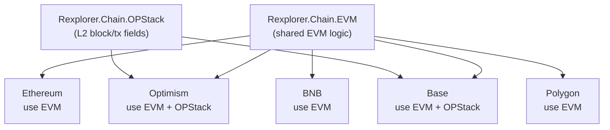

## Context

The adapter behaviour is defined with 9 callbacks. The Ethereum adapter implements all of them — but ~80% of the code (token transfer extraction, unwrapper delegation, ERC-20 decoding helpers) is chain-agnostic. Adding four more adapters by copy-pasting would create ~400 lines of duplicated code.

## Goals / Non-Goals

**Goals:**
- Shared EVM base module (`use Rexplorer.Chain.EVM`)
- OP Stack shared module for Optimism/Base (`use Rexplorer.Chain.OPStack`)
- Four new adapters: Optimism, Base, BNB, Polygon
- Ethereum adapter refactored to use EVM base
- Registry updated with all five adapters

**Non-Goals:**
- Cross-chain link detection logic
- Chain-specific protocol interpreters
- Ethrex L2 adapter

## Decisions

### Decision 1: `__using__` macro for shared behavior

**Choice:** `Rexplorer.Chain.EVM` is a module that defines a `__using__` macro. When a chain adapter does `use Rexplorer.Chain.EVM`, it gets default implementations of all shared callbacks injected via `defoverridable`.

```elixir
defmodule Rexplorer.Chain.EVM do
  defmacro __using__(_opts) do
    quote do
      @behaviour Rexplorer.Chain.Adapter

      # Default implementations
      def extract_operations(tx), do: Rexplorer.Unwrapper.Registry.unwrap(tx, chain_id())
      def block_fields, do: []
      def transaction_fields, do: []
      def bridge_contracts, do: []
      def extract_token_transfers(tx), do: Rexplorer.Chain.EVM.do_extract_token_transfers(tx)

      defoverridable extract_operations: 1, block_fields: 0, transaction_fields: 0,
                     bridge_contracts: 0, extract_token_transfers: 1
    end
  end

  # Shared helper functions (called by the injected defaults)
  def do_extract_token_transfers(transaction), do: ...
end
```

**Alternatives considered:**
- **Inheritance via `defdelegate`:** Verbose — each adapter still needs to declare every delegate.
- **Protocol instead of behaviour:** Protocols dispatch on data types, not modules. Wrong fit.
- **Config-only (no code per chain):** Can't handle chain-specific logic (OP Stack deposits).

**Rationale:** `use` + `defoverridable` is the idiomatic Elixir pattern for shared behavior with optional overrides. Each chain adapter is 10-30 lines of pure metadata. The OP Stack module layers on top with `use Rexplorer.Chain.OPStack` which itself uses `EVM`.

### Decision 2: OP Stack as a second `use` layer

**Choice:** OP Stack adapters `use Rexplorer.Chain.EVM` first, then `use Rexplorer.Chain.OPStack` which overrides `block_fields/0` and `transaction_fields/0` with L2-specific fields.



**Rationale:** OP Stack chains share the same L2-specific fields. Extracting this avoids duplicating field definitions between Optimism and Base.

### Decision 3: Deposit transaction type 126 handling

**Choice:** The OP Stack module's `transaction_fields/0` defines `source_hash`, `mint`, and `is_system_tx`. These are extracted from the raw RPC transaction data into `chain_extra` by the BlockProcessor (which already calls `adapter.transaction_fields()` to build `chain_extra`). No special operation type for deposits — they appear as regular `:call` operations.

**Rationale:** Deposit transactions (type 0x7E) have the same internal structure as regular calls. The L2-specific metadata (source_hash, mint) goes in `chain_extra`. The cross-chain link detection (future change) will use `source_hash` to connect L1→L2 deposits.

### Decision 4: Bridge contract addresses as static lists

**Choice:** Each OP Stack adapter returns known bridge contract addresses from `bridge_contracts/0`. These are not used by the indexer today but will be used by the future cross-chain link detection system.

Known addresses:
- Optimism: `OptimismPortal` (`0xbeb5fc579115071764c7423a4f12edde41f106ed`)
- Base: `BasePortal` (`0x49048044d57e1c92a77f79988d21fa8faf74e97e`)

BNB and Polygon bridge addresses are more fragmented (multiple bridges, validator-based). Deferred.

## Risks / Trade-offs

**[`use` macro complexity]** → Macros can be hard to debug. Mitigated by keeping the macro thin (just injects defaults) and moving all logic to regular functions in the EVM module.

**[OP Stack deposit handling is minimal]** → We store deposit metadata in `chain_extra` but don't do anything special with it yet (no cross-chain links, no L2 lifecycle tracking). This is intentional — the data is captured for future use.

## Open Questions

*(none)*
