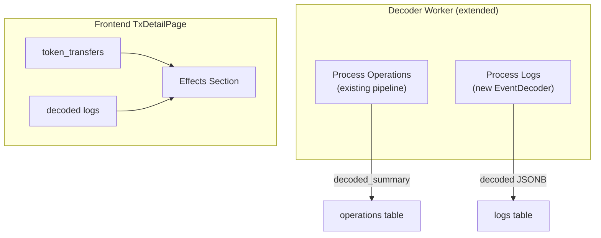

## Context

The decoder pipeline currently decodes operation calldata into `decoded_summary`. Event logs are stored raw with `logs.decoded` always null. This change extends the decoder to also decode known events and adds an "Effects" section to the frontend transaction detail page.

## Goals / Non-Goals

**Goals:**
- Extend ABI registry with event signatures (topic0 → event definition)
- EventDecoder module that decodes logs into structured data + summary strings
- Decoder worker extended to process logs alongside operations
- Frontend Effects section composing token_transfers + decoded logs

**Non-Goals:**
- Decoding all events (only known protocols)
- Separate effects table
- Event-based cross-chain detection

## Decisions

### Decision 1: Extend existing ABI registry with events

**Choice:** Add event signatures to the same ETS table, keyed by topic0 (32-byte hash). Events are stored separately from function selectors (4-byte keys vs 32-byte keys), so no collision.

**Rationale:** One registry, one lookup path. Events and functions are both ABI definitions — splitting them into separate registries adds complexity with no benefit.

### Decision 2: EventDecoder as a separate module

**Choice:** `Rexplorer.Decoder.EventDecoder` handles log decoding, separate from the operation pipeline. It takes a log struct, looks up the event by topic0, decodes indexed params from topics and non-indexed from data.



**Rationale:** Operations decode calldata (input bytes). Events decode log topics + data. Different input format, different decoding logic — separate modules but same worker.

### Decision 3: Worker processes logs per-transaction batch

**Choice:** When the worker processes a batch of operations, it also loads the associated logs for those transactions and decodes them. This piggybacks on the existing worker loop without adding a separate polling mechanism.

**Rationale:** Logs and operations belong to the same transactions. Processing them together avoids a separate "log decoder version" tracking. The operation's `decoder_version` serves as the version gate for both.

### Decision 4: Frontend composes Effects from existing data

**Choice:** No new API endpoint. The BFF transaction detail endpoint already returns `token_transfers` and `logs` (with `decoded`). The frontend combines them, deduplicating Transfer events that appear as both token_transfers and decoded logs.

**Deduplication logic:** If a decoded log has `event_name: "Transfer"` and a matching token_transfer exists (same from, to, amount), skip the log entry. Show only non-Transfer decoded events + all token_transfers.

**Rationale:** Zero API changes. The decoded JSONB field was designed for this from day one.

### Decision 5: Decoded JSONB structure

**Choice:** Each `logs.decoded` JSONB contains:

```json
{
  "event_name": "Swap",
  "params": {
    "sender": "0x7a25...",
    "amount0In": "1000000000000000000",
    "amount1Out": "3247000000"
  },
  "summary": "Swap on Uniswap V2: 1.0 WETH → 3,247 USDC"
}
```

**Rationale:** `event_name` for filtering/grouping. `params` for structured access. `summary` for human display. The frontend can use `summary` directly or build custom rendering from `params`.

## Risks / Trade-offs

**[Worker does more work per batch]** → Loading and decoding logs adds ~30% more DB queries per batch. Acceptable since the worker runs async with 5s idle pauses.

**[Deduplication in frontend is fragile]** → Matching Transfer events to token_transfers requires comparing amounts and addresses, which may not match exactly (rounding, address casing). Mitigated by case-insensitive comparison and tolerance.

## Open Questions

*(none)*
