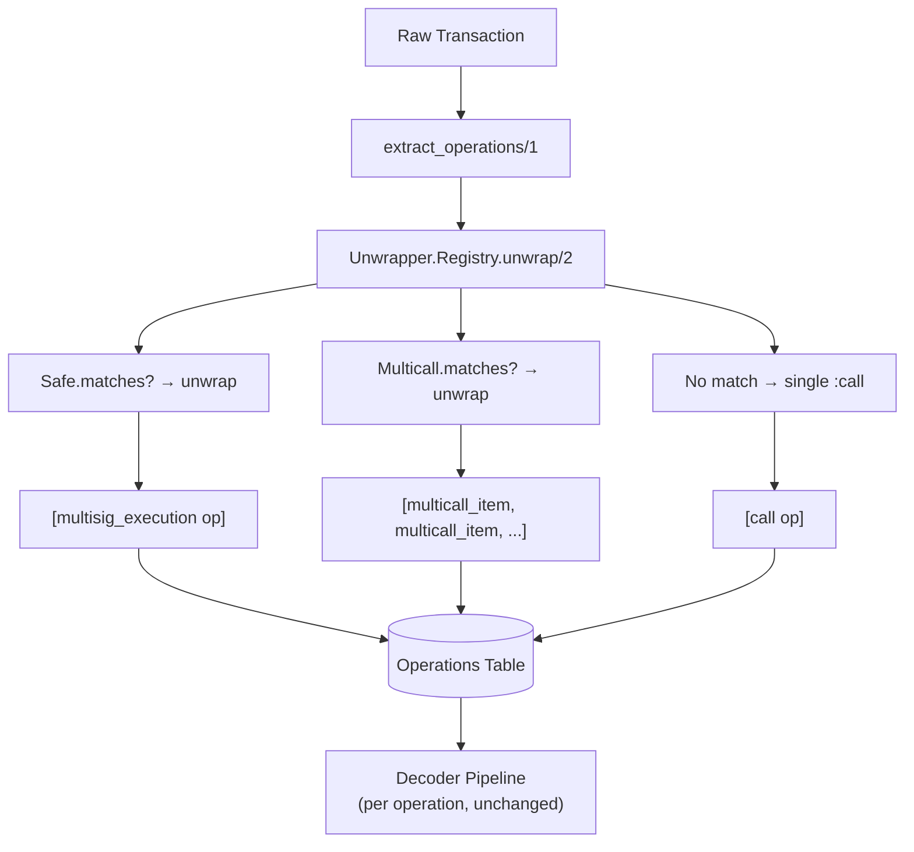

## Context

The operations model supports multiple operations per transaction with types like `:multisig_execution` and `:multicall_item`, but `extract_operations/1` always returns a single `:call`. This change adds the unwrap layer that detects wrapper patterns and decomposes transactions into their actual inner operations.

## Goals / Non-Goals

**Goals:**
- Unwrapper behaviour + registry (mirrors interpreter pattern)
- Safe `execTransaction` unwrapper → `:multisig_execution` operations
- Multicall unwrapper (both variants) → `:multicall_item` operations
- Ethereum adapter updated to use unwrapper registry
- ABI registry extended with execTransaction and multicall signatures

**Non-Goals:**
- ERC-4337 AA (handleOps)
- Recursive unwrapping
- Historical reprocessing
- DSProxy, Timelock, Permit2

## Decisions

### Decision 1: Unwrapper modules in core app, called by adapter

**Choice:** `Rexplorer.Unwrapper.*` modules live in the core `rexplorer` app. The chain adapter's `extract_operations/1` calls `Rexplorer.Unwrapper.Registry.unwrap/2`.

**Rationale:** Unwrappers are chain-agnostic (Safe and Multicall work the same on Ethereum, Optimism, Base). Living in core means all chain adapters can use them. The adapter just calls the registry.

### Decision 2: Selector-based detection, no address lists

**Choice:** Detect wrappers by function selector only, not by contract address.

- Safe: `0x6a761202` (`execTransaction`) is unique to Safe
- Multicall: `0xac9650d8` and `0x5ae401dc` are the standard multicall selectors

**Alternatives considered:**
- **Address-based:** Would need Safe proxy factory detection or hardcoded lists. Every Safe deployment is at a unique address.
- **Combined:** Selector + address. Unnecessary since these selectors are distinctive enough.

**Rationale:** `execTransaction`'s 10-parameter signature is extremely unlikely to collide. Multicall selectors are also distinctive. Selector-only detection avoids per-chain address maintenance.

### Decision 3: ABI decoding for unwrap, not raw byte parsing

**Choice:** Use `ex_abi` to decode `execTransaction` and `multicall` calldata, not manual byte offset parsing.

**Rationale:** `execTransaction` has 10 parameters including dynamic `bytes` fields. Manual parsing is error-prone. `ex_abi` handles it correctly. We add the signatures to the ABI registry.

### Decision 4: Single-level unwrap only

**Choice:** The unwrapper peels one layer. A multicall wrapping a Safe execution won't unwrap the Safe — the multicall items will each be a `:multicall_item` with the Safe's `execTransaction` calldata. The decoder will see "Called execTransaction on 0x..." for that item.

**Rationale:** Recursive unwrapping adds complexity and edge cases. Single-level covers the vast majority of real-world usage. Can be extended later.

### Decision 5: Unwrap at index time, no reprocessing

**Choice:** Unwrapping happens in `extract_operations/1` during block indexing. Historical transactions that were indexed before the unwrap layer are not retroactively reprocessed.

**Rationale:** Reprocessing would require deleting existing operations and re-running `extract_operations` for affected transactions — a destructive migration. Not worth the complexity for v1. Historical data can be reindexed if needed.

## Risks / Trade-offs

**[Selector collision]** → The `execTransaction` selector `0x6a761202` could theoretically collide with a different function. In practice, this 10-parameter signature is unique to Safe. If a false positive is detected in production, we can add an address exclusion list.

**[Multicall variants we miss]** → Some protocols use custom multicall implementations with different selectors. We cover the two most common (`0xac9650d8`, `0x5ae401dc`). Others can be added incrementally.

**[Historical data inconsistency]** → Pre-unwrap blocks have 1 operation per tx even for Safe/multicall transactions. Post-unwrap blocks have N operations. This is acceptable — the data is still correct, just less detailed for older blocks.

## Open Questions

*(none)*
