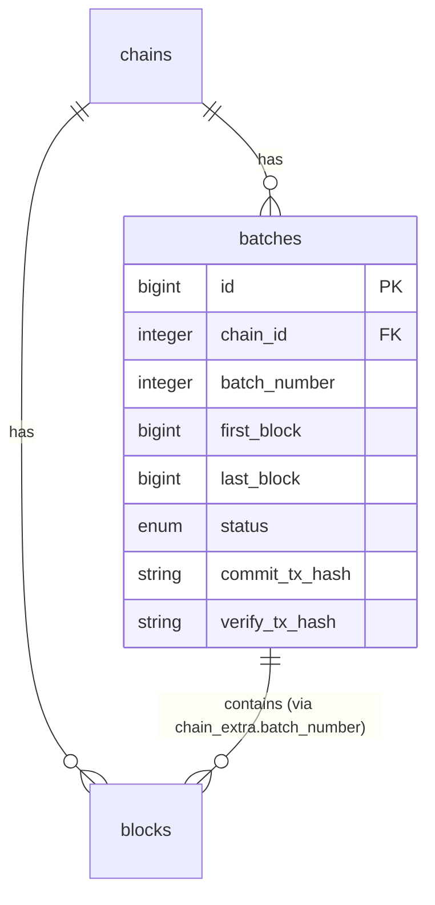

## Context

Rexplorer's chain adapter system uses hardcoded modules per chain (Ethereum, Optimism, etc.) with shared behavior via `use EVM` and `use OPStack` macros. Ethrex is a ZK rollup stack where each deployment gets its own chain ID, bridge, and RPC URL — requiring a config-driven approach. This change adds Ethrex support and the batches table for L2 lifecycle tracking.

## Goals / Non-Goals

**Goals:**
- Ethrex stack module with ZK rollup fields (privileged txs, fee_token, batch_number)
- Config-driven adapter instantiation (no new module per Ethrex deployment)
- Batches table with lifecycle status (sealed → committed → verified)
- Dual block→batch lookup (chain_extra + batches table)
- Ethrex-specific RPC methods in the client
- Batch info fetching in the indexer worker

**Non-Goals:**
- Batch detail page in frontend
- Withdrawal proof tracking
- L2-to-L2 messaging
- Fee breakdown display
- Forced inclusion

## Decisions

### Decision 1: Parameterized adapter struct instead of module

**Choice:** Ethrex adapters are structs (`%Rexplorer.Chain.Ethrex{}`) created at startup from config, not compiled modules. Each struct holds the chain's config (chain_id, native_token, bridge, poll_interval) and implements all adapter callbacks by reading from the struct.

```elixir
defmodule Rexplorer.Chain.Ethrex do
  defstruct [:chain_id, :name, :rpc_url, :poll_interval_ms, :bridge_address]

  def new(config) do
    %__MODULE__{
      chain_id: config.chain_id,
      name: config.name,
      rpc_url: config.rpc_url,
      poll_interval_ms: config.poll_interval_ms,
      bridge_address: config.bridge_address
    }
  end

  # Adapter callbacks operate on the struct
  def chain_id(%__MODULE__{chain_id: id}), do: id
  def chain_type(_), do: :zk_rollup
  def native_token(_), do: {"ETH", 18}
  def poll_interval_ms(%__MODULE__{poll_interval_ms: ms}), do: ms
  def bridge_contracts(%__MODULE__{bridge_address: addr}), do: [addr]
  def block_fields(_), do: [{:batch_number, :integer}]
  def transaction_fields(_), do: [...]
  def extract_operations(_, tx), do: Rexplorer.Unwrapper.Registry.unwrap(tx, ...)
  def extract_token_transfers(_, tx), do: Rexplorer.Chain.EVM.do_extract_token_transfers(tx)
end
```

**Alternatives considered:**
- **Dynamic module compilation:** Use `Module.create/3` to define `Rexplorer.Chain.Ethrex12345` at runtime. Works but adds complexity, harder to debug, modules accumulate in the BEAM.
- **One hardcoded module per chain (like OPStack):** Requires code changes per deployment. Doesn't match the "just add config" requirement.

**Rationale:** Structs are simple, inspectable, and garbage-collected. The Registry stores them alongside module-based adapters. The only change needed: the Registry's `get_adapter/1` returns either a module atom OR a struct, and callers use a protocol or wrapper to dispatch.

### Decision 2: Protocol-based dispatch for mixed adapter types

**Choice:** Define a `Rexplorer.Chain.AdapterProtocol` that both module-based adapters (via a wrapper) and struct-based adapters implement. The Registry wraps hardcoded adapters in a thin struct so the caller always gets a struct back.

Actually, simpler approach: the Registry stores `{chain_id, adapter}` where `adapter` is either a module atom or an Ethrex struct. A dispatch function checks the type:

```elixir
def call_adapter(adapter, :chain_id) when is_atom(adapter), do: adapter.chain_id()
def call_adapter(%Ethrex{} = adapter, :chain_id), do: Ethrex.chain_id(adapter)
```

**Even simpler:** Make the Ethrex module implement callbacks as module functions that take the struct as first arg, and have the worker/indexer pass the adapter through. Since existing callers do `adapter.chain_id()`, we can make Ethrex work the same by storing a closure-based module or using a thin GenServer per chain that holds the config.

**Final choice:** Use a **thin wrapper module per Ethrex chain** created at startup via a macro or closure, registered under a unique module name. This preserves the existing `adapter.callback()` calling convention without changing any existing code.

```elixir
# At startup, for each Ethrex config entry:
module_name = :"Elixir.Rexplorer.Chain.Ethrex_#{config.chain_id}"
Module.create(module_name, quote do
  use Rexplorer.Chain.EVM
  use Rexplorer.Chain.Ethrex, unquote(Macro.escape(config))
end, Macro.Env.location(__ENV__))
```

**Rationale:** This preserves the `adapter.chain_id()` calling convention used everywhere. No changes to the Worker, BlockProcessor, or any existing caller. The dynamically created module is indistinguishable from a hardcoded one.

### Decision 3: Batches table with dual lookup

**Choice:** New `batches` table for batch lifecycle. Blocks also store `batch_number` in `chain_extra`. Indexer writes both atomically.



Lookup patterns:
- Block → batch: read `chain_extra->>'batch_number'` (O(1), already loaded)
- Batch → blocks: query batches table for `first_block`/`last_block` range
- Batch lifecycle: query batches table by `(chain_id, batch_number)`

### Decision 4: Batch status enum

**Choice:** PostgreSQL enum `batch_status` with values: `sealed`, `committed`, `verified`.

This matches the Ethrex lifecycle. The OP Stack equivalent (if we ever add it) would use different states, but can share the same column with additional enum values later.

### Decision 5: Batch fetching integrated into worker, not separate process

**Choice:** After persisting a block on an Ethrex chain, the worker calls `ethrex_getBatchByBlock` in the same flow. A separate periodic check (every 30s) updates batch statuses for recent batches.

**Rationale:** Batch info is tightly coupled to block indexing — the block needs its `batch_number` at index time. A separate process would add complexity and eventual consistency issues. The periodic status update is lightweight (only checks recent unbatched/uncommitted/unverified batches).

### Decision 6: Ethrex chains also need seeds

**Choice:** Ethrex chain records in the `chains` table are auto-seeded at startup from the config, not via `seeds.exs`. When the Registry creates Ethrex adapters, it also ensures the chain record exists in the DB (upsert).

**Rationale:** Ethrex chains are defined purely in config. Requiring manual seed updates would defeat the "just add config" goal.

## Risks / Trade-offs

**[Dynamic module creation is unconventional]** → `Module.create/3` is a valid Elixir API but rarely used. The created modules are simple (just `use` macros + config) and inspectable. If this proves problematic, we can switch to a protocol-based approach later.

**[Batch RPC may not be available on all Ethrex versions]** → The `ethrex_*` methods may not exist on older deployments. The worker should handle RPC errors gracefully and skip batch tracking if the methods aren't available.

**[Batch status updates lag behind L1]** → The periodic check runs every 30s, so there's up to 30s delay before a batch shows as committed/verified. Acceptable for v1.

## Open Questions

*(none)*
