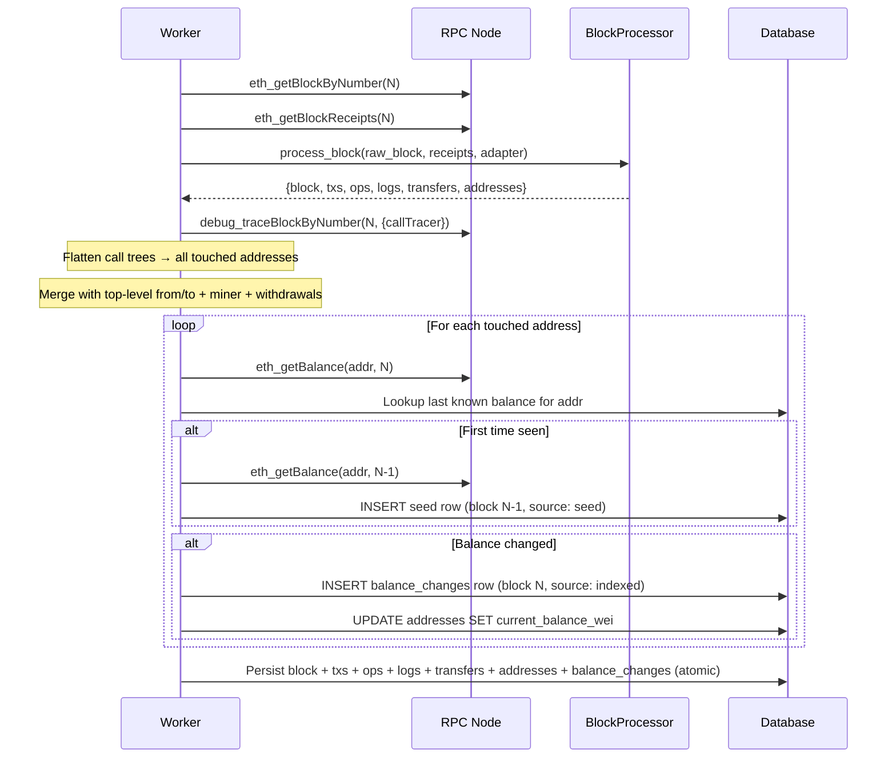
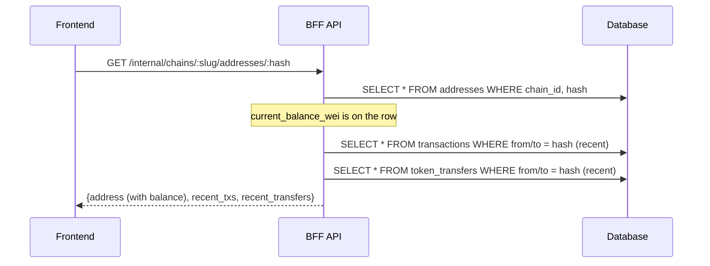
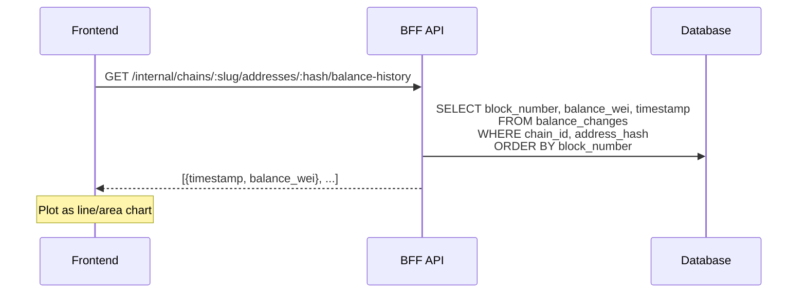

## Context

Rexplorer currently indexes blocks, transactions, operations, logs, and token transfers. The `addresses` table tracks address metadata (is_contract, label, first_seen_at) but stores no balance. When a user views an address, they see recent transactions but not how much ETH the address holds or how its balance changed over time.

The indexer worker (`RexplorerIndexer.Worker`) processes blocks sequentially per chain, persisting all data atomically in a single DB transaction. Chain adapters control chain-specific behavior. The RPC client (`Rexplorer.RPC.Client`) provides stateless JSON-RPC calls.

Ethrex nodes support `debug_traceBlockByNumber` with the `callTracer` tracer, which returns nested call trees including internal CALL, CREATE, and SELFDESTRUCT operations with value transfers. This enables complete discovery of all addresses whose balance may have changed in a block.

## Goals / Non-Goals

**Goals:**
- Track native token balance changes for every address touched in each indexed block
- Provide current balance for the address overview page
- Provide historical balance data suitable for charting (Trezor-style balance-over-time)
- Establish a baseline ("seed") balance for addresses that existed before indexing started
- Support chains with and without trace APIs via adapter-driven strategy

**Non-Goals:**
- Token (ERC-20/721/1155) balance tracking (separate change)
- Backfilling historical blocks before the indexer's starting point
- Async/batched balance fetching (synchronous is sufficient for L2 block sizes)
- Daily rollup/materialized view for chart performance (premature; add if needed)
- Pre-state/state-diff based approaches (Erigon/Reth only, not needed)

## Decisions

### 1. RPC-based absolute balances, not tx-derived deltas

**Decision:** Fetch balance via `eth_getBalance(address, blockNumber)` for each touched address. Store the absolute balance at each block where it changed.

**Why not derive from transactions:** Tx-derived deltas miss internal calls, mining rewards, self-destructs, and gas refunds. The balance would drift from reality. RPC returns the exact balance as computed by the node.

**Why not state diffs:** `trace_replayBlockTransactions` with `stateDiff` would give perfect data but is only available on Erigon/Reth. `eth_getBalance` is universally supported.

**Alternatives considered:**
- Tx-derived deltas: simpler, no extra RPC calls, but inaccurate for contracts
- State diffs: perfect but too restrictive on node requirements
- Blockscout's async two-phase approach (insert NULL, fetch later): adds complexity; synchronous is fine for our L2-first target

### 2. Seed row for first-seen addresses

**Decision:** When an address is first encountered in block N, fetch `eth_getBalance(address, N-1)` and store it as a "seed" row with `source: "seed"`. This establishes the balance baseline before our indexing began.

**Why:** Without a seed, the first chart data point would show the balance *after* the first indexed change, with no prior context. The seed gives the chart a starting point.

**Impact on future backfill:** If backfill is added later, it uses the same logic — seed at the block before the earliest backfilled change. Existing seed rows from forward indexing become redundant but harmless (they're still correct balance data points). Backfill can optionally clean them up.

**Alternatives considered:**
- Separate `offset` field on addresses table: works but adds a parallel concept; the seed row is more uniform
- Lazy seed on first user view: delays the RPC call but means the indexer doesn't have complete data; complicates the write path
- No seed, accept the gap: poor chart UX for addresses with pre-existing balance

### 3. Trace-based touched address collection via adapter

**Decision:** Add a `collect_touched_addresses/3` callback to the chain adapter behaviour. Adapters with trace support (Ethrex) implement it using `debug_traceBlockByNumber` + `callTracer`, recursively flattening the nested call tree. Adapters without trace support fall back to extracting addresses from top-level transaction fields + miner + withdrawals.

**Why adapter-driven:** Different chains/nodes have different trace capabilities. Ethrex supports `debug_traceBlockByNumber` with `callTracer`. Public Ethereum RPCs often don't support trace APIs at all. The adapter pattern already governs chain-specific behavior in the indexer.

**Alternatives considered:**
- Always require traces: would block non-trace chains entirely
- Separate "trace fetcher" GenServer: over-engineered for sync approach
- Hardcoded trace detection in worker: breaks adapter abstraction

### 4. Store only rows where balance changed

**Decision:** After fetching `eth_getBalance` for a touched address, compare with the last known balance in DB. Only insert a `balance_changes` row if the balance actually differs.

**Why:** An address can be "touched" (e.g., a failed call, a zero-value call, a log emission) without its balance changing. Storing unchanged balances would bloat the table with noise and make charts less useful.

### 5. Denormalized current balance on addresses table

**Decision:** Add `current_balance_wei` to the `addresses` table. Update it whenever a new `balance_changes` row is inserted for that address.

**Why:** The address overview page needs the current balance for every view. Querying `balance_changes ORDER BY block_number DESC LIMIT 1` is cheap but the denormalized field avoids even that join. Blockscout uses the same pattern (`fetched_coin_balance` on `addresses`).

## Data Flow



## Address Overview Flow



## Balance History Chart Flow



## Schema

```sql
-- New table
CREATE TABLE balance_changes (
    id BIGSERIAL PRIMARY KEY,
    chain_id INTEGER NOT NULL REFERENCES chains(chain_id),
    address_hash VARCHAR NOT NULL,
    block_number BIGINT NOT NULL,
    balance_wei NUMERIC NOT NULL,
    timestamp TIMESTAMPTZ NOT NULL,
    source VARCHAR NOT NULL DEFAULT 'indexed',  -- 'seed' | 'indexed'
    inserted_at TIMESTAMPTZ NOT NULL DEFAULT NOW(),
    updated_at TIMESTAMPTZ NOT NULL DEFAULT NOW()
);

CREATE UNIQUE INDEX balance_changes_chain_addr_block
    ON balance_changes (chain_id, address_hash, block_number);

CREATE INDEX balance_changes_chain_addr_ts
    ON balance_changes (chain_id, address_hash, timestamp);

-- Alter existing table
ALTER TABLE addresses ADD COLUMN current_balance_wei NUMERIC;
```

## Chain Extensibility

The balance tracking system respects the adapter pattern used throughout Rexplorer:

| Adapter capability | Touched address sources | Coverage |
|---|---|---|
| Traces supported (Ethrex) | callTracer traces + top-level txs + miner + withdrawals | Complete |
| No trace support | Top-level tx from/to + miner + withdrawals | Partial (misses internal calls) |

Each adapter declares its capability via `supports_traces?/0`. The worker checks this before making the `debug_traceBlockByNumber` call. When traces are unavailable, balance tracking still works — it just may not capture balances for addresses only touched by internal transactions.

## Risks / Trade-offs

**[Risk] RPC call volume per block** — For a block touching N addresses, we make N+1 RPC calls (1 trace + N balances), plus up to N more for seeds. On an L2 with ~50 addresses per block, this is ~100 calls.
- Mitigation: Synchronous is acceptable for L2 block times (1-2s). JSON-RPC batching can be added later to reduce round trips.

**[Risk] Trace API unavailable** — If a node doesn't support `debug_traceBlockByNumber`, the adapter falls back to top-level addresses only.
- Mitigation: Adapter-driven; partial coverage is better than none. The balances we DO store are always correct (from `eth_getBalance`).

**[Risk] Seed row for block N-1 may fail** — If the RPC node has pruned state for block N-1, `eth_getBalance` at that block will fail.
- Mitigation: Fall back to seeding at block N itself (the first known balance, without a prior data point). Log a warning.

**[Risk] Table growth** — Active addresses on busy chains could produce many rows.
- Mitigation: Only rows where balance actually changed are stored. A daily rollup table can be added later if chart query performance degrades.

## Open Questions

1. **Should the balance chart endpoint support time-range filtering?** (e.g., last 7 days, last 30 days) — Probably yes, but the exact API shape can be decided when building the endpoint.
2. **Should we store the block hash alongside block_number in balance_changes?** — Useful for reorg handling but adds complexity. Deferring.
