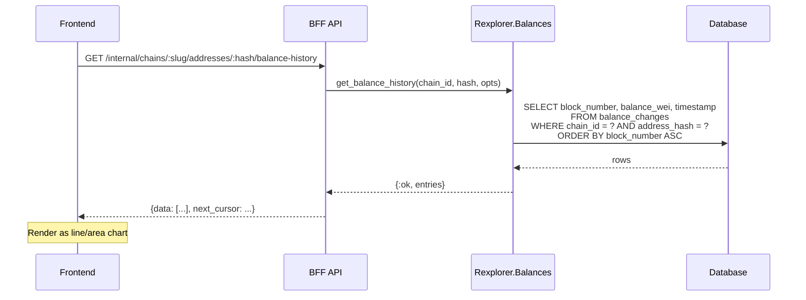

## ADDED Requirements

### Requirement: Balance in address overview response
The BFF address overview endpoint SHALL include the address's current native-token balance in the response. The balance MUST be returned as a string representation of the Wei value.

#### Scenario: Address overview includes balance
- **WHEN** `GET /internal/chains/ethereum/addresses/0xabc...` is called
- **THEN** the response `address` object includes `"balance_wei": "5000000000000000000"` (or `null` if no balance data exists)

#### Scenario: Address with no balance data
- **WHEN** an address has never been tracked for balance (e.g., pre-existing address not yet touched since indexing started)
- **THEN** the `balance_wei` field in the response is `null`

### Requirement: Balance history endpoint
The BFF SHALL expose `GET /internal/chains/:chain_slug/addresses/:hash/balance-history` returning a time-ordered list of balance data points for charting.

#### Scenario: Fetch balance history for charting
- **WHEN** `GET /internal/chains/ethereum/addresses/0xabc.../balance-history` is called
- **THEN** the response contains `{"data": [{"block_number": 100, "balance_wei": "1000", "timestamp": "2025-01-01T00:00:00Z"}, ...]}` ordered by block_number ascending

#### Scenario: Balance history with pagination
- **WHEN** `GET /internal/chains/ethereum/addresses/0xabc.../balance-history?before=1000&limit=50` is called
- **THEN** the response contains at most 50 entries with `block_number < 1000` and a `next_cursor` field if more data exists

#### Scenario: Address with no balance history
- **WHEN** the address has no `balance_changes` rows
- **THEN** the response contains `{"data": [], "next_cursor": null}`

#### Scenario: Unknown address
- **WHEN** the address does not exist in the database
- **THEN** the endpoint returns 404

### Requirement: Balance in public API address response
The public API address endpoint SHALL include the current balance in its response.

#### Scenario: Public API address includes balance
- **WHEN** `GET /api/v1/chains/:chain_slug/addresses/:hash` is called
- **THEN** the response includes `"balance_wei": "5000000000000000000"` (or `null`)

### Diagram: Balance history data flow

