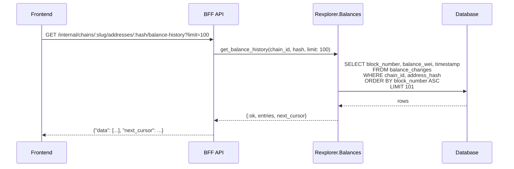

## MODIFIED Requirements

### Requirement: Address overview aggregate
The system SHALL expose `GET /internal/chains/:chain_slug/addresses/:hash` returning the address metadata (including current native-token balance as `balance_wei`), recent transactions (with operation summaries), and recent token transfers (with token metadata) in a single response.

#### Scenario: Address overview with balance
- **WHEN** `GET /internal/chains/ethereum/addresses/0xabc...` is called
- **THEN** the response contains `address` (with `balance_wei` field), `recent_transactions` (last 25 with operation summaries), and `recent_token_transfers` (last 25 with token names)

#### Scenario: Address overview with no balance data
- **WHEN** `GET /internal/chains/ethereum/addresses/0xabc...` is called for an address with no balance data
- **THEN** the `address.balance_wei` field is `null`

## ADDED Requirements

### Requirement: Balance history endpoint
The system SHALL expose `GET /internal/chains/:chain_slug/addresses/:hash/balance-history` returning a time-ordered list of balance data points suitable for rendering a chart. The endpoint MUST support cursor-based pagination via `before` (block_number) and `limit` query parameters.

#### Scenario: Fetch balance history
- **WHEN** `GET /internal/chains/ethereum/addresses/0xabc.../balance-history` is called
- **THEN** the response contains `{"data": [...], "next_cursor": <block_number|null>}` with entries ordered by block_number ascending

#### Scenario: Paginated balance history
- **WHEN** `GET /internal/chains/ethereum/addresses/0xabc.../balance-history?before=1000&limit=50` is called
- **THEN** the response contains at most 50 entries with `block_number < 1000`

#### Scenario: Empty balance history
- **WHEN** the address has no balance_changes rows
- **THEN** the response is `{"data": [], "next_cursor": null}`

#### Scenario: Unknown address returns 404
- **WHEN** the address does not exist in the database
- **THEN** the endpoint returns HTTP 404

### Diagram: Balance history endpoint flow

