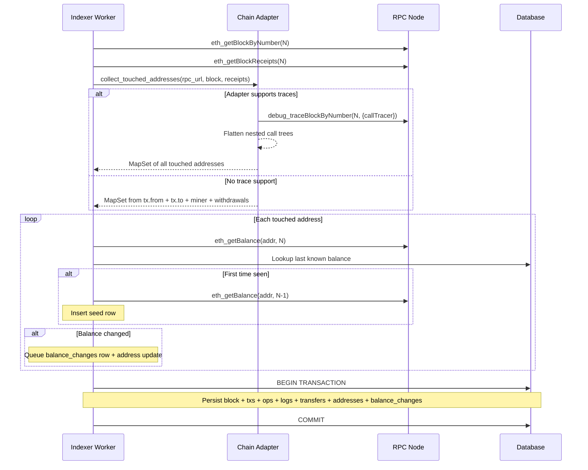

## ADDED Requirements

### Requirement: Balance collection during block indexing
After processing a block and before persisting, the indexer worker SHALL collect all touched addresses, fetch their balances, and include balance changes in the atomic database transaction. This step runs synchronously within the block indexing pipeline.

#### Scenario: Block indexed with balance changes
- **WHEN** block N is indexed on a chain with trace support and 3 addresses have balance changes
- **THEN** 3 `balance_changes` rows are inserted in the same DB transaction as the block, transactions, and other data

#### Scenario: Block indexed without any balance changes
- **WHEN** block N is indexed and all touched addresses have the same balance as their last known balance
- **THEN** no `balance_changes` rows are inserted and indexing proceeds normally

#### Scenario: Balance fetch failure does not block indexing
- **WHEN** `eth_getBalance` fails for one address during block N indexing
- **THEN** that address is skipped for balance tracking, a warning is logged, and the rest of the block is persisted normally

### Requirement: Trace-based address collection in indexer
The indexer worker SHALL call the adapter's `collect_touched_addresses` function to determine which addresses to check for balance changes. On chains with trace support, this involves an additional `debug_traceBlockByNumber` RPC call per block.

#### Scenario: Ethrex chain with traces
- **WHEN** a block is being indexed on an Ethrex chain
- **THEN** the worker calls `debug_traceBlockByNumber(N, {"tracer": "callTracer"})` and flattens the result to get all touched addresses

#### Scenario: Chain without trace support
- **WHEN** a block is being indexed on a chain without trace support
- **THEN** the worker extracts addresses from top-level transaction from/to fields, the block miner, and withdrawals only

### Diagram: Balance indexing data flow

