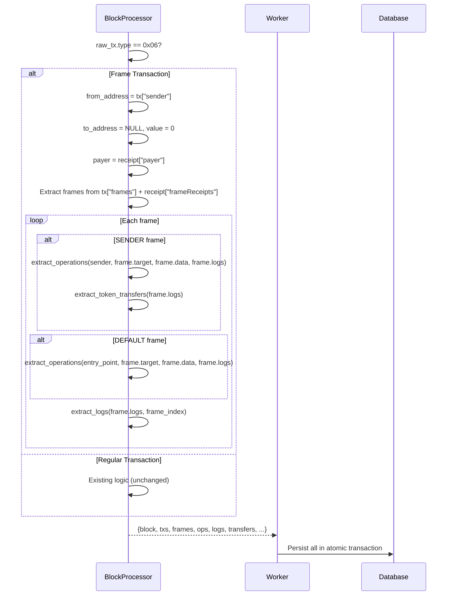

## Context

EIP-8141 frame transactions (type `0x06`) replace the traditional `{from, to, value, input}` model with a list of sequential frames, each with `{mode, target, gasLimit, data}`. Receipts include per-frame `{status, gasUsed, logs}` and a `payer` field.

The current `BlockProcessor.extract_transaction` reads `raw_tx["to"]`, `raw_tx["value"]`, and `raw_tx["input"]` — all absent in frame txs. The receipt parsing assumes a single status and flat log list.

Rexplorer's existing architecture has the right abstractions: the `operations` table already represents "user intents within a transaction." For frame txs, SENDER frames naturally produce operations through the same decoder pipeline. The `logs`, `operations`, and `token_transfers` tables just need a `frame_index` to associate them with specific frames.

### RPC Format (from Ethrex demo investigation)

**Transaction:**
```json
{
  "type": "0x6",
  "sender": "0x18e3...",
  "frames": [
    {"mode": "0x1", "to": "0x18e3...", "gasLimit": "0x7a120", "data": "0xc8ad..."},
    {"mode": "0x2", "to": "0x18e3...", "gasLimit": "0xc350", "data": "0x"}
  ]
  // NO "to", "value", or "input" at tx level
}
```

**Receipt:**
```json
{
  "type": "0x6",
  "payer": "0x18e3...",
  "frameReceipts": [
    {"status": "0x1", "gasUsed": "0x2108e", "logs": []},
    {"status": "0x1", "gasUsed": "0x13", "logs": []}
  ]
}
```

## Goals / Non-Goals

**Goals:**
- Index frame transactions without breaking existing tx processing
- Store per-frame data with execution results (status, gas, logs)
- Decode SENDER frame operations through the existing pipeline
- Show frames on the tx detail page
- Make frame tx targets discoverable on address pages

**Non-Goals:**
- VERIFY frame signature scheme detection
- Smart account custom verification decoding
- Per-frame trace visualization
- Blob data handling

## Decisions

### 1. Frame txs stored in the existing transactions table

**Decision:** Frame txs go in the `transactions` table with `to_address = NULL`, `value = 0`, `input = NULL`, `transaction_type = 6`. A new `payer` column (nullable) is added.

**Why:** A frame tx is still a transaction — it has a hash, a block, a nonce. Existing queries (tx by hash, txs in a block) should find it. `to_address = NULL` already occurs for contract creation txs. A separate table would fork every query path.

### 2. New frames table linked to transactions

**Decision:** A `frames` table with `transaction_id` FK, storing per-frame mode, target, gas_limit, gas_used, status, and data.

```sql
CREATE TABLE frames (
    id BIGSERIAL PRIMARY KEY,
    chain_id INTEGER NOT NULL REFERENCES chains(chain_id),
    transaction_id BIGINT NOT NULL REFERENCES transactions(id),
    frame_index INTEGER NOT NULL,
    mode INTEGER NOT NULL,       -- 0=DEFAULT, 1=VERIFY, 2=SENDER
    target VARCHAR,              -- address
    gas_limit BIGINT,
    gas_used BIGINT,             -- from frameReceipt
    status BOOLEAN,              -- from frameReceipt
    data BYTEA,                  -- full calldata
    UNIQUE (chain_id, transaction_id, frame_index)
);
CREATE INDEX frames_chain_target ON frames (chain_id, target);
```

### 3. frame_index on logs, operations, and token_transfers

**Decision:** Add nullable `frame_index INTEGER` to `logs`, `operations`, and `token_transfers`. For non-frame txs, this is NULL. For frame txs, it links each record to its frame.

**Why:** Simpler than an FK to the frames table. The frame_index + transaction_id is sufficient to identify the frame. No schema changes needed for queries that don't care about frames — they just ignore the NULL column.

### 4. SENDER frames decoded as operations, VERIFY frames skipped

**Decision:** During `extract_operations`, SENDER frames are treated as mini-transactions: `from = tx.sender`, `to = frame.target`, `input = frame.data`, `logs = frame's logs`. They go through the existing adapter pipeline. VERIFY frames are skipped (they contain signature data, not user intent). DEFAULT frames are optionally decoded (paymaster interactions).

**Why:** The decoder pipeline already knows how to handle a `{from, to, input, logs}` tuple. SENDER frames are semantically identical to regular calls. No decoder changes needed.

### 5. Address page queries join on frames.target

**Decision:** The address page transaction query additionally searches `frames.target` to find frame transactions where the address is a target of any frame. This ensures frame tx targets appear in the address transaction list, similar to how internal transactions solved the deposit visibility problem.

**Why:** Frame txs have `to_address = NULL` at the transaction level. Without querying `frames.target`, addresses that only interact via frame targets would show no transactions.

## Data Flow



## Frame Transaction Detail Page

```
┌──────────────────────────────────────────────────────┐
│  Frame Transaction 0xe439...                         │
│  Type: Frame (0x06)    Status: ✓ Success             │
│  Sender: 0x18e3...    Payer: 0x18e3... (self-pay)   │
│  Gas: 210,833 used                                   │
├──────────────────────────────────────────────────────┤
│  ▼ Frame 0  VERIFY  → 0x18e3... (Sender)  ✓ 135K gas│
│    └ Signature verification                          │
│                                                      │
│  ▼ Frame 1  SENDER  → 0x18e3... (Sender)  ✓  19 gas │
│    └ (empty call)                                    │
└──────────────────────────────────────────────────────┘

For complex txs:
│  ▼ Frame 0  VERIFY  → Sender              ✓ 135K gas│
│  ▼ Frame 1  VERIFY  → Paymaster           ✓  20K gas│
│  ▼ Frame 2  SENDER  → USDC Contract       ✓  45K gas│
│    └ "Transferred 5 USDC to Paymaster"               │
│    └ Transfer: 5 USDC → 0xPay...                     │
│  ▼ Frame 3  SENDER  → Uniswap Router      ✓  85K gas│
│    └ "Swapped 100 USDC for 0.05 ETH"                │
│    └ Transfer: 100 USDC → Router                     │
│    └ Transfer: 0.05 ETH → Sender                    │
│  ▼ Frame 4  DEFAULT → Paymaster           ✓  12K gas│
│    └ "Refunded unused gas"                           │
└──────────────────────────────────────────────────────┘
```

## Risks / Trade-offs

**[Risk] Frame data storage** — VERIFY frames contain large signature/proof data (1-2 KB each). At scale this adds up.
- Mitigation: Store full data now; can truncate or move to cold storage later.

**[Risk] Address page query complexity** — Joining on `frames.target` adds query cost for every address page load.
- Mitigation: Index on `(chain_id, target)` on the frames table. Only needed until frame txs are common enough to warrant denormalization.

**[Risk] Legacy tx code paths** — BlockProcessor changes must not break existing (non-frame) tx processing.
- Mitigation: Type check at the top (`if tx_type == 6, else existing logic`). Existing tests continue to pass.

## Open Questions

None — the RPC format is confirmed from the Ethrex demo, and the data model follows established patterns.
