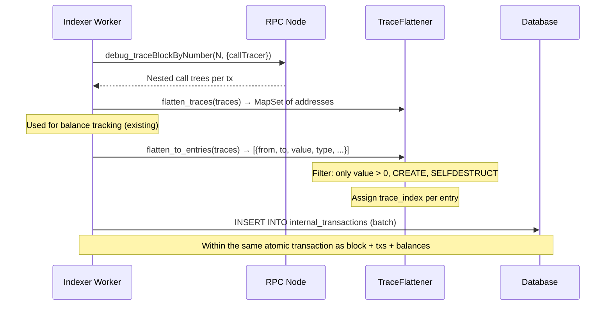
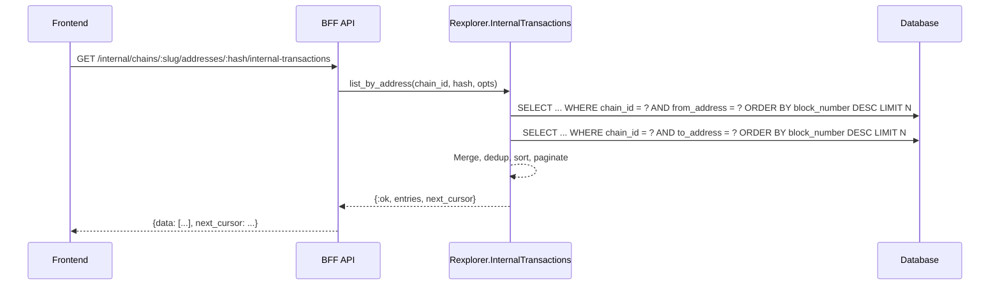

## Context

The indexer already calls `debug_traceBlockByNumber` with `callTracer` for chains that support traces (Ethrex). The `TraceFlattener` module recursively walks the nested call trees but currently only extracts addresses (a `MapSet`). The full trace frames — with `from`, `to`, `value`, `type`, and nested `calls` — are available but discarded after address extraction.

Blockscout stores internal transactions in a table with composite PK `{block_number, transaction_index, index}` and indexes on `from_address` and `to_address`. They query address pages with two separate queries (one for `from`, one for `to`) then union/dedup, avoiding the `OR` index problem. They also progressively shrink storage by truncating input data and deleting zero-value rows.

## Goals / Non-Goals

**Goals:**
- Store value-transferring internal transactions from trace data
- Enable querying internal transactions by address for the address page
- Show deposits and internal ETH transfers on the Ethrex address page
- Keep storage lean by only persisting entries that moved value

**Non-Goals:**
- Full call trace storage (every staticcall, delegatecall, zero-value call)
- Nested trace tree visualization on tx detail page
- Input/output data beyond function selector (first 4 bytes)
- Reprocessing already-indexed blocks for internal transactions

## Decisions

### 1. Only store value-transferring entries

**Decision:** Persist internal transactions only when `value > 0` OR `type` is `CREATE`/`CREATE2`/`SELFDESTRUCT`. Skip zero-value `CALL`, `DELEGATECALL`, `STATICCALL`.

**Why:** Following Otterscan's approach — most address page queries care about value movements, not every call in the trace. A contract that calls 50 other contracts with zero value in a single tx would generate 50 rows per tx otherwise. Blockscout has had to retroactively delete zero-value rows to manage storage.

**Trade-off:** Advanced users can't see the full call graph from our DB. They can still get it from the RPC via `debug_traceTransaction`.

### 2. Extend TraceFlattener to return structured entries

**Decision:** Add a `flatten_to_entries/1` function that returns a list of structured maps (`%{from, to, value, call_type, trace_address, input_prefix}`) alongside the existing `flatten_traces/1` that returns a `MapSet` of addresses. The balance collector continues using `flatten_traces/1`; the worker calls `flatten_to_entries/1` for persistence.

**Why:** Clean separation — the address set for balance tracking is a different concern from the structured entries for internal transactions. Both operate on the same trace data but produce different outputs.

### 3. Composite primary key following Blockscout pattern

**Decision:** PK is `{id}` (auto-increment) with a unique index on `{chain_id, block_number, transaction_index, trace_index}`. This avoids Ecto complications with composite PKs while maintaining the logical uniqueness.

### 4. Two-query union pattern for address lookups

**Decision:** Query internal transactions for an address using two separate queries (`WHERE from_address = ?` and `WHERE to_address = ?`), merge and sort in Elixir, then paginate. This allows each query to use its respective index efficiently.

**Why:** A single `WHERE from = ? OR to = ?` query can't use both indexes simultaneously in PostgreSQL, leading to sequential scans on large tables.

### 5. Store input prefix (4 bytes) only

**Decision:** Store only the first 4 bytes of the `input` field (the function selector). Full calldata is available via RPC on demand.

**Why:** Input data can be huge (multicalls, batch operations). Blockscout learned this the hard way and retroactively truncated. The 4-byte selector is enough to identify the function being called.

## Data Flow



## Address Page Query Flow



## Schema

```sql
CREATE TABLE internal_transactions (
    id BIGSERIAL PRIMARY KEY,
    chain_id INTEGER NOT NULL REFERENCES chains(chain_id),
    block_number BIGINT NOT NULL,
    transaction_hash VARCHAR NOT NULL,
    transaction_index INTEGER NOT NULL,
    trace_index INTEGER NOT NULL,
    from_address VARCHAR NOT NULL,
    to_address VARCHAR,
    value NUMERIC NOT NULL DEFAULT 0,
    call_type VARCHAR NOT NULL,  -- 'call', 'create', 'create2', 'selfdestruct'
    trace_address INTEGER[] NOT NULL DEFAULT '{}',
    input_prefix BYTEA,  -- first 4 bytes of input (function selector)
    error VARCHAR,
    inserted_at TIMESTAMPTZ NOT NULL DEFAULT NOW(),
    updated_at TIMESTAMPTZ NOT NULL DEFAULT NOW()
);

CREATE UNIQUE INDEX internal_transactions_chain_block_tx_trace
    ON internal_transactions (chain_id, block_number, transaction_index, trace_index);

CREATE INDEX internal_transactions_from
    ON internal_transactions (chain_id, from_address, block_number DESC);

CREATE INDEX internal_transactions_to
    ON internal_transactions (chain_id, to_address, block_number DESC);
```

## Risks / Trade-offs

**[Risk] Table growth on busy chains** — Even with the value-only filter, chains with many contract interactions produce substantial trace data.
- Mitigation: Value-only filter eliminates ~80%+ of trace entries. Can add retention policies later.

**[Risk] Trace unavailable on some chains** — Only chains with `supports_traces? == true` produce internal transactions. Other chains' address pages won't have the tab.
- Mitigation: Frontend conditionally shows the tab. The adapter pattern already handles this gracefully.

**[Risk] Reorg handling** — If a block is reorged, its internal transactions become invalid.
- Mitigation: Currently the indexer halts on reorg. When reorg handling is added, internal transactions for the reorged block would be deleted in the same transaction.
