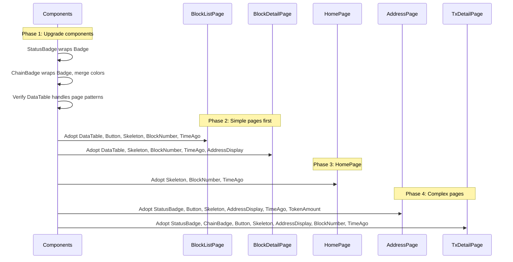

## Context

The frontend defines 9 UI components and 11 explorer components, but **zero** are used by any page. Every page re-implements status badges, buttons, tables, skeletons, address links, block links, and time formatting inline. The component library exists on paper but not in practice.

Current state of component adoption:

```
┌─────────────────────────────────────────────────────────────┐
│  Component Layer (defined)          Page Layer (actual)     │
│                                                             │
│  Button ─────────────────────── raw <button> (6+ places)   │
│  DataTable ──────────────────── raw <table> (2 pages)      │
│  Skeleton ───────────────────── animate-pulse divs (5 pgs) │
│  Badge ──────────────────────── inline styled <span>s      │
│  StatusBadge ────────────────── inline reimpl (5 places)   │
│  ChainBadge ─────────────────── local function in TxDetail │
│  TimeAgo ────────────────────── timeAgo() util (no refresh)│
│  AddressDisplay ─────────────── manual Link + truncation   │
│  BlockNumber ────────────────── manual Link + format       │
│  TokenAmount ────────────────── custom formatters per page │
└─────────────────────────────────────────────────────────────┘
```

## Goals / Non-Goals

**Goals:**
- Every page uses the shared component where a matching component exists
- Components are upgraded where the page's inline version is richer or better
- Visual output remains identical (or improves in consistency)
- Explorer components (StatusBadge, ChainBadge) delegate to UI components (Badge) where appropriate

**Non-Goals:**
- Adding new UI components (Modal, Dropdown, Toast have no page use case yet)
- Changing page layouts, functionality, or data fetching
- Adding new features to components beyond what pages already do inline
- Touching backend code
- Chain-specific UI variations (all chains use the same components)

## Decisions

### Decision 1: Component-first upgrade strategy

**Approach:** For each component/page mismatch, compare both versions. If the page version is richer, update the component first, then swap it into the page. Never downgrade page UX to fit a limited component.

**Why:** The page versions were written more recently and often handle edge cases (frame status, multiple status variants) that the original components missed. The component should absorb the best of both.

### Decision 2: StatusBadge SHALL use Badge internally

**Current state:** StatusBadge renders its own `<span>` with hardcoded styles. Pages also render their own `<span>`s.

**Change:** StatusBadge will import and wrap `Badge`, mapping `status: true` → `Badge variant="green"`, `status: false` → `Badge variant="red"`, `status: null` → `Badge variant="gray"`.

**Why not just use Badge directly in pages?** StatusBadge encapsulates the status→variant mapping and the label text. Pages shouldn't need to know that `true` means green.

### Decision 3: ChainBadge SHALL use Badge internally and merge chain color maps

**Current state:** ChainBadge component has 10 chains. TxDetailPage local function has 5 chains.

**Change:** Merge to a single ChainBadge component with the union of all chain colors. Remove the local function from TxDetailPage. ChainBadge renders a Badge with a colored dot prefix.

### Decision 4: TimeAgo component wins over timeAgo() utility

**Current state:** TimeAgo component auto-refreshes every 30s. Pages use the `timeAgo()` function directly (no refresh).

**Change:** Pages SHALL use the TimeAgo component. The spec requires periodic updates without page reload. The utility function remains available for non-rendering contexts.

**Trade-off:** Slightly more React nodes (one component per timestamp), but correctness wins — stale "2 min ago" text on a page open for 30 minutes is worse.

### Decision 5: DataTable adoption with flexible cell rendering

**Current state:** BlockListPage and BlockDetailPage use raw `<table>` with custom cell content (Links, formatted numbers, TimeAgo).

**Change:** Both pages will use DataTable. The `accessor` prop already supports `(row: T) => React.ReactNode`, so custom cell rendering works. Verify DataTable's styling matches what pages currently render, and adjust if needed.

### Decision 6: Page-by-page migration order



**Why this order?** Start with the simplest pages (fewer component types, less inline logic) to validate the approach. Save TxDetailPage and AddressPage for last — they have the most inline implementations and edge cases.

### Decision 7: Delete DesignPreview.tsx

Scaffolding page with 7 palette variants, all inline styles, zero component usage. Its purpose (color exploration) is complete. Remove the file and its `/design` route from App.tsx.

## Risks / Trade-offs

**[Risk] Component upgrades break existing tests** → Run the full frontend test/lint suite after each component change. Components currently have zero page consumers, so the risk is minimal.

**[Risk] DataTable doesn't support all table patterns** → The accessor function prop handles custom cells, but verify that:
- BlockListPage's gas percentage bar renders correctly in a cell
- BlockDetailPage's multi-column address cells work
- If DataTable needs adjustment, do it before page migration.

**[Risk] TimeAgo 30s refresh creates many timers on pages with long lists** → HomePage shows 10 blocks + 10 txs = 20 timers. AddressPage could show 25+ per tab. This is manageable, but if performance is a concern, TimeAgo could batch updates with a single interval and context. Defer optimization unless measured.

**[Trade-off] Slightly larger component bundle** → Pages will import more components. The total JS size impact is negligible (these are tiny components) and the consistency gain is worth it.

## Open Questions

1. **HomePage's TxTypeIcon** renders status as colored dots (not badges). Should this use StatusBadge, or is a dot indicator a valid separate pattern? Recommend: keep dots for compact list items, use StatusBadge for detail views.
2. **AddressPage's custom formatters** (`formatBalance`, `formatTransferAmount`, `formatInternalValue`) — should these move into TokenAmount, or are they distinct enough to stay as utilities? Recommend: evaluate during implementation.
