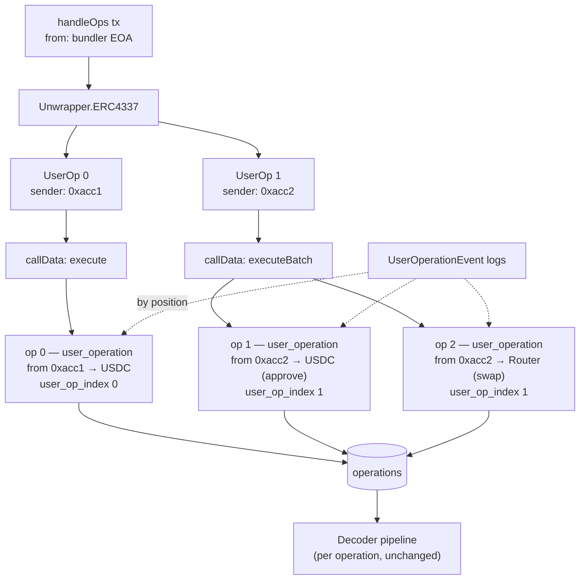
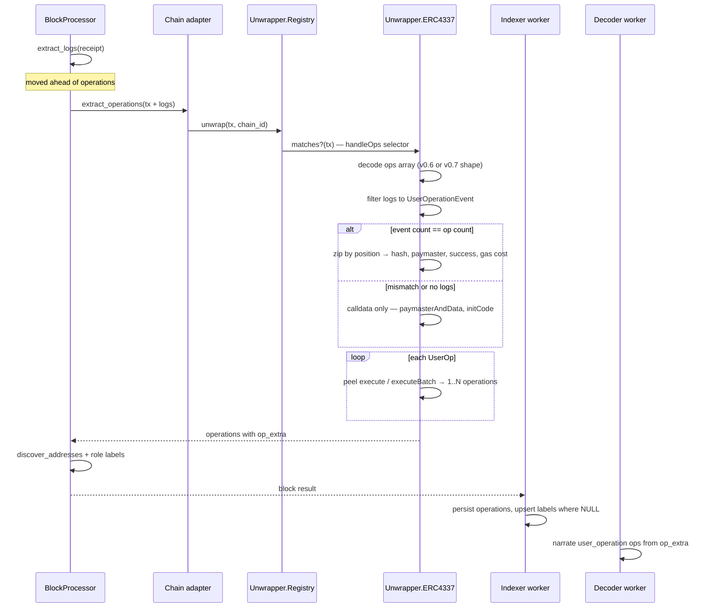

## Context

See `proposal.md` — Why. What the design has to work with:

- `Rexplorer.Unwrapper.Registry.unwrap/2` takes a transaction map (`from_address`, `to_address`, `value`, `input`) and returns operation attribute maps. The map has no logs in it, and `BlockProcessor` builds it from four fields only.
- `BlockProcessor.process_block/3` extracts operations *before* logs for a regular transaction. The frame path already extracts per-frame logs first, so it can pass them in without reordering.
- `Schema.Operation` has `:user_operation` in its enum and no field able to hold a userOpHash or a paymaster.
- `Decoder.Pipeline.decode_operation/2` narrates from `input`/`to_address`/`value` and wraps the result per operation type (`wrap_with_context/3` already special-cases Safe). The decoder worker loads full `Operation` structs, so anything stored on the row is available at narration time.
- `Addresses.label` exists in the schema and in both address API responses. Nothing writes it; the indexer's address upsert is `on_conflict: :nothing`.
- ERC-4337 is a contract standard, so nothing here belongs in a chain adapter.

## Goals / Non-Goals

**Goals:**

- One unwrapper module handling both live EntryPoint calldata shapes, chosen by selector.
- Operations that point at the *real* target of each UserOperation, so the existing interpreters and narrator work unchanged on AA traffic.
- A place on the operation row for facts that have no column, populated from the authoritative source (EntryPoint events) with a calldata-only fallback.
- Address role labels that survive re-indexing and never fight each other.
- No new adapter callbacks and no per-chain configuration.

**Non-Goals:**

- Recomputing userOpHash from calldata. It is version-specific hashing over the packed operation plus the EntryPoint address and chain id; the EntryPoint already emits it.
- A typed schema for `op_extra`. It is a documented bag with one writer per key.
- Backfilling bundles indexed before this change (see `proposal.md` — Non-goals).

## Decisions

### Decision 1: One unwrapper, two calldata shapes, selector-picked

`Rexplorer.Unwrapper.ERC4337` implements the existing behaviour and is registered first in the registry. It matches two selectors:

| EntryPoint | Signature | Selector | Ops array element |
|---|---|---|---|
| v0.6 | `handleOps((address,uint256,bytes,bytes,uint256,uint256,uint256,uint256,uint256,bytes,bytes)[],address)` | `0x1fad948c` | `UserOperation` |
| v0.7 / v0.8 | `handleOps((address,uint256,bytes,bytes,bytes32,uint256,bytes32,bytes,bytes)[],address)` | `0x765e827f` | `PackedUserOperation` |

The two shapes differ only in how gas parameters are encoded — the fields this change reads (`sender`, `nonce`, `initCode`, `callData`, `paymasterAndData`) sit at the same tuple positions in both, so one extraction path serves both once the tuple arity picks the decoder. The matched selector fixes the *calldata shape*. It does not fix the version: v0.8 kept v0.7's `PackedUserOperation`, so the two are indistinguishable by selector. `entry_point_version` therefore reads the canonical EntryPoint addresses first (v0.6 `0x5ff137d4…`, v0.7 `0x00000000717…`, v0.8 `0x4337084d…`) and falls back to the shape for any other deployment. Detection stays selector-based — the address is consulted only to name a version, never to decide whether this is a bundle, so a chain with its own EntryPoint deployment still unwraps.

Both selectors are computed from their signatures and asserted in a test rather than trusted as constants — the same guard `unwrap-layer` used for `execTransaction` and `multicall`.

**Alternatives considered.** *Two modules, one per version:* duplicates the fan-out, correlation and fallback logic to save one `case`. *Address-based detection against a list of known EntryPoints:* needs maintenance per chain and per deployment, and would miss test deployments; the selectors are distinctive enough on their own — and unlike Safe's `execTransaction`, a mis-detection here is caught by decode failure and falls back.

### Decision 2: Peel the account call too, and fan out `executeBatch`

A UserOperation's `callData` is a call to the smart account, so stopping at one level would narrate every AA transaction as "Called execute on 0x…" — the exact failure this change exists to fix. The unwrapper therefore peels one more layer using a small table of account execution selectors:

| Signature | Selector | Produces |
|---|---|---|
| `execute(address,uint256,bytes)` | `0xb61d27f6` | one operation at the inner target |
| `executeBatch(address[],bytes[])` | `0x18dfb3c7` | one operation per inner call, value 0 |
| `executeBatch(address[],uint256[],bytes[])` | `0x47e1da2a` | one operation per inner call, with values |
| anything else | — | one operation at the smart account, raw `callData` preserved |

This deliberately departs from the unwrap layer's "single level only" rule (`unwrap-layer` design, Decision 4). The reason it is safe here and was not there: the second level is not an arbitrary wrapper, it is the account interface the standard itself defines, and the fan-out is bounded by the batch length. Recursion stops there — an `executeBatch` containing a Safe `execTransaction` yields an operation with that calldata, not a further unwrap.

Fan-out means "one operation per UserOp" is no longer literally true, so grouping moves into the data: every operation carries `user_op_index`, and everything downstream (BFF, UI) groups on it. `operation_index` stays what it has always been — a unique sequential index across the transaction.



### Decision 3: `op_extra` JSONB on operations, not new columns

One `map` column, defaulting to `%{}`, mirroring `transactions.chain_extra`. Documented keys:

| Key | Source | Notes |
|---|---|---|
| `user_op_hash` | `UserOperationEvent` topic1 | absent without logs |
| `user_op_index` | position in the ops array | the grouping key |
| `entry_point` | transaction `to_address` | |
| `entry_point_version` | EntryPoint address, else matched selector | `"0.6"`, `"0.7"` or `"0.8"` |
| `paymaster` | event topic3, else `paymasterAndData[0..19]` | absent when unsponsored |
| `factory` | `initCode[0..19]` | absent when not deploying |
| `success` | event data | absent without logs |
| `actual_gas_cost` | event data, decimal string | absent without logs |

**Why not columns.** Six AA-specific columns on the generic `operations` table make the schema read as though ERC-4337 were a first-class dimension of every operation, and the next two roadmap items (cross-chain journeys, L2 lifecycle stages) would each want their own set. A JSONB bag with documented keys and a single writer per key costs one migration now and none later.

**Why not nothing.** The paymaster and outcome are the two facts that make an AA transaction legible, and neither survives as prose in `decoded_summary` — the UI needs them as fields to badge and group on, and the public API needs them for integrators.

**The one query that matters** — userOpHash lookup — gets a partial expression index:

```sql
CREATE INDEX operations_user_op_hash_idx
  ON operations (chain_id, (op_extra->>'user_op_hash'))
  WHERE op_extra ? 'user_op_hash';
```

Partial, because AA operations are a small fraction of all operations. No GIN index: nothing queries arbitrary keys.

### Decision 4: Correlate events by position, and let the event win

The EntryPoint emits exactly one `UserOperationEvent` per UserOperation, in bundle order, whether the operation succeeded or reverted. Matching is therefore positional: filter the transaction's logs to that topic0, and zip with the decoded ops array.

The correlation is applied only when the counts are equal. An unequal count means something is not the shape we think it is — an aggregated bundle, a nested EntryPoint call, an unexpected EntryPoint version — and a positional zip would then attribute one user's hash and paymaster to another user's operation. Silently dropping the enrichment is recoverable; mis-attributing it is not.

Where both sources have a value, the event wins. For v0.7 the paymaster in `paymasterAndData` is a prefix of an opaque field whose layout paymasters vary; the event's `paymaster` topic is what the EntryPoint actually charged.



### Decision 5: Labels are derived in the processor, applied on conflict

`Rexplorer.Labels` is a pure module: given the operations extracted from a block, it returns `{address, label}` pairs for the roles in `address-labels`. `BlockProcessor.discover_addresses/5` merges them into the address maps it already builds, preferring the labelled form when the same address appears twice.

Persistence changes from `on_conflict: :nothing` to an update that sets `label` only where it is currently NULL:

```elixir
on_conflict: from(a in Address, update: [set: [label: coalesce(a.label, fragment("EXCLUDED.label"))]]),
conflict_target: [:chain_id, :hash]
```

This keeps the first label observed, makes re-indexing idempotent, and — because a row that already has a label is written back with the same value — cannot flip between roles for an address that is, say, both a smart account and a paymaster.

**Alternative considered:** a separate `address_labels` table with one row per (address, source, label). Right answer eventually, when labels come from several sources with different trust levels (ENS, curated lists, user submissions). Overbuilt for four derived roles written by one producer, and `label` is already plumbed through both address APIs.

### Decision 6: Narration reads `op_extra`, interpreters stay untouched

`Pipeline.wrap_with_context/3` gains the `:user_operation` clause and takes the operation's `op_extra`, so the AA framing is composed *around* whatever the existing interpreters produced for the inner call:

> `Smart account 0xacc1… swapped 10 ETH for 25,000 USDC on Uniswap V3 (gas paid by paymaster 0xpm…)`

with a deployment clause when `factory` is present and a failure marker when `success` is `false`. Because the inner call was already rewritten to target the real contract, every interpreter (Uniswap, Aave, WETH, ERC-20) works on AA traffic with no change. Bumping `@decoder_version` re-narrates existing operations for free through the mechanism the decoder worker already has.

### Decision 7: Search resolves a userOpHash after a transaction miss

`Rexplorer.Search` keeps its current classification, and a 66-char hex that finds no transaction is retried against the expression index. Ordering matters: transaction hashes are the overwhelmingly common case and must not pay for the second query. The result type is `:user_operation`, carrying the parent transaction, so the BFF's redirect points at the transaction page.

### Decision 8: The UI groups, the API does not

The BFF returns operations as a flat list with `op_extra`, exactly as today plus one field, and `TxDetailPage` groups by `user_op_index` into a `UserOpCard` per UserOperation. Grouping in the client keeps the BFF response shape stable for the frames and multicall cases that already read the flat list, and keeps the public API's contract a list of operations rather than a nested AA-specific structure.

### Chain extensibility

Nothing in this change is chain-aware: no adapter callback, no per-chain address list, no configuration. The unwrapper lives in core and is reached through `Rexplorer.Chain.EVM`'s default `extract_operations/1`, so every current adapter — Ethereum, Optimism, Base, BNB, Polygon, Ethrex — and every future one gets AA unwrapping the moment its chain has bundler traffic. The only chain-shaped variation is which EntryPoint version is deployed, and that is read from the calldata, not configured.

## Risks / Trade-offs

**[Positional event correlation is wrong for an unusual bundle]** → Counts must match exactly or the enrichment is skipped entirely; operations are still produced from calldata. Mis-attribution across users is the one failure mode worth being strict about.

**[Selector collision on `handleOps`]** → Both signatures are long tuple arrays; a collision would fail to decode and fall back to a single `call`. Unlike Safe's unwrapper, a false positive here degrades to today's behaviour rather than producing a wrong operation.

**[Wallet-vendor accounts that do not use `execute`]** → Kernel, Biconomy and the Safe 4337 module use their own execution selectors, so those UserOperations narrate at the account level ("Called 0x… on 0xacc1"). Sender attribution, paymaster and hash are still correct; only the inner action stays opaque. The lookup table is one line per additional selector.

**[`op_extra` becomes a dumping ground]** → Keys are documented in this design and in the schema moduledoc, and each has exactly one writer. If a second consumer needs to filter on a key, that key earns a column and a migration.

**[Operation counts grow]** → A batched bundle now produces more rows than it did (which was one). Bundles are a small fraction of transactions and batch lengths are small; `operations` is already the highest-cardinality table and is indexed by transaction.

**[Historical inconsistency]** → Bundles indexed before this change keep their single `call` operation, so AA history is uneven until a reindex. Same trade-off the Safe and Multicall unwrappers accepted, and the same eventual fix.

**[Reordering log extraction]** → Operations and logs are extracted in one pass per transaction; moving logs first changes evaluation order for every transaction, not just bundles. The two are independent — no existing extractor reads the other's output — and the existing `BlockProcessor` tests cover the regular and frame paths.

## Migration Plan

1. One migration: add `op_extra` (`:map`, default `%{}`, not null) to `operations`, plus the partial expression index. Both are additive; no rewrite of existing rows and no lock beyond the column add.
2. Deploy indexer and web together — the BFF reads a column the indexer writes, and an old web node simply returns `%{}` for it.
3. Bump `@decoder_version` so the decoder worker re-narrates in the background.
4. Rollback: drop the index and the column. Pre-existing operations are untouched; bundles indexed in the meantime revert to their `user_operation` rows without extras, which still narrate and display, just without hashes and paymaster badges.

## Open Questions

*(none — the one open question was answered during implementation; see below.)*

## Answered during implementation

**Which additional account-execution selectors are worth adding first?**
Measured over 291 UserOperations in 40 consecutive Ethereum mainnet blocks:

| Selector | Share | Interface |
|----------|-------|-----------|
| `0x34fcd5be` | 37.1% | `executeBatch((address,uint256,bytes)[])` — Coinbase Smart Wallet |
| `0x26da7d88` | 26.5% | unidentified vendor batch |
| `0xb61d27f6` | 25.8% | `execute(address,uint256,bytes)` — **supported** |
| `0xe9ae5c53` | 5.2% | `execute(bytes32,bytes)` — ERC-7579 modular accounts |
| `0x8dd7712f`, `0x541d63c8`, `0x51945447`, `0x7bb37428`, `0x1bbf564c` | 4.5% | long tail, incl. the Safe 4337 module |
| `0x47e1da2a` | 0.3% | `executeBatch(address[],uint256[],bytes[])` — **supported** |

So the reference `execute` shape covers about a quarter of live mainnet
UserOperations. The rest land in the documented fallback — attributed to the
right smart account, with the right hash, paymaster and outcome, but showing
the account call rather than the action inside it. Wallet-vendor interfaces
remain a non-goal of this change (see `proposal.md`); the numbers say the first
follow-up should add `0x34fcd5be` and `0xe9ae5c53`, which together with the
unidentified `0x26da7d88` would take coverage past 90%.
